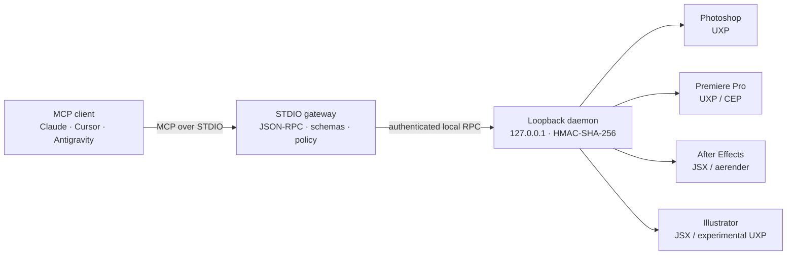

# kirei-adobe-mcp

[](https://www.typescriptlang.org/)
[](https://turbo.build/repo)
[](docs/mcp-protocol-2026.md)
[](LICENSE)
[](docs/architecture-and-security.md#risk-model-r0r4)

One secure, typed Model Context Protocol surface for **Adobe Photoshop, Premiere Pro, After Effects, and Illustrator**.

`kirei-adobe-mcp` turns creative automation into explicit operations with schemas, revisions, risk classification, artifacts, and verification. A small STDIO gateway talks to a loopback-only daemon; application bridges translate safe domain commands into UXP, CEP, ExtendScript, or approved CLI work. No public tool accepts arbitrary JavaScript, JSX, shell commands, or raw `batchPlay` descriptors.

---

### 📖 Documentation & App Guides

| 🎨 [Photoshop Guide](docs/photoshop.md) | 🎬 [Premiere Pro Guide](docs/premiere.md) | ⚡ [After Effects Guide](docs/after-effects.md) | 📐 [Illustrator Guide](docs/illustrator.md) |
|:---:|:---:|:---:|:---:|
| Smart Selection & Layer Styles | Timeline DOM, MOGRT & Lumetri | Shape Animators & aerender | Pathfinders & Image Trace |

| 🌐 [MCP Protocol 2026](docs/mcp-protocol-2026.md) | 🛡️ [Architecture & Security](docs/architecture-and-security.md) | 🗺️ [Master Blueprint](ULTIMATE_ADOBE_MCP_BLUEPRINT.md) | 📜 [Technical Specs](SPECS.md) |
|:---:|:---:|:---:|:---:|
| Prompts, Resources & Progress | R0–R4, HMAC & SQLite WAL | Strategic Roadmap & Gap Audit | Normative Architecture |

---

> [!IMPORTANT]
> This repository is an engineering preview. Unit and contract tests validate the TypeScript surface, but not every advertised Adobe operation is host-certified. The guides distinguish **available**, **capability-gated**, and **roadmap** behavior. Inspect `adobe.system.status` and negotiated capabilities before mutating a real project.

## 📑 Table of Contents

- [Start in two minutes](#start-in-two-minutes)
- [Architecture at a glance](#architecture-at-a-glance)
- [The front-door pattern](#the-front-door-pattern)
- [What you can build](#what-you-can-build)
- [Safety model](#safety-model)
- [Repository map](#repository-map)
- [Documentation Index](#documentation)
- [Development & Testing](#development)
- [Multi-model collaborative engineering](#multi-model-collaborative-engineering)
- [License](#license)

## Start in two minutes

Prerequisites: Node.js 20+, pnpm 9, and at least one supported Adobe desktop application.

```powershell
git clone https://github.com/hyukudan/kirei-adobe-mcp.git
cd kirei-adobe-mcp
corepack enable
pnpm install --frozen-lockfile
pnpm build
```

Start the local daemon and leave it running:

```powershell
node apps/daemon/dist/index.js
```

Then point any STDIO-compatible MCP client at the gateway. Use an absolute repository path and set the working directory to the repository so `adobe-mcp.policy.json` is loaded.

```json
{
  "mcpServers": {
    "adobe": {
      "command": "node",
      "args": ["D:/mcp/adobe-mcp/apps/gateway/dist/index.js"],
      "cwd": "D:/mcp/adobe-mcp"
    }
  }
}
```

The same server entry works in **Claude Desktop**, **Cursor**, **Antigravity/Gemini clients**, and other clients that support local MCP servers. Their settings file locations differ, but the `command`, `args`, and optional `cwd` values are identical. Restart the client after saving the configuration.

Finally, load the relevant Adobe bridge:

- Photoshop: add `apps/photoshop-uxp/manifest.json` in Adobe UXP Developer Tool.
- Premiere Pro: load `apps/premiere-uxp/manifest.json`; use `apps/premiere-cep` only as the compatibility fallback.
- After Effects: install `apps/aftereffects-panel/src/AfterEffectsBridge.jsx` as a ScriptUI Panel.
- Illustrator: use the versioned JSX adapter as the compatibility path; the included UXP panel remains experimental until the host capability is verified.

Follow the application guide for exact installation and capability checks: [Photoshop](docs/photoshop.md), [Premiere Pro](docs/premiere.md), [After Effects](docs/after-effects.md), or [Illustrator](docs/illustrator.md).

## Architecture at a glance



The gateway owns the MCP boundary and keeps `stdout` clean. The daemon binds only to loopback, challenges every peer, and verifies

`HMAC-SHA-256(token, clientNonce || serverNonce || sessionId || protocolVersion)`.

Large outputs move through the immutable artifact store as `artifact://sha256-<digest>` references rather than through oversized JSON-RPC frames. See [Architecture & security](docs/architecture-and-security.md) for trust boundaries, approval binding, persistence, and cross-application sagas.

## The front-door pattern

Creative applications have hundreds of useful operations. Publishing each one as a top-level MCP tool consumes context before the model does any work. The target front door keeps the public surface small:

1. `adobe.tools.discover` searches the internal operation registry by app, capability, group, and risk.
2. `adobe.tools.describe` returns full input/output schemas only for selected operations.
3. `adobe.operations.plan` validates targets and revisions, computes scope and risk, and produces an immutable plan hash.
4. `adobe.operations.execute` executes the approved plan idempotently and returns a receipt.

This progressive-disclosure pattern is designed to reduce initial catalog tokens by at least 80% while preserving strict validation. The gateway now exposes the stable front-door list, structured output, prompts, dynamic resources and the MCP 2026 protocol identifier; the full operation surface remains available through discovery and description.

## What you can build

| Host | Core surface | Advanced workflows |
|---|---|---|
| Photoshop | Layer inspection and edits, masks, adjustment builders, Smart Objects, guarded filters, layer export | Select Subject and Color Range, layer styles, channel recipes, artifact-backed batch export |
| Premiere Pro | Timeline insert/move/trim/split/ripple, transitions, audio keyframes, captions | MOGRT parameter binding, Lumetri recipes, silence cuts, auto-ducking, 9:16 auto-reframe |
| After Effects | Project/comp/layer edits, keyframes, preset resources, render queue | Shape operators, text animators, expression controls, chunked `aerender` jobs |
| Illustrator | Paths, compound paths, boolean operations, type, multi-artboard export | Image Trace, global swatches, variable OpenType, brand-kit vectorization |

Advanced rows are capability-gated and carry an explicit verification level in discovery. Host certification remains authoritative at runtime; the individual guides give exact fallback behavior.

## Safety model

Every operation is classified from **R0** (read-only) through **R4** (irreversible, privileged, or high-impact). R2+ work is designed around `Plan → Snapshot → Execute → Verify`; R3/R4 requires an approval cryptographically bound to the plan hash, scope, target revision, nonce, and expiry. UUID operation keys prevent accidental duplicate effects.

The security boundary also enforces loopback-only networking, strict Zod schemas, handler allowlists, filesystem grants, shell-free process spawning, stable target IDs, and content-addressed evidence. Read the full [R0–R4 and threat model](docs/architecture-and-security.md).

## Repository map

```text
apps/
  gateway/               MCP STDIO entry point
  daemon/                authenticated local router
  photoshop-uxp/         Photoshop panel
  premiere-uxp/          Premiere primary panel
  premiere-cep/          Premiere compatibility fallback
  aftereffects-panel/    After Effects ScriptUI bridge
  illustrator-uxp/       experimental Illustrator panel
packages/
  schemas/               strict Zod contracts and JSON Schema generation
  tool-catalog/           operation metadata, risk, and capabilities
  bridge-*/               application adapters and safe builders
  artifact-store/        immutable SHA-256 content-addressed storage
  workflow-engine/       saga execution and reverse compensation
  policy/                approvals, roots, risk, and path controls
  jobs/                   long-running job state
  protocol/               bridge JSON-RPC and HMAC handshake
```

## Documentation

| Guide | Use it for |
|---|---|
| [Photoshop](docs/photoshop.md) | UXP setup, selection, layer styles, adjustment layers, Smart Objects, Camera Raw, and layer export |
| [Premiere Pro](docs/premiere.md) | UXP/CEP setup, Timeline DOM, MOGRTs, Lumetri, and the `EditPlan` engine |
| [After Effects](docs/after-effects.md) | ScriptUI installation, shape/text systems, effect presets, and headless rendering |
| [Illustrator](docs/illustrator.md) | vector construction, Pathfinder, Image Trace, color, typography, and artboard export |
| [MCP protocol 2026](docs/mcp-protocol-2026.md) | dual protocol strategy, prompts, dynamic resources, tasks, and progress |
| [Architecture & security](docs/architecture-and-security.md) | HMAC, R0–R4 approvals, SQLite/CAS durability, idempotency, and sagas |
| [Compatibility](docs/compatibility.md) | transport and host fallback matrix |
| [Security policy](docs/security.md) | concise deployment rules |
| [Technical specification](SPECS.md) | normative v1 contracts |
| [Master blueprint](ULTIMATE_ADOBE_MCP_BLUEPRINT.md) | audited target architecture and roadmap |

## Development

```powershell
pnpm typecheck
pnpm test
pnpm test:contract
pnpm schemas:check
```

These checks prove contract consistency, not host certification. A capability becomes `host_verified` only after it passes the declared Adobe version matrix, validates an independently observed postcondition, and exercises restore or compensation where promised.

## Multi-model collaborative engineering

The project was shaped through multi-model engineering across **Google DeepMind**, **Anthropic**, and **OpenAI** systems, paired with human architecture, implementation, review, and product judgment. Different models contributed research synthesis, creative-domain modeling, strict TypeScript and schema work, threat analysis, and adversarial audit. Human pair-programming remains the authority for repository changes, host verification, release decisions, and safety claims.

## License

Released under the [MIT License](LICENSE).
