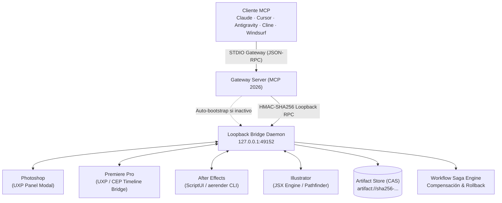

# 🌸 kirei-adobe-mcp

[](https://www.typescriptlang.org/)
[](https://turbo.build/repo)
[](docs/mcp-protocol-2026.md)
[](LICENSE)
[](docs/architecture-and-security.md#risk-model-r0r4)

The definitive, unified, strictly-typed Model Context Protocol (MCP) server for **Adobe Photoshop, Premiere Pro, After Effects, and Illustrator**.

Designed for enterprise AI assistants (**Claude Desktop, Cursor, Antigravity, Cline, Windsurf**), `kirei-adobe-mcp` replaces brittle scripts with 62 deterministic tools, Zod contracts, cryptographic risk tiers (R0–R4), Content-Addressed Storage (CAS), and visual verification.

---

### 📖 Application Guides & Documentation

| 🎨 [Photoshop Guide](docs/photoshop.md) | 🎬 [Premiere Pro Guide](docs/premiere.md) | ⚡ [After Effects Guide](docs/after-effects.md) | 📐 [Illustrator Guide](docs/illustrator.md) |
|:---:|:---:|:---:|:---:|
| Smart Selection & Layer Styles | Timeline DOM, MOGRT & Lumetri | Shape Animators & Headless Render | Pathfinders & Image Trace |

| 🌐 [MCP Protocol 2026](docs/mcp-protocol-2026.md) | 🛡️ [Architecture & Security](docs/architecture-and-security.md) | 🗺️ [Master Blueprint](ULTIMATE_ADOBE_MCP_BLUEPRINT.md) | 📜 [Technical Specs](SPECS.md) |
|:---:|:---:|:---:|:---:|
| Prompts, Resources & Streaming | R0–R4, HMAC & SQLite WAL | Strategic Roadmap & Gap Audit | Normative Specifications |

---

## ⚡ Quickstart en 60 Segundos (Zero-Config)

No necesitas clonar el repositorio ni compilar código manualmente. Puedes usar `kirei-adobe-mcp` directamente con `npx`:

### 1. Añadir a tu Cliente MCP Favorito

#### 🤖 Claude Desktop
Añade a tu archivo de configuración (`%APPDATA%\Claude\claude_desktop_config.json` en Windows o `~/Library/Application Support/Claude/claude_desktop_config.json` en macOS):

```json
{
  "mcpServers": {
    "kirei-adobe": {
      "command": "npx",
      "args": ["-y", "kirei-adobe-mcp"]
    }
  }
}
```

#### 💻 Cursor
Crea o edita `.cursor/mcp.json` en tu workspace o en la configuración global de Cursor:

```json
{
  "mcpServers": {
    "kirei-adobe": {
      "command": "npx",
      "args": ["-y", "kirei-adobe-mcp"]
    }
  }
}
```

#### 🚀 Antigravity / Gemini CLI
Añade a `~/.gemini/antigravity-cli/mcp.json`:

```json
{
  "mcpServers": {
    "kirei-adobe": {
      "command": "npx",
      "args": ["-y", "kirei-adobe-mcp"]
    }
  }
}
```

#### 🌊 Windsurf / Cascade
Añade a `~/.codeium/windsurf/mcp_config.json`:

```json
{
  "mcpServers": {
    "kirei-adobe": {
      "command": "npx",
      "args": ["-y", "kirei-adobe-mcp"]
    }
  }
}
```

#### 🛠️ Cline / Roo Code (VS Code Extension)
Añade a tu configuración de servidores MCP en Cline:

```json
{
  "mcpServers": {
    "kirei-adobe": {
      "command": "npx",
      "args": ["-y", "kirei-adobe-mcp"],
      "disabled": false,
      "autoApprove": []
    }
  }
}
```

---

## 🧙‍♂️ Asistente de Instalación y Diagnóstico CLI

`kirei-adobe-mcp` incluye herramientas interactivas integradas para facilitar la configuración en un solo paso:

```powershell
# 1. Diagnóstico completo del sistema y aplicaciones Adobe instaladas
npx kirei-adobe-mcp doctor

# 2. Configurar automáticamente clientes MCP (Claude Desktop, Cursor, etc.)
npx kirei-adobe-mcp setup

# 3. Instalar extensiones y scripts en las carpetas oficiales de Adobe
npx kirei-adobe-mcp install-plugins
```

### Scripts de 1-Click Automatizados

- **Windows (PowerShell):**
  ```powershell
  powershell -ExecutionPolicy Bypass -File scripts/setup-windows.ps1
  ```
- **macOS (Terminal):**
  ```bash
  bash scripts/setup-macos.sh
  ```

---

## 🏗️ Arquitectura del Sistema



---

## 🎯 El Patrón Front-Door (Ahorro >80% de Tokens)

En lugar de sobrecargar la ventana de contexto de la IA exponiendo 62 herramientas atómicas a la vez, `kirei-adobe-mcp` implementa el patrón Front-Door de descubrimiento progresivo:

1. `adobe.tools.discover`: Busca en el registro interno de operaciones por aplicación, categoría o riesgo.
2. `adobe.tools.describe`: Obtiene el esquema JSON Zod completo únicamente para las operaciones necesarias.
3. `adobe.operations.plan`: Compila y valida un plan inmutable con cálculo de riesgo y `planHash`.
4. `adobe.operations.execute`: Ejecuta las operaciones aprobadas de manera idempotente con recibo de confirmación.

---

## 🎨 Cobertura por Aplicación

| Aplicación | Capacidades Principales | Workflows Avanzados |
|---|---|---|
| **Photoshop** | Capas, selecciones, máscaras, ajustes, objetos inteligentes, recorte | *Select Subject*, *Color Range*, *Layer Styles*, máscaras de luminosidad, exportación real de capas, Firefly *Generative Fill* (R3). |
| **Premiere Pro** | Inserción/corte/desplazamiento en Timeline, pistas, clips, subtítulos | Parametrización de plantillas MOGRT con manifest, graduación de color Lumetri declarativa, gestión de proxies, auto-ducking y reframe 9:16. |
| **After Effects** | Composiciones, capas, keyframes tipados, presets de efectos | Operadores de forma (*Trim Paths*, *Repeater*, *Wiggle*), animadores de texto con selectores de rango, controles de expresión y render headless vía `aerender`. |
| **Illustrator** | Trazados, arte vectorial, tipografía, exportación multi-mesa | Vectorización *Image Trace*, gestión de paletas y muestras globales, tipografía variable OpenType y operaciones booleanas de *Pathfinder*. |

---

## 🛡️ Modelo de Seguridad y Riesgos (R0–R4)

| Nivel de Riesgo | Clasificación | Requisitos de Aprobación | Ejemplos |
|:---:|---|---|---|
| **R0** | Lectura e Inspección | Acceso libre automático | Inspeccionar jerarquía de capas, leer timeline, previsualizaciones. |
| **R1** | Mutación No Destructiva | Verificación local | Añadir capas vacías, crear máscaras, aplicar keyframes. |
| **R2** | Mutación Moderada | Plan Hash + Snapshot | Modificar cortes existentes, cambiar orden de capas, aplicar estilos. |
| **R3** | Mutación Mayor / Generativa | Aprobación Criptográfica Explícita | Firefly Generative Fill, reestructuración profunda de timeline, render queue. |
| **R4** | Destructiva / Irreversible | Aprobación Crítica con Token Único | Sobrescribir archivos originales, eliminación masiva de recursos. |

---

## 🔧 Resolución de Problemas (Troubleshooting & FAQ)

### ❓ El cliente MCP muestra `BRIDGE_UNAVAILABLE: panel disconnected`
* **Solución:** Abre la aplicación Adobe correspondiente (Photoshop, Premiere, etc.) y asegúrate de que el panel o script de extensión esté cargado y muestre el estado en verde (**Connected**).

### ❓ Error de firma en Premiere CEP (`PlayerDebugMode`)
* **Solución:** Ejecuta `npx kirei-adobe-mcp install-plugins` para habilitar automáticamente el modo de depuración de CSXS en el Registro de Windows o defaults de macOS.

### ❓ Conflicto con el puerto `49152`
* **Solución:** Si otro servicio ocupa el puerto 49152, define la variable de entorno en tu cliente MCP:
  ```json
  "env": {
    "ADOBE_MCP_DAEMON_PORT": "50000"
  }
  ```

---

## 🛠️ Desarrollo Local y Contribución

Si deseas contribuir al desarrollo del monorepo:

```powershell
git clone https://github.com/hyukudan/kirei-adobe-mcp.git
cd kirei-adobe-mcp
corepack enable
pnpm install
pnpm build
pnpm turbo run test typecheck
```

---

## 🤝 Ingeniería Colaborativa Multi-Modelo

Este proyecto ha sido diseñado e implementado mediante ingeniería colaborativa avanzada, aprovechando capacidades de razonamiento profundo y arquitectura multi-modelo de **Google DeepMind**, **Anthropic** y **OpenAI**, junto con las APIs oficiales y especificaciones de **Adobe Creative Cloud** y **Model Context Protocol**.

---

## 📄 Licencia

Distribuido bajo la Licencia MIT. Consulta [LICENSE](LICENSE) para más información.
