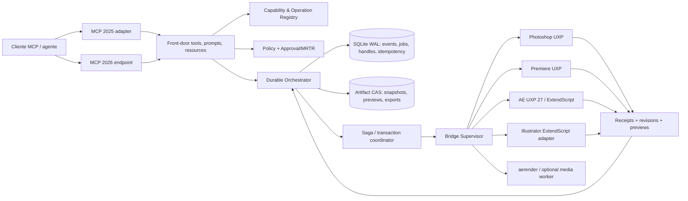
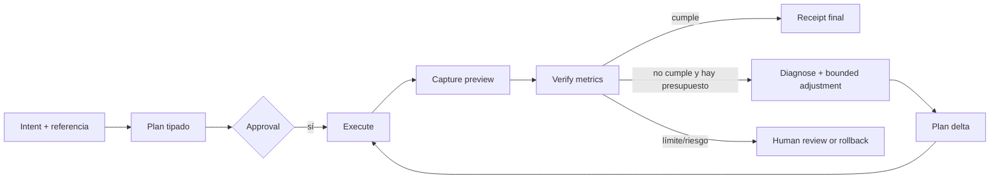

# Definitive Adobe MCP Server — auditoría estratégica y blueprint maestro

**Repositorio auditado:** `D:\mcp\adobe-mcp`

**Referencias locales:** `reference_repos/photoshop-mcp`, `premiere-mcp`, `ae-mcp`, `ae-mcp-imt`

**Fecha de corte:** 2026-10-02 (Europe/Madrid)
**Objetivo:** convertir `adobe-mcp` en el servidor MCP más completo, seguro, verificable y ergonómico para Photoshop, Premiere Pro, After Effects e Illustrator.

> Este documento distingue deliberadamente entre **implementado**, **conectado al host**, **probado** y **propuesto**. Un contrato TypeScript, un descriptor `batchPlay` o un test con un mock no equivalen a una capacidad certificada en una aplicación Adobe real.

---

## 1. Dictamen ejecutivo

`adobe-mcp` tiene una base arquitectónica mejor que la mayoría de los servidores comunitarios: gateway separado, daemon local, bridges por aplicación, catálogo tipado, HMAC, políticas de riesgo, artefactos content-addressed, previsualizaciones y una primera abstracción de sagas. Sin embargo, todavía no es un producto Adobe operativo de extremo a extremo. Su principal deuda no es “añadir más tools”, sino cerrar la distancia entre **surface area declarada** y **ejecución host verificable**.

### Resultado de la auditoría

| Dimensión | Estado actual | Objetivo | Diagnóstico |
|---|---:|---:|---|
| Seguridad local | 7/10 | 10/10 | Buenas primitivas; grants, persistencia, secretos y aprobación aún no están cerrados E2E. |
| Arquitectura modular | 8/10 | 10/10 | Separación gateway/daemon/bridge sólida; falta un runtime durable y un registro único de capacidades. |
| Conformidad MCP actual | 3/10 | 10/10 | Gateway basado en MCP `2024-11-05`, sin prompts, output estructurado, descubrimiento progresivo ni modelo 2026. |
| Photoshop | 4/10 | 10/10 | Edición básica y `batchPlay`; faltan selección inteligente, generativo, estilos, canales y warps avanzados. |
| Premiere Pro | 3/10 | 10/10 | Contratos de timeline razonables; adaptador UXP real ausente para gran parte de las mutaciones. |
| After Effects | 4/10 | 10/10 | ExtendScript básico y `aerender`; faltan shape/text/effects/tracking avanzados y rollback real. |
| Illustrator | 2/10 | 10/10 | Operaciones vectoriales básicas; runtime UXP no acreditado y semántica de pathfinder incompleta. |
| Autonomía multimodal | 3/10 | 10/10 | Preview y verificación existen como semillas; no hay bucle adaptativo durable y acotado. |
| Pruebas host reales | 2/10 | 10/10 | Tests verdes de contratos/mocks, pero casi ninguna certificación dentro de aplicaciones Adobe. |

### Decisiones maestras

1. **No exponer 200 herramientas MCP atómicas.** Exponer 12–14 herramientas front-door estables y un catálogo interno de operaciones tipadas, consultable con `adobe.tools.discover` y `adobe.tools.describe`.
2. **Compatibilidad dual de protocolo.** Mantener un adaptador MCP 2025 para clientes existentes y añadir un endpoint MCP 2026-07-28 nativo; no mezclar semánticas de sesión, progreso o aprobación.
3. **Capacidad demostrada, no presumida.** Toda operación devuelve su nivel: `implemented`, `host_verified`, `experimental` o `unavailable`, junto con versión de host, bridge y limitaciones.
4. **No publicar ejecución arbitraria.** Nada equivalente a `eval`, JSX libre, `execute_script` o `batchPlay` crudo será accesible a un agente. Los descriptores internos se generan desde builders permitidos y versionados.
5. **Plan primero, mutación después.** Toda R2–R4 se compila a un plan inmutable, con diff, previsualización, estimación, snapshot, `planHash`, aprobación vinculada e idempotencia.
6. **Durabilidad antes de autonomía.** Jobs, snapshots, leases, idempotencia, eventos y compensaciones deben sobrevivir a reinicios antes de habilitar auto-corrección visual multi-paso.
7. **UXP donde esté oficialmente soportado; compatibilidad explícita donde no.** Premiere UXP y Photoshop UXP son carriles primarios. After Effects UXP 27 debe incorporarse tras certificación. Illustrator requiere un carril ExtendScript/CEP claramente etiquetado hasta disponer de soporte UXP oficial verificable.

---

## 2. Alcance, método y fiabilidad de la evidencia

La auditoría recorrió el monorepo, sus contratos Zod, catálogo de tools, gateway, daemon, políticas, jobs, ArtifactStore, workflow engine, bridges y paneles. Se contrastaron los cuatro repositorios de referencia locales y la documentación oficial vigente de MCP y Adobe. También se ejecutaron `pnpm -s typecheck` y `pnpm -s test`; ambos terminaron correctamente, en gran medida desde caché de Turbo.

Esos verdes demuestran consistencia interna, no integración Adobe real. El panel de After Effects tiene un test vacío, Illustrator valida sintaxis, Photoshop valida manifest/ficheros y buena parte de Premiere usa mocks. El dictamen exhaustivo previo del propio repositorio, `FINAL_CERTIFICATION_VERDICT_COMPLETE.md`, identifica además rutas públicas no ejecutables, exportación de Photoshop ficticia, ensamblado inválido de chunks de vídeo y pathfinders Illustrator no fieles.

### Escala usada

- **I — Implementado:** existe código de producción alcanzable.
- **H — Host-verified:** probado dentro de una versión Adobe soportada.
- **C — Contract-only:** esquema/bridge existe, pero falta adaptador o ejecución host demostrada.
- **P — Propuesto:** forma parte de este blueprint.
- **X — No disponible:** el host/API pública no ofrece una ruta acreditada.

---

## 3. Inventario real del monorepo

### 3.1 Componentes

| Capa | Implementación | Fortaleza | Deuda principal |
|---|---|---|---|
| MCP gateway | JSON-RPC stdio en `apps/gateway` | Simple y auditable | Protocolo 2024, respuesta textual, 42 tools simultáneas, recursos AE hardcoded, sin prompts. |
| Daemon | WebSocket local en `apps/daemon` | Frontera clara y HMAC | Handlers especiales inconsistentes; varios servicios son stubs; no hay base durable. |
| Schemas/catalog | `packages/schemas`, `packages/tool-catalog` | Tipado central y validación estricta | Riesgo/aprobación no siempre encajan con inputs; JSON Schema no está gobernado como 2020-12. |
| Policy | `packages/policy` | Roots, symlinks, riesgos y redacción | Grants no enlazados completamente al resolver real; estado/nonce volátil. |
| Orchestration | jobs, workflow engine y saga | Semilla correcta | Estado in-memory, cancelación imperfecta, compensación no durable. |
| ArtifactStore | CAS filesystem | Determinismo SHA-256 y metadata canónica | Sin GC, cuotas, transacción multiarchivo ni cifrado opcional. |
| Photoshop | UXP + bridge `batchPlay` | Modalidad y builders | Export de capa no produce bytes reales; snapshot no restaurable. |
| Premiere | UXP + bridge/edit-plan | Buen modelo algorítmico de edición | `runtime.invoke/applyOperation` no tiene adaptador DOM completo incluido. |
| After Effects | ExtendScript/TCP + `aerender` | Transporte autenticado y render CLI | Mutación limitada, snapshots metadata-only, contrato render divergente. |
| Illustrator | panel JS + JSX | Operaciones geométricas básicas | UXP no acreditado; compound/pathfinder/tipografía incompletos. |

### 3.2 Superficie MCP actual

El catálogo contiene **42 tools**: After Effects 8, Premiere 8, Photoshop 7, Illustrator 7, system 3, operations 3, jobs 2, assets 1, preview 1, state 1 y verify 1. `tools/list` publica todas a la vez. Aunque el catálogo interno conoce esquemas de salida, el gateway solo anuncia `inputSchema` y responde con JSON serializado dentro de `TextContent`; no entrega `structuredContent` ni `outputSchema`.

`resources/list` y `resources/read` publican únicamente ocho presets de After Effects duplicados en el gateway. No existen `prompts/list`, `prompts/get`, templates de recursos, suscripciones, catálogo paginado, task extension, elicitación/MRTR ni streaming moderno.

### 3.3 Hallazgos bloqueantes ya presentes

| Hallazgo | Impacto | Acción obligatoria |
|---|---|---|
| `adobe.premiere.editPlan.execute` es R3 pero su schema no admite el plan/aprobación exigidos | Tool pública inejecutable | Sustituir aprobación embebida por `planHandle` + MRTR/approval proof. |
| Premiere delega en hooks opcionales no implementados | Cobertura aparente, no real | Adapter UXP concreto y tests host. |
| Photoshop `exportLayers` espera `bytesBase64` de un `get` de capa | Exportación no funcional | Pipeline real de aislamiento, exportación, lectura y cleanup. |
| Snapshots Photoshop/AE son metadata, no restauración | Rollback falso | Tiering de snapshots y prueba de restore. |
| Preset AE pierde la receta en daemon → panel | Ruta rota | Registro canónico único y contrato por `presetId@version`. |
| `aerender` no encaja con input MCP y concatena contenedores | Render distribuido inválido | Contrato único y ensamblado por secuencia/FFmpeg validado. |
| Illustrator agrupa donde promete compound/pathfinder | Resultado semánticamente incorrecto | Implementación nativa + verificación geométrica. |
| Estado durable parcial o inexistente | Reinicio corrompe jobs/sagas/approvals | SQLite WAL + CAS + recovery log. |

---

## 4. Comparativa por aplicación y gaps de cobertura

## 4.1 Photoshop

### Matriz comparativa

| Dominio | `adobe-mcp` | `photoshop-mcp` | UXP/DOM viable | Decisión |
|---|---|---|---|---|
| Capas y texto | I/C: crear, set, transformar, borrar, texto | Amplio | DOM + `batchPlay` | Consolidar con refs estables y receipts. |
| Selección inteligente | — | Select Subject y selección/alpha | `batchPlay`; Selection DOM para cargar/guardar/invertir/grow | P0: Subject, Color Range, Object; capability probes. |
| Generative Fill/Expand | — | Fill, remove, expand, upscale, sky | Acciones/versiones/cloud; disponibilidad variable | P1 experimental R3, créditos y consentimiento explícitos. |
| Layer Styles | — | Aplicación de estilos | `batchPlay` descriptor | P0: shadow, stroke, bevel, inner/outer glow. |
| Canales | — | Parcial | DOM `Channel`, active/component channels, histogram | P0: list/create/duplicate/delete/load/save selection. |
| Máscaras de luminosidad | — | Recetas parciales | Histograma + cálculos/selección/canales | P1 como receta determinista y auditable. |
| Transformación | Matriz afín | Más variantes | DOM/`batchPlay`; warp depende de versión | P1: free, perspective y warp; Puppet Warp tras probe host. |
| Smart objects/artboards | Muy limitado | Amplio | DOM + acciones | P1. |
| Exportación de capas | C, actualmente rota | Existe | UXP filesystem/imaging/export | Reparación P0 antes de ampliar superficie. |
| Código arbitrario | No público | `execute_script` | Técnicamente posible, inseguro | Prohibido en producción. |

El repositorio comunitario declara 123 capacidades entre operaciones y recetas. Es una excelente lista de cobertura, no un modelo de seguridad a copiar: la ejecución de scripts arbitrarios y las acciones opacas rompen el principio de mínimo privilegio. La implementación definitiva debe usar DOM cuando exista y `batchPlay` únicamente detrás de builders allowlisted, `executeAsModal`, probes por versión y fixtures de descriptores.

La API oficial de Photoshop documenta [`batchPlay`](https://developer.adobe.com/photoshop/uxp/ps_reference/media/batchplay/), recomienda preferir el DOM cuando sea posible y exige contexto modal para mutaciones. También expone [`Selection`](https://developer.adobe.com/photoshop/uxp/ps_reference/classes/selection/) y [`Channel`](https://developer.adobe.com/photoshop/uxp/2022/ps_reference/classes/channel/). Las funciones Firefly/generativas deben considerarse dependientes de versión, cuenta, región, créditos y términos; nunca una garantía universal.

### Definition of Done Photoshop

- Toda mutación corre dentro de una única unidad modal con cancelación cooperativa.
- IDs de documento/capa y revision tokens se validan justo antes del commit.
- Export devuelve bytes reales decodificables, dimensiones, color profile, hash y provenance.
- Undo/restore se prueba en host para cada familia R2+.
- Los descriptores generativos se aíslan tras un feature flag `experimental.firefly` y una aprobación R3.

## 4.2 Premiere Pro

### Matriz comparativa

| Dominio | `adobe-mcp` | `premiere-mcp` | API oficial 2026 | Decisión |
|---|---|---|---|---|
| Timeline básico | C: insert/move/trim/cut/delete/slip/ripple/speed | Amplio | UXP actions/editor | P0: adapter real por operación. |
| Project Items/Bins | Import/create/move/rename | Amplio | `FolderItem`, acciones de proyecto | P0: árbol paginado, smart bins y relink. |
| Proxies | — | `manage_proxies` | `ClipProjectItem.attachProxy`, `hasProxy`, path | P0: attach/detach/status/toggle workflow. |
| MOGRT | — | Importación | `SequenceEditor.insertMogrt...`; parámetros vía components cuando estén expuestos | P0 insert/inspect; P1 parámetros/media con manifest. |
| Lumetri | Efecto genérico | Color/LUT básico | Component/ComponentParam; mapeo dependiente de versión | P1 receta declarativa, manifest de parámetros, no índices mágicos. |
| Multicámara | — | Parcial | `isMulticamClip`; creación/control público no plenamente acreditado | P2 experimental, probe y fallback manual. |
| Audio Track Mixer | — | Audio/ducking, no mixer completo | Sin ruta DOM pública completa acreditada | X/P2: no prometer; plugin nativo opcional. |
| Transcripción | Captions básicas | Silence/captions | `Transcript` desde 25.6, idiomas 26.3 | P0: transcribe/read/import/export/captions. |
| Sync por audio | — | Operaciones afines | Sin API pública suficiente acreditada | P1: fingerprint propio + plan de offsets; commit timeline. |
| Descubrimiento | 42 tools globales | 3 meta-tools + ~115 operaciones | Compatible con catálogo interno | Adoptar el patrón seguro de meta-tools. |

La referencia `premiere-mcp` demuestra que el descubrimiento progresivo funciona: búsqueda, schema y ejecución evitan inundar el contexto. También cubre bins, proxies, MOGRT, LUTs, audio y captions. Su amplitud se apoya en scripting generado/legacy y, en algunos casos, APIs QE o comportamientos no públicos; debe usarse como benchmark funcional, no como dependencia.

La documentación oficial UXP de Premiere se actualizó el 1 de julio de 2026 y expone el objeto de proyecto, [`FolderItem.createSmartBinAction`](https://developer.adobe.com/premiere-pro/uxp/ppro_reference/classes/folderitem/), capacidades de proxy en [`ClipProjectItem`](https://developer.adobe.com/premiere-pro/uxp/ppro-reference/classes/clipprojectitem), [`Transcript`](https://developer.adobe.com/premiere-pro/uxp/ppro-reference/classes/transcript), inserción de MOGRT en [`SequenceEditor`](https://developer.adobe.com/premiere-pro/uxp/ppro-reference/classes/sequenceeditor) y parámetros mediante [`ComponentParam`](https://developer.adobe.com/premiere-pro/uxp/ppro-reference/classes/componentparam). No se debe afirmar soporte de Mixer, sincronización nativa o edición MOGRT arbitraria sin una prueba por versión.

### Diseño MOGRT correcto

Un MOGRT no se manipula por etiquetas localizadas. Al insertarlo se crea un `mogrtInstanceManifest` con `templateFingerprint`, component match names, parameter stable keys, tipo, rango, flags de keyframing y media slots. `premiere.mogrt.parameters.set` solo acepta claves del manifest. Los controles desconocidos se publican como `unsupported`, nunca se escriben por índice a ciegas.

### Diseño Lumetri correcto

`premiere.lumetri.applyRecipe` compila un modelo declarativo —temperatura/tinte, exposición/contraste, curvas RGB/HSL, ruedas sombras-medios-luces, LUT e intensidad— contra un manifest de ComponentParam específico de versión. Antes del commit genera un diff normalizado y una captura split-screen. Si la versión no permite mapear una curva con seguridad, la operación falla con `CAPABILITY_UNAVAILABLE`.

## 4.3 After Effects

### Matriz comparativa

| Dominio | `adobe-mcp` | `ae-mcp` | `ae-mcp-imt` | AE API viable | Decisión |
|---|---|---|---|---|---|
| Capas/keyframes | Básico | Scripts simples | Muy amplio | ExtendScript y UXP 27 | P0 endurecer y migrar gradualmente. |
| Shape operators | — | — | Trim, Repeater, Pucker, Wiggle, etc. | `addProperty`/match names | P0. |
| Text animators | — | — | Animator/selectors/variable fonts | UXP Layer property groups | P0. |
| Expression Controls | — | — | Efectos genéricos | Slider/Point/Color/Checkbox match names | P0 builders tipados. |
| Tracking Camera | Preset parcial | — | Operaciones relacionadas | Datos accesibles de forma desigual | P1 inspect/export si host lo prueba. |
| Mocha AE | — | — | Cobertura funcional variable | Plugin/clipboard/files; API pública no acreditada | P2 experimental import/export. |
| MOGRT/EGP | Presets | — | Amplio | Comp/Property EGP | P1. |
| Render | `aerender`, contrato roto | — | Frame render | `aerender` oficial | Reparación P0. |
| Ejecución arbitraria | No pública | Script oriented | `eval.run` desactivable | Debe permanecer prohibida. |

`ae-mcp` aporta un patrón simple de prompts y ejecución por fichero, pero no es una base segura ni moderna. `ae-mcp-imt` es el benchmark funcional: 199 operaciones en 23 categorías, dry-run, un undo group, inspección profunda, shapes, texto, EGP/MOGRT y render de frames. Su licencia no comercial y requisito de atribución impiden copiar código sin revisión jurídica; se usará una implementación clean-room basada en documentación oficial y pruebas propias.

After Effects 27 dispone ya de referencia UXP oficial: [`Layer.addProperty`](https://developer.adobe.com/after-effects/uxp/after-effects-api/layer) cubre efectos, animadores de texto y selectores; [`Property`](https://developer.adobe.com/after-effects/uxp/after-effects-api/property) cubre keyframes y propiedades para Essential Graphics; [`CompItem`](https://developer.adobe.com/after-effects/uxp/after-effects-api/compitem) expone controladores/export MOGRT. El carril recomendado es **UXP 27 primario tras certificación + ExtendScript compatible para hosts anteriores**.

### Tracking y Mocha: límite honesto

Se implementarán primero `tracking.camera.inspect/export` y `tracking.data.import` sobre propiedades verificadas. Mocha AE se tratará como adaptador opcional: import/export de datos compatibles, clipboard o fichero con autorización. Hasta encontrar una API pública estable y testeada, no se publicará un supuesto control directo de Mocha.

## 4.4 Illustrator

### Matriz comparativa

| Dominio | `adobe-mcp` | Referencias locales | Ruta viable | Decisión |
|---|---|---|---|---|
| Objetos/path/text | Básico | Sin referencia dedicada | ExtendScript DOM | P0 estabilizar. |
| Compound/pathfinder | C, semántica incorrecta | — | DOM/menu con selección y expansión controladas | Reparación P0. |
| Image Trace | — | — | ExtendScript o API cloud Firefly | P0 local si host; cloud opt-in P1. |
| Swatches/paletas | — | — | ExtendScript DOM | P0 list/create/import/export. |
| Símbolos | — | — | ExtendScript DOM | P1 create/place/redefine. |
| Graphic Styles | — | — | DOM/acciones limitadas | P1 apply/capture con probes. |
| OpenType/variable | Solo tipografía básica | — | DOM variable según versión | P1 axes/features con fallback. |

El punto crítico es de plataforma: el UXP Developer Tool documenta hosts como Photoshop, InDesign y Premiere, pero no se encontró soporte oficial equivalente de Illustrator que valide `require("illustrator")`. Por tanto, el panel `apps/illustrator-uxp` debe etiquetarse como experimental hasta una certificación del host. El carril compatible es ExtendScript/CEP con un sandbox de comandos tipados, nunca JSX libre.

Adobe ofrece además una API cloud de [Image Trace](https://developer.adobe.com/firefly-services/docs/illustrator/guides/image-trace/). Es una capacidad opcional: OAuth, egress, coste, residencia de datos y subida de assets requieren consentimiento y policy específicos; el modo local debe seguir siendo preferido cuando esté disponible.

---

## 5. Estado del arte MCP 2026 y rediseño del protocolo

La versión estable vigente no se denomina formalmente “MCP 1.0”; la revisión es **2026-07-28**. Esta revisión elimina el handshake `initialize/initialized` y la sesión de protocolo, mueve metadatos y capacidades a cada request, introduce descubrimiento opcional de servidor y formaliza resultados que requieren input adicional. Véase el [anuncio oficial 2026-07-28](https://blog.modelcontextprotocol.io/posts/2026-07-28/) y la [especificación de tools](https://modelcontextprotocol.io/specification/2026-07-28/server/tools).

### Gap de conformidad

| Tema | Gateway actual | Objetivo 2026 |
|---|---|---|
| Negociación | `initialize`, versión fija `2024-11-05` | Adapter 2025 + endpoint 2026 sin sesión; `_meta` por request. |
| Tool results | JSON dentro de texto | `structuredContent` validado + texto JSON compatible. |
| Tool metadata | Nombre/description/input | title, icons, input/output Schema 2020-12, annotations. |
| Catálogo | 42 tools globales | Front-door estable y catálogo de operaciones paginado/cacheable. |
| Lists | Sin cursores/TTL | Orden determinista, cursor, `ttlMs`, `cacheScope`. |
| Resources | Ocho URI hardcoded | Resources, templates, reads y suscripciones reales. |
| Prompts | Ausentes | `prompts/list/get`, argumentos simples y contenido multimodal. |
| Long-running | Jobs propios | Task extension negociada; fallback jobs/polling; progreso legacy solo 2025. |
| Aprobación | Tokens ad hoc | MRTR/input-required donde se soporte; proof local en fallback. |
| Estado | Implícito/volátil | Handles explícitos, revisionados, con TTL y ownership. |

### Regla clave de descubrimiento dinámico

La especificación 2026 permite que `tools/list` cambie por configuración/autorización, pero no que varíe de forma oculta por conexión ni como efecto lateral de ejecutar una tool. En consecuencia:

- `adobe.tools.discover` busca en un **registro interno estable** de 200+ operaciones.
- `adobe.tools.describe` devuelve schemas completos de las operaciones elegidas.
- `adobe.operation.plan/execute` las invoca de forma tipada y controlada.
- `tools/list` conserva siempre el mismo front-door para una identidad/configuración.
- Como alternativa, se ofrecen subservidores configurados al arranque: `adobe-photoshop`, `adobe-premiere`, `adobe-aftereffects`, `adobe-illustrator` y `adobe-suite`.

No habrá una tool genérica capaz de ejecutar código. `operationName` se resuelve contra un registro firmado y el `args` se revalida con su schema específico antes de planificar y antes de ejecutar.

---

## 6. Arquitectura objetivo



### Principios internos

1. **Registro canónico único:** schema, riesgo, versión, host requirements, permissions, cost model, snapshot strategy y verifier viven juntos.
2. **Bridge manifest firmado:** cada panel anuncia host/version/build, capabilities verificadas y hashes de handlers. El servidor calcula la intersección, no confía en claims libres.
3. **Command/Query separation:** inspecciones no mutan; mutaciones siempre pasan por plan/commit.
4. **Receipts verificables:** cada commit devuelve referencias pre/post, revision, change summary, snapshot handle y evidence artifacts.
5. **No shared mutable session:** el contexto activo se referencia con handles explícitos y revisions; nunca “el documento que casualmente estaba activo”.
6. **Adapters por versión:** Photoshop/Premiere/AE/Illustrator mantienen matrices de compatibilidad y fixtures por host, sin ramas ocultas por locale.

---

## 7. Catálogo MCP público propuesto

| Tool estable | Propósito | Riesgo máximo | Input/Output Zod |
|---|---|---:|---|
| `adobe.system.status` | Salud, hosts, compatibilidad y policy | R0 | `StatusInput` / `StatusOutput` |
| `adobe.tools.discover` | Búsqueda semántica/facetada de operaciones | R0 | `DiscoverInput` / `DiscoverOutput` |
| `adobe.tools.describe` | Schemas, ejemplos, riesgos y requirements | R0 | `DescribeInput` / `DescribeOutput` |
| `adobe.context.read` | Inspección paginada y consistente | R0–R1 | `ContextReadInput` / `ContextReadOutput` |
| `adobe.operation.plan` | Compilar operación, diff, coste, snapshots | R1 | `PlanInput` / `PlanOutput` |
| `adobe.operation.execute` | Commit de un plan inmutable | R2–R4 | `ExecuteInput` / `ExecuteOutput` |
| `adobe.operation.rollback` | Compensar/restaurar un receipt | R3 | `RollbackInput` / `ExecuteOutput` |
| `adobe.preview.capture` | Captura visual/audio/timeline | R1 | `PreviewInput` / `PreviewOutput` |
| `adobe.verify.visual` | Métricas de discrepancia y diagnóstico | R1 | `VerifyInput` / `VerifyOutput` |
| `adobe.workflow.plan` | DAG cross-app, presupuesto y approvals | R1 | `WorkflowPlanInput` / `WorkflowPlanOutput` |
| `adobe.workflow.execute` | Ejecutar saga durable | R2–R4 | `WorkflowExecuteInput` / `JobOutput` |
| `adobe.job.get` | Compatibilidad cuando Tasks no existe | R0 | `JobGetInput` / `JobOutput` |
| `adobe.job.cancel` | Cancelación cooperativa | R2 | `JobCancelInput` / `JobOutput` |

La Task extension 2026 se usa cuando el cliente la negocia; sigue siendo una extensión separada y debe versionarse como tal. En clientes 2025 se soporta `_meta.progressToken` + `notifications/progress`. En MCP 2026 sin Tasks se usa `adobe.job.get` y recursos de estado. No se emiten notificaciones de progreso legacy dentro de subscriptions de Tasks, porque sus semánticas no son equivalentes. Referencia: [MCP Tasks extension draft](https://tasks.extensions.modelcontextprotocol.io/specification/draft/tasks).

---

## 8. Contratos Zod de referencia

Los siguientes contratos son el **baseline normativo**. Deben vivir en `packages/schemas-v2`, generar JSON Schema 2020-12, fixtures positivos/negativos y tipos cliente. Se recomienda Zod 4 con conversión oficial o una pipeline verificada con Ajv 2020; la salida del generador actual no debe asumirse conforme sin contract tests.

### 8.1 Primitivas, referencias y receipts

```ts
import { z } from "zod";

const App = z.enum(["photoshop", "premiere", "aftereffects", "illustrator"]);
const Risk = z.enum(["R0", "R1", "R2", "R3", "R4"]);
const CapabilityState = z.enum([
  "implemented", "host_verified", "experimental", "unavailable"
]);

const TargetRef = z.object({
  app: App,
  hostInstanceId: z.string().uuid(),
  projectId: z.string().min(1).optional(),
  documentId: z.string().min(1).optional(),
  sequenceId: z.string().min(1).optional(),
  compId: z.string().min(1).optional(),
  itemIds: z.array(z.string().min(1)).max(10_000).default([]),
  expectedRevision: z.string().min(1),
}).strict();

const ArtifactRef = z.object({
  uri: z.string().regex(/^adobe:\/\/artifacts\/sha256\/[a-f0-9]{64}$/),
  sha256: z.string().length(64),
  mediaType: z.string().min(1),
  sizeBytes: z.number().int().nonnegative(),
  provenance: z.object({ operationId: z.string(), hostVersion: z.string() }).strict(),
}).strict();

const StateHandle = z.object({
  handle: z.string().regex(/^sth_[A-Za-z0-9_-]+$/),
  revision: z.string(),
  expiresAt: z.string().datetime(),
  owner: z.string(),
}).strict();

const Receipt = z.object({
  receiptId: z.string().uuid(),
  operationId: z.string().uuid(),
  operationName: z.string(),
  target: TargetRef,
  beforeRevision: z.string(),
  afterRevision: z.string(),
  changed: z.array(z.object({ ref: z.string(), fields: z.array(z.string()) }).strict()),
  snapshot: StateHandle.optional(),
  artifacts: z.array(ArtifactRef),
  warnings: z.array(z.string()),
  durationMs: z.number().int().nonnegative(),
}).strict();
```

Nunca se aceptan rutas absolutas en estos schemas. Toda entrada/salida de fichero usa `assetGrantId` o `ArtifactRef`, y el daemon resuelve la ruta dentro de un root autorizado después de comprobar symlinks y canonicalización.

### 8.2 Descubrimiento, descripción, plan y ejecución

```ts
export const DiscoverInput = z.object({
  query: z.string().max(500).optional(),
  apps: z.array(App).max(4).optional(),
  groups: z.array(z.string()).max(20).optional(),
  maxRisk: Risk.default("R2"),
  requireStates: z.array(CapabilityState).default(["host_verified"]),
  hostInstanceId: z.string().uuid().optional(),
  cursor: z.string().optional(),
  limit: z.number().int().min(1).max(50).default(20),
}).strict();

export const OperationDescriptor = z.object({
  name: z.string().regex(/^[a-z]+(?:\.[a-zA-Z][a-zA-Z0-9]*)+$/),
  title: z.string(),
  summary: z.string(),
  app: App,
  group: z.string(),
  version: z.string(),
  risk: Risk,
  state: CapabilityState,
  requiredCapabilities: z.array(z.string()),
  inputSchemaUri: z.string(),
  outputSchemaUri: z.string(),
  estimatedContextTokens: z.number().int().nonnegative(),
}).strict();

export const DiscoverOutput = z.object({
  operations: z.array(OperationDescriptor),
  nextCursor: z.string().optional(),
  ttlMs: z.number().int().positive(),
  cacheScope: z.enum(["public", "identity", "host"]),
}).strict();

export const DescribeInput = z.object({
  operations: z.array(z.string()).min(1).max(20),
  hostInstanceId: z.string().uuid().optional(),
}).strict();

export const DescribeOutput = z.object({
  descriptors: z.array(OperationDescriptor.extend({
    inputSchema: z.record(z.string(), z.unknown()),
    outputSchema: z.record(z.string(), z.unknown()),
    examples: z.array(z.object({ title: z.string(), input: z.unknown() }).strict()).max(5),
    limitations: z.array(z.string()),
  })),
}).strict();

export const PlanInput = z.object({
  operation: z.string(),
  target: TargetRef,
  args: z.record(z.string(), z.unknown()), // revalidado por schema de operación
  idempotencyKey: z.string().min(16).max(128),
  preview: z.enum(["none", "thumbnail", "full"]).default("thumbnail"),
  dryRun: z.literal(true).default(true),
}).strict();

export const PlanOutput = z.object({
  planHandle: StateHandle,
  planHash: z.string().length(64),
  canonicalOperationVersion: z.string(),
  risk: Risk,
  summary: z.string(),
  diff: z.array(z.object({ ref: z.string(), action: z.string(), before: z.unknown(), after: z.unknown() }).strict()),
  estimated: z.object({ durationMs: z.number(), credits: z.number(), bytes: z.number() }).strict(),
  requiredApprovals: z.array(z.string()),
  previewArtifacts: z.array(ArtifactRef),
  snapshotStrategy: z.enum(["undo", "incremental", "save-copy", "full", "none"]),
  expiresAt: z.string().datetime(),
}).strict();

export const ExecuteInput = z.object({
  planHandle: StateHandle,
  expectedPlanHash: z.string().length(64),
  idempotencyKey: z.string().min(16).max(128),
  approvalProof: z.string().optional(), // fallback; MRTR es preferido en MCP 2026
  wait: z.boolean().default(false),
}).strict();

export const ExecuteOutput = z.discriminatedUnion("status", [
  z.object({ status: z.literal("completed"), receipt: Receipt }).strict(),
  z.object({ status: z.literal("accepted"), job: StateHandle }).strict(),
  z.object({ status: z.literal("input_required"), requestState: StateHandle,
    fields: z.array(z.object({ id: z.string(), prompt: z.string(), secret: z.boolean() }).strict()) }).strict(),
]);
```

`PlanInput.args` es genérico solo en la frontera MCP para mantener pequeño el catálogo. En el registro interno se convierte inmediatamente al discriminated union correspondiente; cualquier clave extra falla. El plan guarda la versión exacta del schema, no solo el nombre de operación.

### 8.3 Operaciones Photoshop prioritarias

```ts
const PhotoshopArgs = z.discriminatedUnion("op", [
  z.object({ op: z.literal("photoshop.selection.selectSubject"),
    mode: z.enum(["replace", "add", "subtract", "intersect"]).default("replace"),
    cloudProcessing: z.boolean().default(false), refineHair: z.boolean().default(false) }).strict(),
  z.object({ op: z.literal("photoshop.selection.colorRange"),
    color: z.object({ space: z.literal("lab"), l: z.number(), a: z.number(), b: z.number() }),
    fuzziness: z.number().min(0).max(200), localizedClusters: z.boolean().default(false) }).strict(),
  z.object({ op: z.literal("photoshop.selection.object"),
    region: z.object({ x: z.number(), y: z.number(), width: z.number().positive(), height: z.number().positive() }),
    mode: z.enum(["rectangle", "lasso", "auto"]).default("auto") }).strict(),
  z.object({ op: z.literal("photoshop.mask.luminosity"),
    range: z.enum(["lights", "midtones", "darks"]), level: z.number().int().min(1).max(6),
    output: z.enum(["selection", "channel", "layerMask"]), name: z.string().max(128).optional() }).strict(),
  z.object({ op: z.literal("photoshop.generative.fill"),
    prompt: z.string().max(1_000), negativePrompt: z.string().max(500).optional(),
    variations: z.number().int().min(1).max(4).default(1), reference: ArtifactRef.optional() }).strict(),
  z.object({ op: z.literal("photoshop.generative.expand"),
    canvas: z.object({ left: z.number().int(), top: z.number().int(), right: z.number().int(), bottom: z.number().int() }),
    prompt: z.string().max(1_000).optional(), anchor: z.enum(["center", "contentAware"]).default("center") }).strict(),
  z.object({ op: z.literal("photoshop.layerStyle.patch"), layerIds: z.array(z.string()).min(1),
    styles: z.object({
      dropShadow: z.object({ color: z.string(), opacity: z.number().min(0).max(1), angle: z.number(), distance: z.number(), size: z.number() }).optional(),
      stroke: z.object({ color: z.string(), width: z.number().positive(), position: z.enum(["inside", "center", "outside"]) }).optional(),
      bevel: z.object({ depth: z.number(), size: z.number(), soften: z.number() }).optional(),
      glow: z.object({ kind: z.enum(["inner", "outer"]), color: z.string(), size: z.number(), opacity: z.number().min(0).max(1) }).optional(),
    }).strict() }).strict(),
  z.object({ op: z.literal("photoshop.channel.mutate"), action: z.enum(["create", "duplicate", "delete", "loadSelection", "saveSelection"]),
    channelId: z.string().optional(), name: z.string().max(128).optional() }).strict(),
  z.object({ op: z.literal("photoshop.transform.warp"), layerIds: z.array(z.string()).min(1),
    kind: z.enum(["free", "perspective", "puppet", "mesh"]),
    mesh: z.array(z.object({ u: z.number().min(0).max(1), v: z.number().min(0).max(1), x: z.number(), y: z.number() })).max(256).optional(),
    pins: z.array(z.object({ x: z.number(), y: z.number(), dx: z.number(), dy: z.number() })).max(100).optional() }).strict(),
]);
```

### 8.4 Operaciones Premiere prioritarias

```ts
const Time = z.object({ ticks: z.string().regex(/^\d+$/), seconds: z.number().nonnegative() }).strict();

const PremiereArgs = z.discriminatedUnion("op", [
  z.object({ op: z.literal("premiere.bin.smart.create"), parentId: z.string(), name: z.string(),
    query: z.string().min(1), validateOnly: z.boolean().default(false) }).strict(),
  z.object({ op: z.literal("premiere.proxy.attach"), projectItemIds: z.array(z.string()).min(1).max(500),
    proxyGrantIds: z.array(z.string()).min(1).max(500), mapping: z.enum(["byOrder", "byStem", "explicit"]) }).strict(),
  z.object({ op: z.literal("premiere.proxy.setPlayback"), enabled: z.boolean() }).strict(),
  z.object({ op: z.literal("premiere.mogrt.insert"), template: z.union([ArtifactRef, z.object({ library: z.string(), name: z.string() }).strict()]),
    track: z.object({ kind: z.enum(["video", "audio"]), index: z.number().int().nonnegative() }), at: Time }).strict(),
  z.object({ op: z.literal("premiere.mogrt.parameters.set"), clipId: z.string(), templateFingerprint: z.string(),
    values: z.record(z.string(), z.union([z.string(), z.number(), z.boolean(), z.object({ r: z.number(), g: z.number(), b: z.number(), a: z.number() }).strict()])),
    media: z.record(z.string(), ArtifactRef).optional() }).strict(),
  z.object({ op: z.literal("premiere.lumetri.applyRecipe"), clipIds: z.array(z.string()).min(1),
    basic: z.object({ temperature: z.number().optional(), tint: z.number().optional(), exposure: z.number().optional(), contrast: z.number().optional(), whites: z.number().optional(), blacks: z.number().optional() }).optional(),
    curves: z.array(z.object({ channel: z.enum(["rgb", "r", "g", "b", "hueSat"]), points: z.array(z.tuple([z.number().min(0).max(1), z.number().min(0).max(1)])).min(2).max(32) })).optional(),
    wheels: z.record(z.enum(["shadows", "midtones", "highlights"]), z.object({ angle: z.number(), magnitude: z.number().min(0).max(1), luminance: z.number() })).optional(),
    lut: ArtifactRef.optional(), lutIntensity: z.number().min(0).max(1).optional() }).strict(),
  z.object({ op: z.literal("premiere.multicam.create"), sourceSequenceIds: z.array(z.string()).min(2).max(64),
    sync: z.enum(["timecode", "inPoints", "audio", "markers"]), audioTrack: z.number().int().nonnegative().optional() }).strict(),
  z.object({ op: z.literal("premiere.multicam.switch"), clipId: z.string(),
    cuts: z.array(z.object({ at: Time, camera: z.number().int().positive() })).min(1) }).strict(),
  z.object({ op: z.literal("premiere.audioMixer.automate"), trackIndex: z.number().int().nonnegative(),
    parameter: z.enum(["volume", "pan", "mute"]), points: z.array(z.object({ at: Time, value: z.number() })).min(1) }).strict(),
  z.object({ op: z.literal("premiere.transcript.transcribe"), sequenceId: z.string(), language: z.string(),
    speakerLabeling: z.boolean().default(true), cloudAllowed: z.boolean().default(false) }).strict(),
  z.object({ op: z.literal("premiere.transcript.toCaptions"), transcriptId: z.string(),
    maxChars: z.number().int().min(10).max(80), maxLines: z.number().int().min(1).max(3), styleId: z.string().optional() }).strict(),
  z.object({ op: z.literal("premiere.sync.byAudio"), clipIds: z.array(z.string()).min(2).max(64),
    referenceClipId: z.string(), channelMode: z.enum(["mix", "left", "right", "adaptive"]).default("mix"), minConfidence: z.number().min(0).max(1).default(0.85) }).strict(),
]);
```

`audioMixer.automate` y `multicam.*` solo se marcan `host_verified` donde la versión/adaptador lo demuestre. En caso contrario el descubrimiento devuelve `experimental` o `unavailable`; no se degrada silenciosamente a una operación distinta.

### 8.5 Operaciones After Effects prioritarias

```ts
const AfterEffectsArgs = z.discriminatedUnion("op", [
  z.object({ op: z.literal("aftereffects.shape.operator.add"), layerId: z.string(), groupPath: z.array(z.string()),
    operator: z.enum(["trimPaths", "repeater", "puckerBloat", "wiggleTransform", "mergePaths", "offsetPaths", "twist"]),
    properties: z.record(z.string(), z.union([z.number(), z.boolean(), z.string(), z.array(z.number())])) }).strict(),
  z.object({ op: z.literal("aftereffects.text.animator.add"), layerId: z.string(), name: z.string(),
    properties: z.record(z.string(), z.union([z.number(), z.string(), z.array(z.number())])),
    selector: z.discriminatedUnion("type", [
      z.object({ type: z.literal("range"), start: z.number(), end: z.number(), offset: z.number(), basedOn: z.enum(["characters", "words", "lines"]) }).strict(),
      z.object({ type: z.literal("wiggly"), mode: z.string(), maxAmount: z.number(), minAmount: z.number(), wigglesPerSecond: z.number() }).strict(),
      z.object({ type: z.literal("expression"), expression: z.string().max(20_000) }).strict(),
    ]), perCharacter3D: z.boolean().default(false) }).strict(),
  z.object({ op: z.literal("aftereffects.control.add"), layerId: z.string(),
    control: z.enum(["slider", "point", "3dPoint", "angle", "color", "checkbox", "layer"]),
    name: z.string(), value: z.union([z.number(), z.boolean(), z.string(), z.array(z.number())]) }).strict(),
  z.object({ op: z.literal("aftereffects.control.set"), layerId: z.string(), propertyPath: z.array(z.string()).min(1),
    value: z.union([z.number(), z.boolean(), z.string(), z.array(z.number())]), atSeconds: z.number().nonnegative().optional() }).strict(),
  z.object({ op: z.literal("aftereffects.tracking.camera.export"), layerId: z.string(),
    format: z.enum(["json", "csv", "jsx-compatible"]), includePoints: z.boolean().default(true) }).strict(),
  z.object({ op: z.literal("aftereffects.tracking.data.import"), targetLayerId: z.string(), data: ArtifactRef,
    mapping: z.enum(["position", "cornerPin", "camera", "nulls"]), frameOffset: z.number().int().default(0) }).strict(),
  z.object({ op: z.literal("aftereffects.mocha.import"), targetLayerId: z.string(), data: ArtifactRef,
    kind: z.enum(["transform", "cornerPin", "cornerPinMotionBlur"]), frameOffset: z.number().int().default(0) }).strict(),
]);
```

Las expresiones son datos de una propiedad, no código privilegiado del bridge. Aun así se limitan en tamaño, se analizan para bloquear `eval`, acceso a filesystem/network y patrones de denegación de servicio, y se aplican como R2/R3 según policy.

### 8.6 Operaciones Illustrator prioritarias

```ts
const IllustratorArgs = z.discriminatedUnion("op", [
  z.object({ op: z.literal("illustrator.trace.image"), itemId: z.string(),
    preset: z.enum(["photoHigh", "photoLow", "blackWhiteLogo", "lineArt", "custom"]),
    custom: z.object({ colors: z.number().int().min(2).max(256), threshold: z.number().min(0).max(255),
      paths: z.number().min(0).max(100), corners: z.number().min(0).max(100), noisePx: z.number().nonnegative(), ignoreWhite: z.boolean() }).optional(),
    expand: z.boolean().default(false) }).strict(),
  z.object({ op: z.literal("illustrator.swatches.import"), palette: ArtifactRef,
    conflict: z.enum(["rename", "replace", "skip"]), createGroup: z.string().max(128).optional() }).strict(),
  z.object({ op: z.literal("illustrator.swatch.upsert"), name: z.string(),
    color: z.discriminatedUnion("space", [
      z.object({ space: z.literal("rgb"), r: z.number(), g: z.number(), b: z.number() }).strict(),
      z.object({ space: z.literal("cmyk"), c: z.number(), m: z.number(), y: z.number(), k: z.number() }).strict(),
      z.object({ space: z.literal("lab"), l: z.number(), a: z.number(), b: z.number() }).strict(),
    ]), global: z.boolean().default(false) }).strict(),
  z.object({ op: z.literal("illustrator.symbol.create"), sourceItemIds: z.array(z.string()).min(1),
    name: z.string(), registration: z.enum(["center", "topLeft", "custom"]), dynamic: z.boolean().default(true) }).strict(),
  z.object({ op: z.literal("illustrator.graphicStyle.apply"), styleId: z.string(), itemIds: z.array(z.string()).min(1),
    merge: z.boolean().default(false) }).strict(),
  z.object({ op: z.literal("illustrator.typography.variable.set"), textItemIds: z.array(z.string()).min(1),
    axes: z.record(z.string().regex(/^[A-Za-z0-9]{4}$/), z.number()),
    features: z.record(z.enum(["liga", "dlig", "smcp", "c2sc", "onum", "tnum", "frac", "swsh"]), z.boolean()).optional() }).strict(),
]);
```

### 8.7 Output común por operación

Cada operación concreta define un `result` tipado, pero todas usan la misma envolvente:

```ts
const OperationResult = z.object({
  receipt: Receipt,
  result: z.unknown(),             // schema específico, anunciado en DescribeOutput
  capabilityState: CapabilityState,
  hostEvidence: z.object({ host: z.string(), version: z.string(), adapter: z.string(), fixture: z.string().optional() }).strict(),
}).strict();
```

### 8.8 Resto de contratos front-door

```ts
export const StatusInput = z.object({
  includeDiagnostics: z.boolean().default(false),
  apps: z.array(App).max(4).optional(),
}).strict();

export const StatusOutput = z.object({
  server: z.object({ version: z.string(), mcpRevisions: z.array(z.string()), uptimeMs: z.number() }).strict(),
  hosts: z.array(z.object({
    app: App, hostInstanceId: z.string().uuid(), hostVersion: z.string(),
    adapterVersion: z.string(), connected: z.boolean(), verifiedCapabilities: z.number().int(),
  }).strict()),
  policy: z.object({ profile: z.string(), maxRisk: Risk, externalNetwork: z.boolean() }).strict(),
  diagnostics: z.array(z.object({ code: z.string(), severity: z.string(), message: z.string() }).strict()).optional(),
}).strict();

export const ContextReadInput = z.object({
  uri: z.string().regex(/^adobe:\/\//),
  expectedRevision: z.string().optional(),
  cursor: z.string().optional(),
  limit: z.number().int().min(1).max(1_000).default(200),
  detail: z.enum(["summary", "standard", "full"]).default("standard"),
}).strict();

export const ContextReadOutput = z.object({
  uri: z.string(), revision: z.string(), etag: z.string(),
  data: z.unknown(), partial: z.boolean(), nextCursor: z.string().optional(),
  resourceLinks: z.array(z.string()),
}).strict();

export const RollbackInput = z.object({
  receiptId: z.string().uuid(),
  expectedCurrentRevision: z.string(),
  idempotencyKey: z.string().min(16).max(128),
  mode: z.enum(["compensate", "restoreSnapshot", "auto"]).default("auto"),
  approvalProof: z.string().optional(),
}).strict();

export const PreviewInput = z.object({
  target: TargetRef,
  kind: z.enum(["canvas", "frame", "timeline", "audioWaveform", "structure"]),
  atSeconds: z.number().nonnegative().optional(),
  region: z.object({ x: z.number(), y: z.number(), width: z.number().positive(), height: z.number().positive() }).optional(),
  maxDimension: z.number().int().min(64).max(4_096).default(1_024),
  overlays: z.array(z.enum(["safeAreas", "bounds", "guides", "differences"])).max(4).default([]),
}).strict();

export const PreviewOutput = z.object({
  artifact: ArtifactRef,
  targetRevision: z.string(),
  width: z.number().int().positive().optional(),
  height: z.number().int().positive().optional(),
  durationSeconds: z.number().positive().optional(),
  colorSpace: z.string().optional(),
}).strict();

const WorkflowNode = z.object({
  id: z.string().regex(/^[A-Za-z0-9_-]{1,64}$/),
  operation: z.string(), target: TargetRef,
  args: z.record(z.string(), z.unknown()),
  dependsOn: z.array(z.string()).default([]),
  onFailure: z.enum(["stop", "compensate", "continue"]).default("compensate"),
}).strict();

export const WorkflowPlanInput = z.object({
  name: z.string().max(128), version: z.string(),
  nodes: z.array(WorkflowNode).min(1).max(500),
  budgets: z.object({ maxDurationMs: z.number().int().positive(), maxCredits: z.number().nonnegative(), maxBytes: z.number().int().nonnegative() }).strict(),
  idempotencyKey: z.string().min(16).max(128),
}).strict();

export const WorkflowPlanOutput = z.object({
  workflowPlan: StateHandle, planHash: z.string().length(64),
  topologicalOrder: z.array(z.string()), criticalPath: z.array(z.string()),
  risk: Risk, requiredApprovals: z.array(z.string()),
  estimated: z.object({ durationMs: z.number(), credits: z.number(), bytes: z.number() }).strict(),
  previews: z.array(ArtifactRef),
}).strict();

export const WorkflowExecuteInput = z.object({
  workflowPlan: StateHandle,
  expectedPlanHash: z.string().length(64),
  idempotencyKey: z.string().min(16).max(128),
  approvalProof: z.string().optional(),
}).strict();

export const JobGetInput = z.object({ job: StateHandle, afterSequence: z.number().int().nonnegative().optional() }).strict();
export const JobCancelInput = z.object({ job: StateHandle, reason: z.string().max(500), approvalProof: z.string().optional() }).strict();

export const JobOutput = z.object({
  job: StateHandle,
  state: z.enum(["queued", "planning", "awaiting_input", "running", "verifying", "cancelling", "compensating", "completed", "failed", "cancelled", "partially_compensated"]),
  progress: z.object({ current: z.number(), total: z.number().optional(), unit: z.string(), phase: z.string() }).strict(),
  receipts: z.array(Receipt),
  errors: z.array(z.object({ code: z.string(), message: z.string(), retryable: z.boolean() }).strict()),
  nextPollAfterMs: z.number().int().positive().optional(),
}).strict();
```

`adobe.operation.rollback` devuelve `ExecuteOutput`: puede completarse inmediatamente o convertirse en job. `adobe.workflow.execute` devuelve `JobOutput`. `adobe.verify.visual` usa `VerifyInput/VerifyOutput`, definidos en la sección 14 porque forman parte del bucle multimodal.

---

## 9. Registro de operaciones propuesto

La siguiente tabla es el backlog funcional mínimo del registro. “Fase” remite al roadmap de la sección 15.

| Aplicación/grupo | Operaciones canónicas | Riesgo | Fase |
|---|---|---:|---:|
| Photoshop inspect | `document.get`, `layers.list`, `selection.get`, `channels.list`, `histogram.get` | R0 | 1–2 |
| Photoshop selection | `selectSubject`, `colorRange`, `object`, `refine`, `save/load` | R2 | 2 |
| Photoshop masks | `mask.fromSelection`, `mask.luminosity`, `mask.apply/delete` | R2 | 2 |
| Photoshop channels | `channel.create/duplicate/delete/rename`, `channel.calculate` | R2 | 2 |
| Photoshop styles | `layerStyle.get/patch/remove/copy` | R2 | 2 |
| Photoshop generative | `generative.fill/expand/remove/variations` | R3 | 3 |
| Photoshop transform | `free`, `perspective`, `warp`, `puppet` | R2–R3 | 3 |
| Photoshop export | `layer.export`, `document.export`, `smartObject.package` | R2 | 1–2 |
| Premiere project | `items.list/import/relink/move`, `bin.create/smart`, `metadata.patch` | R1–R2 | 2 |
| Premiere proxy | `proxy.status/attach/detach/setPlayback`, `proxy.generatePlan` | R2–R3 | 2 |
| Premiere timeline | `insert/move/trim/split/delete/slip/slide/ripple`, transitions, speed | R2–R3 | 1–2 |
| Premiere MOGRT | `mogrt.inspect/insert`, `parameters.set`, `media.replace` | R2–R3 | 2–3 |
| Premiere Lumetri | `lumetri.inspect/applyRecipe/curves/wheels/lut/whiteBalance` | R2 | 3 |
| Premiere multicam | `multicam.create/switch/flatten` | R3 | 3–4 |
| Premiere audio | `audio.gain/keyframes/duck`, `audioMixer.inspect/automate` | R2–R3 | 3–4 |
| Premiere transcript | `transcribe/read/import/export/toCaptions/editSegments` | R1–R3 | 2–3 |
| Premiere sync | `sync.analyzeAudio`, `sync.commitOffsets` | R1/R3 | 3 |
| After Effects inspect | `project/comp/layers/properties/effects/renderQueue` | R0 | 1–2 |
| After Effects shapes | `shape.group/path/fill/stroke`, `shape.operator.add/patch/remove` | R2 | 3 |
| After Effects text | `text.document`, `animator.add`, `selector.range/wiggly/expression`, `perChar3d` | R2 | 3 |
| After Effects controls | `control.add/set/link`, expression binding | R2 | 3 |
| After Effects tracking | `camera.inspect/export`, `tracking.data.import`, `mocha.import/export` | R2–R3 | 3–4 |
| After Effects EGP | `egp.publish/inspect`, `mogrt.export` | R2–R3 | 3 |
| After Effects render | `frame.preview`, `render.enqueue`, `aerender.execute`, `render.sequenceAssemble` | R2–R3 | 1–3 |
| Illustrator inspect | `document/artboards/items/swatches/symbols/styles/fonts` | R0 | 2 |
| Illustrator vector | `path.create`, `compound.create`, `pathfinder.apply`, `trace.image` | R2–R3 | 2–3 |
| Illustrator color | `swatch.upsert/import/export`, `palette.harmonize` | R2 | 3 |
| Illustrator symbols | `symbol.create/place/redefine/breakLink` | R2 | 3 |
| Illustrator styles | `graphicStyle.capture/apply/remove` | R2 | 3 |
| Illustrator type | `typography.variable.set`, `opentype.features.set`, `text.outline` | R2–R3 | 3 |

---

## 10. MCP Resources: el proyecto Adobe como espacio navegable

La [especificación de Resources 2026](https://modelcontextprotocol.io/specification/2026-07-28/server/resources) debe implementarse como una vista consistente, paginada y revisionada. `resources/list` publica roots útiles; `resources/templates/list` publica familias parametrizadas; `resources/read` devuelve JSON, texto o blobs pequeños. Los binarios grandes se entregan como `resource_link`/ArtifactRef.

### URI canónicas

| URI/template | Contenido |
|---|---|
| `adobe://system/capabilities` | Hosts conectados, versiones, adapters y estados verificados. |
| `adobe://photoshop/documents/{docId}` | Metadata y revision. |
| `adobe://photoshop/documents/{docId}/layers{?depth,cursor}` | Árbol de capas paginado. |
| `adobe://photoshop/documents/{docId}/channels` | Canales, máscara rápida y histogramas resumidos. |
| `adobe://premiere/projects/{projectId}/items{?binId,cursor}` | Project Items/Bins. |
| `adobe://premiere/sequences/{sequenceId}/tracks{?range,detail}` | Clips y transiciones en rango. |
| `adobe://premiere/sequences/{sequenceId}/transcript` | Segmentos, speakers y revisions. |
| `adobe://aftereffects/projects/{projectId}/comps/{compId}/layers` | Árbol de capas/properties lazy. |
| `adobe://aftereffects/projects/{projectId}/render-queue` | Estado de renders. |
| `adobe://illustrator/documents/{docId}/artboards` | Artboards/items/resumen. |
| `adobe://illustrator/documents/{docId}/swatches` | Paletas y grupos. |
| `adobe://catalog/luts{?query,cursor}` | LUTs autorizadas, fingerprint y metadata. |
| `adobe://artifacts/sha256/{digest}` | Artefacto inmutable. |
| `adobe://jobs/{jobId}` | Estado durable y eventos resumidos. |
| `adobe://operations/{receiptId}` | Receipt, diff y evidencia. |

Cada respuesta incluye `revision`, `etag`, `generatedAt`, `partial`, `nextCursor` y `schemaVersion`. Las suscripciones se limitan a recursos explícitos y se agregan/debouncean para no convertir cada keyframe en una tormenta. Nunca se publica el filesystem real ni secretos de plugin.

---

## 11. MCP Prompts: recetas guiadas y auditables

Los prompts son flujos **iniciados por el usuario**, no tools invisibles. Deben aparecer en `prompts/list/get`, aceptar argumentos string sencillos y devolver mensajes que referencien recursos/artefactos. El prompt explica approvals y límites, pero la seguridad reside en policy/plan/execute.

| Prompt | Argumentos | Flujo | Checkpoints humanos |
|---|---|---|---|
| `auto-reframe-tiktok` | sequence, ratio, duration, captionStyle | Analiza sujetos → propone crops → captions → export vertical | Aprobar cortes/crop y export. |
| `podcast-cleanup-assembly` | sequence, language, silencePolicy, loudnessTarget | Transcript → silence analysis → edit plan → ducking/loudness → captions | Aprobar eliminaciones y mezcla. |
| `motion-graphic-bumper` | comp, brandKit, duration, copy | Shape/text rig → animators → expression controls → preview → MOGRT | Aprobar diseño y publicación. |
| `brand-identity-vectorization` | rasterAsset, paletteMode, tracePreset | Trace → palette → clean paths → symbols/styles → export kit | Aprobar trace expandido. |
| `generative-composite` | document, prompt, reference | Selección → generative fill → mask/refine → color match | Aprobar consumo cloud/créditos y variante. |
| `mogrt-personalization-batch` | sequence, template, dataAsset | Inspect manifest → bind rows → insert/parametrize → QA overflow | Aprobar lote y replacements. |
| `multicam-social-cutdown` | sequence, transcriptQuery, ratios | Sync → select moments → multicam plan → reframe → captions | Aprobar selects/cortes. |
| `cross-app-campaign-kit` | brandKit, masterAsset, deliverables | Illustrator assets → Photoshop composites → AE motion → Premiere assembly | Approval por aplicación y final. |

Los prompts se versionan (`name@semver`), fijan las versiones de las operaciones y generan un workflow plan reproducible. Ningún prompt debe depender de la selección/ventana activa sin capturarla como `TargetRef` revisionado.

---

## 12. Operaciones largas, progreso y cancelación

### Máquina de estados durable

`queued → planning → awaiting_input → running → verifying → compensating → {completed|failed|cancelled|partially_compensated}`.

Una solicitud de cancelación lleva `running → cancelling`; el worker confirma el punto seguro y solo entonces pasa a `cancelled`. Esto corrige la transición directa actual, que puede violar la propia máquina de estados y no cancela realmente el host.

### Eventos de progreso normalizados

```ts
const ProgressEvent = z.object({
  jobId: z.string(),
  sequence: z.number().int().nonnegative(),
  phase: z.enum(["plan", "snapshot", "execute", "render", "verify", "compensate", "finalize"]),
  current: z.number().nonnegative(),
  total: z.number().positive().optional(),
  unit: z.enum(["items", "frames", "bytes", "steps", "percent"]),
  message: z.string().max(500),
  etaMs: z.number().int().nonnegative().optional(),
  artifact: ArtifactRef.optional(),
  at: z.string().datetime(),
}).strict();
```

Los eventos se guardan antes de publicarse; `sequence` permite reanudar. `aerender` informa frames y fases, los batches de Photoshop reportan descriptor/layer, los exports reportan bytes y el workflow reporta pasos. La cancelación se comprueba entre unidades atómicas y jamás abandona documentos temporales o grants abiertos.

---

## 13. Human-in-the-loop y aprobaciones interactivas

### Política R0–R4

| Riesgo | Ejemplo | Comportamiento |
|---:|---|---|
| R0 | status, schemas, lectura de metadata | Sin aprobación; rate limits. |
| R1 | preview, análisis, plan, transcript read | Consentimiento implícito de la llamada; no mutación. |
| R2 | cambios reversibles en documento con snapshot | Plan + revision check; aprobación configurable. |
| R3 | borrado/ripple, overwrite/export, cloud generativo, lote | Aprobación obligatoria, before/after, coste y alcance. |
| R4 | operación irreversible, egress sensible, overwrite masivo | Aprobación reforzada, frase/selección explícita, límite duro y recovery probado. |

### Binding criptográfico

Un approval proof se vincula a:

`identity + planHash + target IDs + expectedRevision + snapshotDigest + risk + cost ceiling + allowed side effects + expiry + nonce`.

No puede reutilizarse para otro documento, operación o revisión. Debe ser single-use y persistido como consumido. En MCP 2026 el servidor devuelve `input_required` con previews como resource links y el cliente reintenta la misma operación con respuestas y `requestState`; el adaptador legacy muestra el mismo envelope y firma localmente la confirmación.

### Envelope visual de aprobación

- Resumen en lenguaje natural y diff estructurado.
- Captura “antes” y preview “después”, con overlay/split/difference heatmap.
- Elementos exactos afectados y rango temporal.
- Ficheros/egress, consumo de créditos y estimación de duración.
- Estrategia de undo/snapshot y consecuencia si la compensación falla.
- Botones semánticos: aprobar una vez, aprobar lote acotado, editar parámetros, rechazar.

Una aprobación de lote incluye límites: máximo de assets, duración, créditos, bytes, hosts y desviación permitida. El motor se detiene si rebasa cualquiera de ellos.

---

## 14. Autonomía multimodal y bucle de auto-corrección



### `adobe.verify.visual`

No debe fingir una “comprensión” única. Combina verificadores deterministas y, opcionalmente, evaluación vision del cliente:

- geometría: bounding boxes, safe areas, crop de sujeto, overlaps;
- color: ΔE2000, histograma, exposición, gamut y contrast ratio;
- imagen: SSIM/LPIPS/perceptual hash frente a referencia;
- texto: OCR, copy exacta, overflow, fuentes/estilos;
- vídeo: black frames, freeze frames, motion continuity, cadence;
- audio: LUFS-I, true peak, silencios, clipping y sync offset;
- estructura: número/orden/nombres de layers, effects, clips y properties.

```ts
const VerifyInput = z.object({
  candidate: ArtifactRef,
  reference: ArtifactRef.optional(),
  assertions: z.array(z.discriminatedUnion("kind", [
    z.object({ kind: z.literal("deltaE"), max: z.number().nonnegative(), region: z.string().optional() }).strict(),
    z.object({ kind: z.literal("ssim"), min: z.number().min(0).max(1) }).strict(),
    z.object({ kind: z.literal("text"), expected: z.string(), tolerance: z.number().min(0).max(1) }).strict(),
    z.object({ kind: z.literal("safeArea"), subject: z.string(), inset: z.number().min(0).max(0.5) }).strict(),
    z.object({ kind: z.literal("loudness"), lufs: z.number(), tolerance: z.number().positive() }).strict(),
  ])).min(1).max(100),
}).strict();

const VerifyOutput = z.object({
  passed: z.boolean(), score: z.number().min(0).max(1),
  metrics: z.array(z.object({ kind: z.string(), value: z.number(), threshold: z.number(), passed: z.boolean() }).strict()),
  discrepancies: z.array(z.object({ severity: z.enum(["info", "warning", "error"]), region: z.unknown().optional(), message: z.string() }).strict()),
  evidence: z.array(ArtifactRef),
}).strict();
```

### Guardrails de autocorrección

- Máximo de iteraciones, tiempo, créditos y tamaño de delta.
- Solo parámetros declarados ajustables; nada de cambiar objetivos o assets de origen.
- Cada intento crea plan/receipt y conserva lineage.
- R3/R4 requiere nueva aprobación si el delta sale del envelope aprobado.
- Stop conditions: mejora inferior a ε durante dos iteraciones, regresión, host state drift, verifier disagreement o snapshot failure.
- La evaluación visual con LLM es una señal, no autoridad única; los checks deterministas y de estructura mandan para copy, dimensiones, color técnico y audio.

---

## 15. Transacciones idempotentes y rollback declarativo

No existe ACID real entre cuatro aplicaciones Adobe. El modelo correcto es una **saga durable con checkpoints y compensación explícita**.

### Diseño

1. `workflow.plan` congela DAG, schemas, targets/revisions, costes y compensaciones.
2. Se reserva un lease por documento/proyecto con renovación y fencing token.
3. Antes de cada mutación se persiste `StepPrepared` y el snapshot adecuado.
4. Tras respuesta host se valida el estado observado y se persiste `StepCommitted`.
5. El mismo `transactionId + stepId + idempotencyKey + operationVersion` devuelve el receipt original.
6. Al fallar, se compensan solo pasos comprometidos, en orden inverso, con claves de compensación separadas.
7. Tras reinicio, el recovery worker reconcilia eventos “prepared sin committed” consultando revisions/markers del host.

### Persistencia

- **SQLite WAL:** workflows, steps, jobs, events, handles, approvals, nonces, leases, idempotency y indexes.
- **CAS:** previews, exports, full/save-copy snapshots, manifests y logs grandes.
- **Host marker:** cuando sea posible, metadata no invasiva con operationId/revision para reconciliación.
- **Cifrado:** DPAPI/Keychain/secret service para claves; cifrado opcional de CAS sensible.

### Tiering de snapshot

| Nivel | Uso | Garantía |
|---|---|---|
| Undo token | Cambio pequeño y host abierto | Rápido; inválido si cambia historial. |
| Incremental | Props/layers/clips afectados | Restore selectivo y hash por entidad. |
| Save-copy | Proyecto/documento complejo | Recuperación fuerte; coste alto. |
| Full package | R4/cross-app | Proyecto + assets/manifiesto; muy costoso. |
| Compensation-only | Operación naturalmente reversible | Solo si postcondition y inverse están probados. |

Un JSON de metadata no se anunciará como snapshot restaurable. El receipt expone `restoreGuarantee: tested | best_effort | none`.

### Conflictos

La ejecución falla con `STATE_CONFLICT` si `expectedRevision` cambió. No se replanifica silenciosamente. El cliente puede pedir un nuevo plan, que recalcula diff, preview y aprobación.

---

## 16. Seguridad y privacidad

### Threat model prioritario

| Amenaza | Control requerido |
|---|---|
| Tool/script injection | Registro allowlisted; sin eval/JSX/batchPlay crudo; schemas strict. |
| Confused deputy entre apps | TargetRefs con owner, app y host; grants de capacidad por operación. |
| Path traversal/symlink race | Handles de fichero, `realpath`, no-follow, roots, apertura segura y recheck. |
| Replay de aprobación/HMAC | Nonce durable, TTL, binding completo, single-use y constant-time compare. |
| Daemon impostor/panel impostor | Mutual challenge, secret OS-bound, manifest/handler fingerprint. |
| SSRF/egress | Network deny-by-default, allowlist por proveedor, proxy, DNS/IP validation. |
| Exfiltración en logs | Redaction estructurada, content hashing, no prompts/tokens/binarios. |
| ZIP/media bombs | Límites de bytes/pixels/duration/decompression ratio y sandbox worker. |
| DoS por descriptors/properties | Depth/cardinality/time limits y cancelación cooperativa. |
| Race con documento activo | IDs estables + expectedRevision; no dependencia de foco. |
| Supply chain | Lockfile, SBOM, firmas, provenance build, dependency scanning. |
| API cloud Firefly | Consentimiento, scopes OAuth, data classification, cost ceilings y retention. |

### Modos de despliegue

- **Local stdio (default):** daemon loopback, sin puertos públicos, filesystem mediante grants.
- **Local multi-client:** autenticación por identidad del OS, aislamiento de cache/handles y rate limits.
- **Remote enterprise (posterior):** HTTPS, OAuth 2.1/OIDC, audience-bound tokens, scopes por app/operation y política central. No exponer el WebSocket de panel directamente.

### Observabilidad

Adoptar OpenTelemetry para traces/metrics/logs con `traceId`, `operationId`, `jobId`, `workflowId`, app/host/version, duración, resultado y risk; nunca contenido sensible. SLOs: disponibilidad local 99.9%, P95 de inspección <500 ms, cancel acknowledgement <2 s donde el host coopere y cero mutaciones sin receipt.

### Licencias

- Mantener un inventario SPDX y revisión de cada referencia.
- `ae-mcp-imt` se trata como especificación conductual clean-room por su licencia no comercial/atribución.
- No copiar recetas/descriptores comunitarios sin confirmar licencia y origen.
- Las dependencias opcionales (FFmpeg, modelos CV, SDK cloud) deben aislarse por feature y distribución.

---

## 17. Roadmap por fases

Las duraciones son estimaciones para un equipo de 4–6 ingenieros más QA de hosts. “Valor” y “Esfuerzo” usan 1–5.

### Fase 0 — Verdad operacional y protocolo (2–3 semanas)

| Epic | Prioridad | Valor | Esfuerzo | Gate de salida |
|---|---:|---:|---:|---|
| Matriz implementado/host-verified por operación | P0 | 5 | 2 | `discover` nunca sobredeclara una capacidad. |
| Reparar contratos públicos rotos de Premiere/AE | P0 | 5 | 3 | Gateway→daemon→panel test positivo/negativo. |
| SDK MCP oficial y adapter dual 2025/2026 | P0 | 5 | 4 | Conformance suite para ambas versiones. |
| Front-door 13 tools + registry único | P0 | 5 | 4 | Context footprint <15% del catálogo actual; schemas recuperables. |
| `structuredContent`, output schemas y errors | P0 | 4 | 2 | 100% resultados validan schema. |

### Fase 1 — Durabilidad, seguridad y base host (3–5 semanas)

| Epic | Prioridad | Valor | Esfuerzo | Gate de salida |
|---|---:|---:|---:|---|
| SQLite WAL/events/idempotency/leases/recovery | P0 | 5 | 5 | Kill/restart tests sin doble mutación. |
| Approval/MRTR + visual envelope | P0 | 5 | 4 | Replay/cross-target/expired proofs rechazados. |
| Grants E2E y ArtifactStore quotas/GC | P0 | 5 | 3 | Traversal/symlink/race suite. |
| Snapshots restaurables y receipts | P0 | 5 | 5 | Restore host test por familia crítica. |
| Reparar PS export, AE preset/render e Illustrator pathfinder | P0 | 5 | 4 | Outputs reales validados, no mocks. |
| Harness host + CI manual nightly | P0 | 5 | 4 | Smoke suite en versiones soportadas. |

### Fase 2 — Photoshop y Premiere de alto valor (6–10 semanas)

| Epic | Prioridad | Valor | Esfuerzo | Gate de salida |
|---|---:|---:|---:|---|
| Photoshop selection/channels/masks/styles | P0 | 5 | 4 | Fixtures visuales + undo/restore en 2 versiones. |
| Premiere DOM adapter timeline completo | P0 | 5 | 5 | Operación por operación host-verified. |
| Project Items, Smart Bins y proxies | P0 | 5 | 4 | Proyectos grandes, paginación, relink seguro. |
| Transcript + captions | P0 | 5 | 3 | Idiomas/versiones soportados explícitos. |
| MOGRT manifest/insert/parameters | P1 | 5 | 5 | Templates fixture y parámetros sin locale/index. |
| Resources navegables para PS/Premiere | P1 | 4 | 3 | List/read/template/subscription contract tests. |

### Fase 3 — AE, Illustrator y media avanzada (8–12 semanas)

| Epic | Prioridad | Valor | Esfuerzo | Gate de salida |
|---|---:|---:|---:|---|
| AE UXP 27 adapter + fallback ExtendScript | P1 | 5 | 5 | Paridad definida y compat matrix. |
| Shapes, text animators y controls | P1 | 5 | 4 | Golden comps + property path stability. |
| Illustrator ExtendScript hardened adapter | P1 | 5 | 4 | No UXP claim sin evidencia; host fixtures. |
| Image Trace, swatches, symbols, styles, variable type | P1 | 5 | 5 | Visual/geometric/font verification. |
| Lumetri recipes y audio sync analyzer | P1 | 5 | 5 | ΔE/audio offset thresholds cumplidos. |
| Tracking import/export y MOGRT AE | P2 | 4 | 5 | Capability probes; no Mocha overclaim. |

### Fase 4 — Autonomía y workflows cross-app (6–8 semanas)

| Epic | Prioridad | Valor | Esfuerzo | Gate de salida |
|---|---:|---:|---:|---|
| Visual verifier determinista | P1 | 5 | 5 | Benchmark de métricas y falsos positivos. |
| Bucle acotado de autocorrección | P1 | 5 | 5 | Budget/stop/approval tests y lineage completo. |
| Prompts/recetas versionadas | P1 | 4 | 3 | 8 recetas reproducibles y documentadas. |
| Saga cross-app durable | P1 | 5 | 5 | Chaos tests por caída de cada app. |
| Task extension + progreso/reanudación | P2 | 4 | 4 | Negotiation/fallback/cancel con clientes reales. |

### Fase 5 — Producto, ecosistema y escala (4–6 semanas)

| Epic | Prioridad | Valor | Esfuerzo | Gate de salida |
|---|---:|---:|---:|---|
| Subservidores/config profiles y remote enterprise | P2 | 4 | 5 | OAuth/scopes/tenant isolation auditados. |
| SDK de operaciones/presets firmado | P2 | 4 | 4 | Third-party op no puede escapar sandbox/policy. |
| Telemetría/SLO/dashboard/diagnostics bundle | P1 | 4 | 3 | Métricas sin PII y support playbook. |
| Instaladores, auto-update firmado y rollback | P1 | 5 | 4 | Upgrade/downgrade matrix por OS/host. |
| Red-team y auditoría externa | P0 para GA | 5 | 4 | Cero findings críticos/altos abiertos. |

### Secuencia de valor recomendada

La ruta con mayor retorno es: **honestidad de capacidades → durabilidad/approval → Photoshop selection/styles → Premiere bins/proxies/transcript/MOGRT → AE shapes/text → Illustrator trace/color → autonomía**. Generative Fill, Mixer, multicam y Mocha no deben desplazar reparaciones P0 porque dependen de APIs/entornos más variables.

---

## 18. Estrategia de pruebas y certificación

### Pirámide

1. **Schema:** positivos, negativos, unknown keys, límites, JSON Schema 2020-12.
2. **Builders:** descriptor/action golden files por versión, sin secretos ni locale.
3. **Contract:** MCP 2025/2026, resources, prompts, tasks, errors y pagination.
4. **Bridge harness:** peer simulado con fault injection, timeouts, fragmented frames y replay.
5. **Host integration:** documento/proyecto fixture real por versión soportada.
6. **Visual/media golden:** pixels, geometría, audio y estructura; tolerancias justificadas.
7. **Recovery/chaos:** matar gateway/daemon/panel/app durante prepared/commit/compensate.
8. **Security:** fuzzing JSON-RPC, traversal, symlinks, SSRF, zip bombs, approval replay y resource exhaustion.

### Matriz mínima de hosts

- Última versión estable y N−1 de Photoshop/Premiere.
- After Effects 27 UXP y última versión soportada por ExtendScript fallback.
- Dos versiones Illustrator compatibles con el adapter ExtendScript.
- Windows y macOS; locales `en-US` y uno no inglés para detectar dependencia de etiquetas.
- Proyectos con nombres Unicode, miles de items/layers y media offline/VFR.

### Gate para declarar una operación `host_verified`

- Test exitoso en matriz declarada, incluido caso negativo.
- Receipt y postcondition verificados por lectura independiente.
- Undo/restore o compensation ensayados.
- Preview/result artifact válido y decodificable cuando aplique.
- Capability manifest firmado con fecha y fixture.
- Documentación de limitaciones y error estable.

No se aceptará “tests pasan” como certificación si el test no abre el host Adobe y comprueba el resultado observable.

---

## 19. KPIs del producto definitivo

| KPI | Meta GA |
|---|---:|
| Operaciones anunciadas como `host_verified` con evidencia vigente | 100% |
| Mutaciones con receipt, revision y postcondition | 100% |
| R3/R4 ejecutadas sin aprobación válida | 0 |
| Reejecuciones idempotentes que duplican efectos | 0 |
| Recovery tras crash sin pérdida de estado durable | 100% de escenarios certificados |
| Rollback exitoso en operaciones que prometen `tested` | ≥99.5% |
| Tools front-door anunciadas | ≤14 |
| Tokens de catálogo inicial frente a 200 tools atómicas | reducción ≥80% |
| P95 `discover/describe/context.read` local | <500 ms / <800 ms / <1 s |
| Cancel acknowledgement en puntos cooperativos | <2 s |
| Operaciones con output schema y structured content | 100% |
| Hallazgos security críticos/altos abiertos en GA | 0 |

---

## 20. Decisiones de arquitectura (ADRs)

1. **ADR-001:** catálogo interno + front-door estable, no 200 tools MCP.
2. **ADR-002:** protocolo dual durante migración; MCP 2026 es la implementación canónica.
3. **ADR-003:** operaciones declarativas allowlisted; scripting arbitrario fuera del threat model aceptable.
4. **ADR-004:** SQLite WAL + CAS como source of truth local; estado de proceso solo es cache.
5. **ADR-005:** plan handles inmutables y approvals ligados criptográficamente.
6. **ADR-006:** saga durable, no promesa de transacción ACID cross-app.
7. **ADR-007:** UXP oficial primero, fallback explícito; sin afirmar Illustrator UXP no documentado.
8. **ADR-008:** generativo/cloud siempre opt-in, R3 y con coste/egress visible.
9. **ADR-009:** verificadores deterministas primero; vision-LLM es señal complementaria.
10. **ADR-010:** licencia y clean-room son gates técnicos, no tareas administrativas tardías.

---

## 21. Backlog inmediato: primeros 30 días

### Semana 1

- Congelar claims del README y generar `CAPABILITY_MATRIX.json` desde el registro.
- Crear fixtures reales mínimos por aplicación y registrar versiones exactas.
- Corregir schema/aprobación de Premiere, preset AE y contrato `aerender`.
- Sustituir los tests vacíos/sintácticos por smoke tests que fallen honestamente si no hay host.

### Semana 2

- Implementar el registry v2 y `discover/describe/plan` con schemas versionados.
- Añadir `structuredContent`, output schemas, errores tipados y pagination.
- Introducir SQLite WAL para jobs/idempotency/approval nonce.
- Reparar export de capa Photoshop y validar bytes/dimensiones.

### Semana 3

- Implementar `operation.execute` con plan handle, revision check y receipt.
- Conectar grants reales al resolver de ficheros.
- Implementar approval envelope con preview y tests de replay.
- Reparar compound/pathfinder Illustrator o degradar capability a unavailable.

### Semana 4

- Ejecutar conformance MCP dual y chaos básico.
- Certificar al menos una operación R0, R2 y R3 por aplicación en host real.
- Publicar resources iniciales de documentos/proyectos y cuatro prompts.
- Reemitir un dictamen reproducible ligado a commit, host builds y artefactos de evidencia.

---

## 22. Fuentes y trazabilidad

### Código y evidencias locales

- `SPECS.md`, `README.md`, `adobe-mcp.policy.json`.
- `apps/gateway`, `apps/daemon` y los cuatro paneles.
- `packages/schemas`, `tool-catalog`, `policy`, `jobs`, `artifact-store`, `workflow-engine` y bridges.
- `FINAL_CERTIFICATION_VERDICT_COMPLETE.md`, que documenta bloqueos E2E aún relevantes.
- Referencias: `reference_repos/photoshop-mcp`, `premiere-mcp`, `ae-mcp`, `ae-mcp-imt`.

### Fuentes primarias externas

- MCP [tools 2026-07-28](https://modelcontextprotocol.io/specification/2026-07-28/server/tools), [resources](https://modelcontextprotocol.io/specification/2026-07-28/server/resources), [anuncio de revisión](https://blog.modelcontextprotocol.io/posts/2026-07-28/) y [Tasks extension](https://tasks.extensions.modelcontextprotocol.io/specification/draft/tasks).
- Photoshop UXP: [`batchPlay`](https://developer.adobe.com/photoshop/uxp/ps_reference/media/batchplay/), [`Selection`](https://developer.adobe.com/photoshop/uxp/ps_reference/classes/selection/) y [`Channel`](https://developer.adobe.com/photoshop/uxp/2022/ps_reference/classes/channel/).
- Premiere UXP: [API reference](https://developer.adobe.com/premiere-pro/uxp/ppro-reference/), [`FolderItem`](https://developer.adobe.com/premiere-pro/uxp/ppro_reference/classes/folderitem/), [`ClipProjectItem`](https://developer.adobe.com/premiere-pro/uxp/ppro-reference/classes/clipprojectitem), [`Transcript`](https://developer.adobe.com/premiere-pro/uxp/ppro-reference/classes/transcript), [`SequenceEditor`](https://developer.adobe.com/premiere-pro/uxp/ppro-reference/classes/sequenceeditor) y [`ComponentParam`](https://developer.adobe.com/premiere-pro/uxp/ppro-reference/classes/componentparam).
- After Effects UXP: [API reference](https://developer.adobe.com/after-effects/uxp/after-effects-api/), [`Layer`](https://developer.adobe.com/after-effects/uxp/after-effects-api/layer), [`Property`](https://developer.adobe.com/after-effects/uxp/after-effects-api/property) y [`CompItem`](https://developer.adobe.com/after-effects/uxp/after-effects-api/compitem).
- Adobe Firefly Services: [Illustrator Image Trace](https://developer.adobe.com/firefly-services/docs/illustrator/guides/image-trace/).

Las URLs y capacidades externas corresponden al corte 2026-10-02. Todo comportamiento dependiente de versión debe conservar una copia de schema/fixture y volver a certificarse ante cada release Adobe o MCP.

---

## 23. Conclusión

El “servidor MCP definitivo” no será el que publique más tools, sino el que pueda demostrar que cada operación anunciada es **descubrible, tipada, compatible, aprobada, idempotente, observable, reversible y verificada en el host real**.

El monorepo ya contiene las piezas conceptuales correctas —bridges, policy, artifacts, previews y sagas—, pero debe invertir el orden de prioridades: primero convertir esas piezas en garantías durables y cerrar las rutas E2E; después ampliar cobertura con las mejores ideas de los repositorios comunitarios; finalmente habilitar autonomía multimodal. Siguiendo este blueprint, `adobe-mcp` puede diferenciarse no solo por amplitud funcional, sino por algo que hoy falta en casi todos los servidores creativos: **confianza operacional demostrable**.
