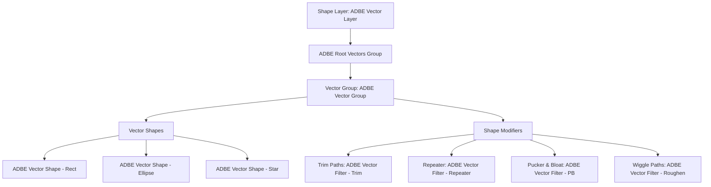
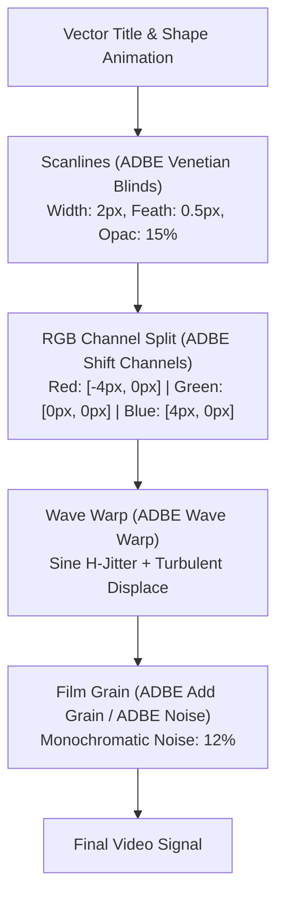
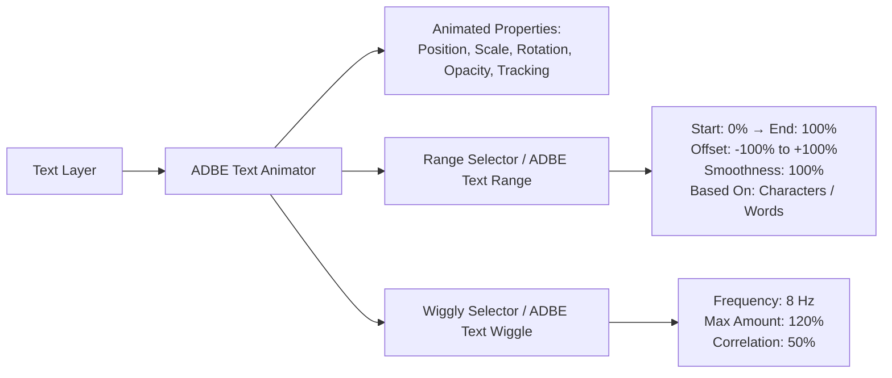
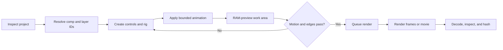

# After Effects Automation & Motion Graphics Guide

Control compositions, procedural vector shapes, advanced text animators, expressions, and distributed headless rendering with `aerender`.

[Back to README](../README.md) · [Architecture & Security](architecture-and-security.md) · [MCP Protocol 2026](mcp-protocol-2026.md)

---

## 1. Architecture & ExtendScript Bridge

After Effects automation operates over an allowlisted ScriptUI Bridge panel (`AfterEffectsBridge.jsx`) and a high-throughput headless CLI worker (`aerender`).

```
┌─────────────────────────────────────────────────────────────────────────┐
│                           MCP Client / LLM                              │
└────────────────────────────────────┬────────────────────────────────────┘
                                     │ JSON-RPC 2.0
                                     ▼
┌─────────────────────────────────────────────────────────────────────────┐
│                    @adobe-mcp/gateway (Policy / R0-R4)                  │
└────────────────────────────────────┬────────────────────────────────────┘
                                     │ Local IPC / TCP Loopback
                                     ▼
┌─────────────────────────────────────────────────────────────────────────┐
│                   @adobe-mcp/bridge-aftereffects                        │
└───────────────────┬─────────────────────────────────┬───────────────────┘
                    │ Allowlisted JSON RPC            │ Process Spawn (shell: false)
                    ▼                                 ▼
   ┌─────────────────────────────────┐   ┌────────────────────────────────┐
   │    AfterEffectsBridge.jsx       │   │       aerender CLI Worker      │
   │  • ScriptUI Panel / Loopback    │   │  • Headless Frame Rendering    │
   │  • Bounded Match Name Traversal │   │  • Parallel Chunk Segmentation │
   │  • Guaranteed Undo Groups       │   │  • Content-Addressed SHA-256   │
   └─────────────────────────────────┘   └────────────────────────────────┘
```

### 1.1 Bridge Safety Rules
* **Undo Group Discipline**: Mutation batches are wrapped in `app.beginUndoGroup(name)` / `app.endUndoGroup()` with `finally`-style cleanup. An undo group improves recoverability but is not proof of transactional rollback; receipts must state the actual restore guarantee.
* **Match Names vs Localized Strings**: Property navigation uses certified Adobe Match Names (e.g., `ADBE Vector Shape - Rect`, `ADBE Vector Filter - Trim`), preventing runtime breakage across localized host installations.

---

## 2. Procedural Shape Modifiers & Vector Architecture

Shape layers are composed of nested vector groups and dynamic operators.



### 2.1 Modifier Reference & Recipes
| Modifier Name | Adobe Match Name | Key Properties | Visual Impact |
|---|---|---|---|
| **Trim Paths** | `ADBE Vector Filter - Trim` | `start` ($0\text{--}100\%$), `end` ($0\text{--}100\%$), `offset` (deg) | Progressive stroke reveal, wireframe laser scans |
| **Repeater** | `ADBE Vector Filter - Repeater` | `copies` ($1\text{--}1000$), `offset`, `position`, `scale`, `rotation` | Grid matrix duplication, retro tunnel arrays |
| **Pucker & Bloat**| `ADBE Vector Filter - PB` | `amount` ($-100\%\text{ to }+100\%$) | Organic starburst spikes ($>0$) or bulbous curves ($<0$) |
| **Wiggle Paths** | `ADBE Vector Filter - Roughen` | `size`, `detail`, `frequency` | Electric sparks, jittering hand-drawn contours |

---

## 3. Procedural Film Grain, Noise & Analog Retro Recipes

Authentic analog motion graphics and stylized visuals require layered physical optical artifacts, CRT phosphor simulation, and color fringing.



### 3.1 Step-by-Step Retro Analog Blueprint
1. **Procedural Scanlines**:
   * Apply `ADBE Venetian Blinds` to a top-level adjustment layer:
     * `Transition Completion`: $15\%$
     * `Direction`: $90.0^\circ$
     * `Width`: $2\text{ px}$
     * `Feather`: $0.5\text{ px}$
2. **RGB Chromatic Aberration**:
   * Duplicate composition content into 3 sub-layers set to `Screen` blend mode.
   * Apply `ADBE Shift Channels` (Layer 1: Take Red only; Layer 2: Take Green only; Layer 3: Take Blue only).
   * Apply horizontal drift displacement expression to the Red channel:
     ```javascript
     seedRandom(Math.floor(timeToFrames(time)), true);
     var drift = Math.sin(time * 12) * 3.5;
     var glitch = (random() > 0.96) ? random(-8, 8) : 0;
     [value[0] + drift + glitch, value[1]];
     ```
3. **Procedural 35mm / 16mm Noise & Grain**:
   * Apply `ADBE Noise` with `Amount: 14%`, `Use Noise: Monochromatic: false`.
   * Stagger frame luminance with a deterministic per-frame seed, for example `seedRandom(Math.floor(timeToFrames(time)), true); 85 + random(0, 15)`.

---

## 4. Expression Controls & Advanced Text Animators

Text Animators provide character-level procedural motion without requiring manual keyframing of individual glyphs.



### 4.1 Typed Expression Controls
The bridge registers certified expression control match names:
* **Slider Control**: `ADBE Slider Control`
* **Color Control**: `ADBE Color Control`
* **Point Control**: `ADBE Point Control`
* **Angle Control**: `ADBE Angle Control`

### 4.2 Inertial Bounce Expression Recipe
```javascript
var amp = effect("Bounce Amplitude")("Slider") / 100;
var freq = effect("Bounce Frequency")("Slider");
var decay = effect("Bounce Decay")("Slider");
var n = 0;
if (numKeys > 0) {
  n = nearestKey(time).index;
  if (key(n).time > time) { n--; }
}
if (n == 0) { t = 0; } else { t = time - key(n).time; }
if (n > 0 && t < 1) {
  var v = velocityAtTime(key(n).time - thisComp.frameDuration / 10);
  value + v * amp * Math.sin(freq * t * 2 * Math.PI) / Math.exp(decay * t);
} else {
  value;
}
```

---

## 5. Headless `aerender` & Distributed Render Architecture

`@adobe-mcp/bridge-aftereffects` manages headless rendering with strict security isolation, execution guarantees, and frame-range chunking.

> [!WARNING]
> Render chunks should be frame sequences or independently valid media segments. Concatenating movie bytes is not container-aware assembly and must not be treated as a finished render.

### 5.1 Process Isolation & Security
* **Official Binary Discovery**: `aerender` is discovered in verified Adobe installation directories.
* **Shell-Free Execution**: Process spawn enforces `shell: false`, rejecting command injection vectors.
* **Cooperative Cancellation**: Graceful termination via `SIGINT` transitioning to `SIGTERM` after a $3000\text{ms}$ timeout.

---

## 6. Ready-to-Use JSON-RPC 2.0 Payloads

### 6.1 Create Procedural Vector Shape Rig
```json
{
  "jsonrpc": "2.0",
  "id": "req-ae-001",
  "method": "tools/call",
  "params": {
    "name": "adobe.aftereffects.shape.create",
    "arguments": {
      "target": {
        "app": "after-effects",
        "projectId": "proj-bumper-01",
        "entityId": "comp-main-title"
      },
      "compId": "comp-main-title",
      "groupName": "NeonGridMatrix",
      "shapes": [
        {
          "type": "rectangle",
          "size": [1600, 900]
        }
      ],
      "modifiers": {
        "trimPaths": {
          "start": 0.0,
          "end": 100.0,
          "offset": 45.0
        },
        "repeater": {
          "copies": 8,
          "offset": [0, 25],
          "scale": 112.0
        },
        "puckerAndBloat": {
          "amount": -35.0
        }
      },
      "options": {
        "operationId": "e4f5a6b7-c8d9-4e0f-1a2b-3c4d5e6f7a8b",
        "expectedRevision": "ae-rev-5012",
        "dryRun": false,
        "atomic": true,
        "conflictPolicy": "fail",
        "verification": "state"
      }
    }
  }
}
```

### 6.2 Animate 3D Typography with Range Selector
```json
{
  "jsonrpc": "2.0",
  "id": "req-ae-002",
  "method": "tools/call",
  "params": {
    "name": "adobe.aftereffects.text.animate",
    "arguments": {
      "target": {
        "app": "after-effects",
        "projectId": "proj-bumper-01"
      },
      "layerId": "layer-title-text",
      "text": "RETRO MOTION 2026",
      "properties": {
        "position": true,
        "rotation": true,
        "opacity": true,
        "tracking": true
      },
      "rangeSelector": {
        "start": 0.0,
        "end": 100.0,
        "offset": 0.0,
        "smoothness": 100.0
      },
      "wiggle": {
        "frequency": 4.5,
        "amplitude": 18.0
      },
      "options": {
        "operationId": "f5a6b7c8-d9e0-4f1a-2b3c-4d5e6f7a8b9c",
        "expectedRevision": "ae-rev-5013",
        "dryRun": false,
        "atomic": true,
        "conflictPolicy": "fail",
        "verification": "state"
      }
    }
  }
}
```

### 6.3 Headless `aerender` Job Execution
```json
{
  "jsonrpc": "2.0",
  "id": "req-ae-004",
  "method": "tools/call",
  "params": {
    "name": "adobe.aftereffects.render",
    "arguments": {
      "projectPath": "D:/projects/bumpers/retro_motion.aep",
      "comp": "comp-main-title",
      "outputPath": "D:/renders/bumpers/retro_motion.mov",
      "startFrame": 0,
      "endFrame": 240,
      "segmentSize": 60,
      "renderSettingsTemplate": "Best Settings",
      "outputModuleTemplate": "ProRes 422 HQ",
      "options": {
        "operationId": "1a2b3c4d-5e6f-7a8b-9c0d-1e2f3a4b5c6d",
        "dryRun": false,
        "atomic": true,
        "conflictPolicy": "fail",
        "verification": "render-proof"
      }
    }
  }
}
```

---

## 7. Composition Engineering Workflow



Build comps around explicit dependencies. A dependable hierarchy is `MASTER` → scene precomps → element precomps → source footage. Put global controls on a clearly named null, keep expression links local where possible, and avoid using mutable layer indexes as identity. Record comp dimensions, pixel aspect, frame rate, work area, duration, renderer, color depth, working space, and revision before writing keyframes.

### 7.1 Rigging discipline

- Use match names for effects and properties; display names are localized and mutable.
- Separate controls from driven properties. A slider named `Grain Amount` is easier to audit than a numeric literal repeated across expressions.
- Keep expression dependencies acyclic and bounded. Inspect for expression errors after every batch.
- Define whether keyframe times are composition, layer, or source time before compiling them.
- Enable motion blur intentionally at both layer and comp level and inspect shutter angle/phase.
- Use one undo group for one logical mutation and return the new project revision.

## 8. Recipe: Animated 1980s Horror Title

This recipe combines condensed typography, perspective, chromatic separation, flicker, red/cyan lighting, and an optical finish. It can be executed in phases even when advanced text animators are capability-gated.

1. **Typography:** use a licensed condensed display face, generous tracking, and a short uppercase phrase. Keep a live-text master before any outline or raster treatment.
2. **Extrusion illusion:** duplicate the title or use a 3D layer with shallow Z depth. Offset a dark red copy down/right and a cyan edge up/left; keep separation around 1–3 px at HD scale.
3. **Reveal:** animate tracking from wide to final while a Range Selector drives opacity from 0 to 100. Offset characters by 2–4 frames for a mechanical crawl.
4. **Impact:** overshoot scale to roughly 103–108%, settle to 100%, and add a short exposure or glow pulse. Use eased keyframes rather than an unbounded bounce.
5. **Instability:** drive position with sub-pixel noise and apply rare, seeded displacement bursts. Continuous large wiggle looks digital and harms readability.
6. **Light:** place a dim cyan ambience behind the title and a localized blood-red practical or gradient on one edge.
7. **Optical finish:** add highlight halation, grain, a light vignette, and optional one-frame flash or splice marks.

```text
MASTER TITLE
  ├─ CTRL — title rig
  ├─ TITLE — bone highlight
  ├─ TITLE — red extrusion
  ├─ TITLE — cyan fringe
  ├─ LIGHT — red practical
  ├─ FX — halation
  ├─ FX — grain
  └─ FX — vignette
```

Test at full resolution on a representative dark and bright background. Verify that chromatic offsets do not close counters, motion blur does not erase thin strokes, and the title remains inside title-safe bounds.

## 9. Recipe: Vintage Film Grain and Gate Texture

Use moving grain, not static noise. Realistic texture has temporal variation, a defined scale, and different behavior in luma and chroma.

### 9.1 Procedural stack

1. Create a 50% gray solid named `FX — grain luma` and apply a capability-checked noise/fractal effect.
2. Animate evolution with a bounded, loopable rate; retain the random seed for reproducibility.
3. Keep the texture monochrome, tighten it with Levels, and composite with `Overlay` or `Soft Light` at low opacity.
4. Duplicate for coarse clumps only if needed; blur slightly so the result is not single-pixel video noise.
5. Reduce grain in extreme shadows and highlights with a luma matte.
6. Add independent dust/scratch footage on `Screen`, never baked into the grain layer.
7. Simulate gate weave on a parent null with very small, slow position/rotation changes. At 1920×1080, begin below roughly 1–2 px and 0.05–0.15°, then judge visually.
8. Add halation from thresholded bright regions, blurred and tinted orange-red. Keep it edge-localized.

| Stock impression | Grain scale | Temporal character | Companion effects |
|---|---|---|---|
| Fine 35 mm | small | rapid, low amplitude | faint halation |
| Fast 35 mm | medium | rapid, visible | stronger color variation |
| 16 mm print | coarse | lively | weave, sparse dust, occasional scratch |
| Distressed release print | mixed | irregular | splice flashes, density breathing |

### 9.2 Scanned grain plate

For maximum authenticity, place a licensed scanned plate at native cadence and sufficient resolution. Confirm whether it is log, linear, or display-referred; neutralize unwanted base color only when appropriate. Loop with a non-obvious offset or use a plate longer than the shot. Record the plate artifact digest, starting frame, blend mode, opacity, and any transforms in the receipt.

Render a short high-bitrate proof. Fine procedural grain can alias during scaling, disappear in temporal compression, or become blocks after delivery encoding.

## 10. Keyframe and Motion Recipes

### Organic settle without an expression

For a deterministic scale settle, use four keyframes: `0%` at frame 0, `106%` at frame 8, `98.5%` at frame 13, and `100%` at frame 18. Apply strong ease-out on arrival and decreasing velocity on each oscillation. Scale the timing to the comp frame rate, not wall-clock guesses.

### Seamless loop

Ensure the last sampled frame is not a duplicate of the first when the renderer includes both endpoints. For a two-second loop at 24 fps, design 48 unique frame intervals and preview the wrap from the final visible frame back to frame zero.

### Responsive layout

Drive dependent layers from one control null and measured source bounds. Check longest localized text, multiline text, right-to-left text, and missing-glyph behavior. Expressions that read text bounds must handle empty strings and disabled layers without throwing.

## 11. Rendering, Verification, and Failure Recovery

Use frame sequences for chunked or restartable renders; they make missing-frame detection and retries deterministic. Movie-container chunks cannot generally be assembled by concatenating bytes. Keep source projects immutable by rendering from a saved copy when the workflow requires headless execution.

Verify:

- every expected frame exists and decodes;
- frame numbering, dimensions, bit depth, alpha interpretation, and color metadata match the plan;
- audio start, duration, sample rate, and channel layout match where audio is included;
- no expression, missing-footage, missing-font, or effect warnings occurred;
- the first, last, and several interior frames visually match the comp;
- final artifacts have recorded byte lengths and SHA-256 digests.

| Symptom | Likely cause | Corrective action |
|---|---|---|
| Grain freezes | static noise or posterized-time placement | animate evolution or use a moving plate |
| Loop pops | duplicated endpoint or discontinuous seed | render unique intervals and match the wrap |
| Text animator changes wrong characters | selector basis/range mismatch | inspect selector units and test edge strings |
| Render differs from preview | renderer, color, resolution, or proxy mismatch | record and compare comp/render settings |
| Chunk has missing frames | inclusive range math or worker failure | validate manifest and rerender only missing ranges |
| Expression slows project | unbounded sampling or deep cross-comp dependencies | cache inputs, simplify, or bake reviewed keyframes |
