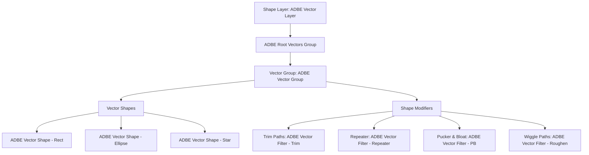
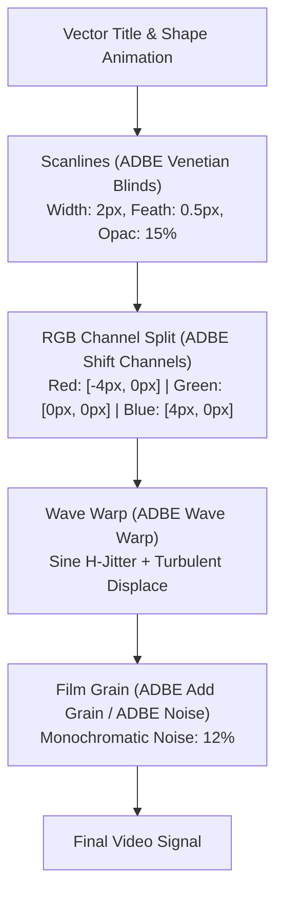
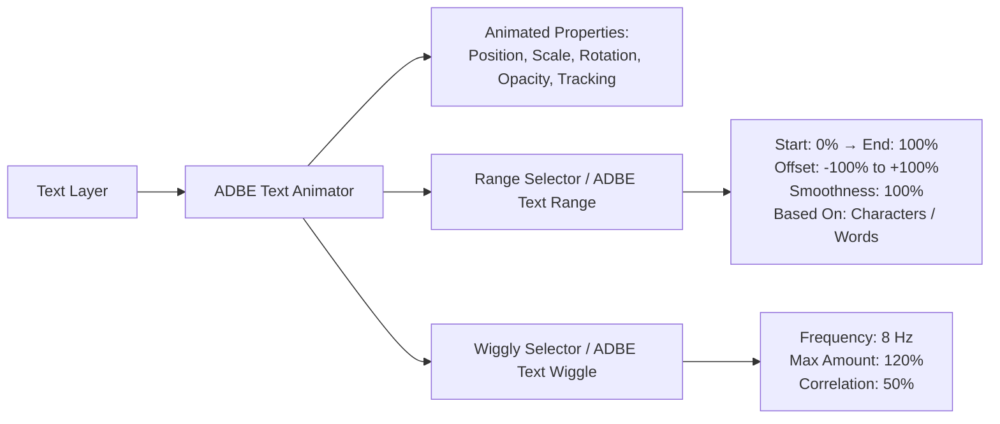

# After Effects Automation & Motion Graphics Guide

Control compositions, procedural vector shapes, advanced text animators, expressions, and distributed headless rendering with `aerender`.

[Back to README](../README.md) · [Architecture & Security](architecture-and-security.md) · [MCP Protocol 2026](mcp-protocol-2026.md)

---

## 1. Architecture & ExtendScript Bridge

After Effects automation operates over an allowlisted ScriptUI Bridge panel (`AfterEffectsBridge.jsx`) and a high-throughput headless CLI worker (`aerender`).

```
┌─────────────────────────────────────────────────────────────────────────┐
│                           MCP Client / LLM                              │
└────────────────────────────────────┬────────────────────────────────────┘
                                     │ JSON-RPC 2.0
                                     ▼
┌─────────────────────────────────────────────────────────────────────────┐
│                    @adobe-mcp/gateway (Policy / R0-R4)                  │
└────────────────────────────────────┬────────────────────────────────────┘
                                     │ Local IPC / TCP Loopback
                                     ▼
┌─────────────────────────────────────────────────────────────────────────┐
│                   @adobe-mcp/bridge-aftereffects                        │
└───────────────────┬─────────────────────────────────┬───────────────────┘
                    │ Allowlisted JSON RPC            │ Process Spawn (shell: false)
                    ▼                                 ▼
   ┌─────────────────────────────────┐   ┌────────────────────────────────┐
   │    AfterEffectsBridge.jsx       │   │       aerender CLI Worker      │
   │  • ScriptUI Panel / Loopback    │   │  • Headless Frame Rendering    │
   │  • Bounded Match Name Traversal │   │  • Parallel Chunk Segmentation │
   │  • Guaranteed Undo Groups       │   │  • Content-Addressed SHA-256   │
   └─────────────────────────────────┘   └────────────────────────────────┘
```

### 1.1 Bridge Safety Rules
* **Guaranteed Undo Transactionality**: Every mutation batch is wrapped inside an atomic `app.beginUndoGroup(name)` and `app.endUndoGroup()` block.
* **Match Names vs Localized Strings**: Property navigation uses certified Adobe Match Names (e.g., `ADBE Vector Shape - Rect`, `ADBE Vector Filter - Trim`), preventing runtime breakage across localized host installations.

---

## 2. Procedural Shape Modifiers & Vector Architecture

Shape layers are composed of nested vector groups and dynamic operators.



### 2.1 Modifier Reference & Recipes
| Modifier Name | Adobe Match Name | Key Properties | Visual Impact |
|---|---|---|---|
| **Trim Paths** | `ADBE Vector Filter - Trim` | `start` ($0\text{--}100\%$), `end` ($0\text{--}100\%$), `offset` (deg) | Progressive stroke reveal, wireframe laser scans |
| **Repeater** | `ADBE Vector Filter - Repeater` | `copies` ($1\text{--}1000$), `offset`, `position`, `scale`, `rotation` | Grid matrix duplication, retro tunnel arrays |
| **Pucker & Bloat**| `ADBE Vector Filter - PB` | `amount` ($-100\%\text{ to }+100\%$) | Organic starburst spikes ($>0$) or bulbous curves ($<0$) |
| **Wiggle Paths** | `ADBE Vector Filter - Roughen` | `size`, `detail`, `frequency` | Electric sparks, jittering hand-drawn contours |

---

## 3. Procedural Film Grain, Noise & Analog Retro Recipes

Authentic analog motion graphics and stylized visuals require layered physical optical artifacts, CRT phosphor simulation, and color fringing.



### 3.1 Step-by-Step Retro Analog Blueprint
1. **Procedural Scanlines**:
   * Apply `ADBE Venetian Blinds` to a top-level adjustment layer:
     * `Transition Completion`: $15\%$
     * `Direction`: $90.0^\circ$
     * `Width`: $2\text{ px}$
     * `Feather`: $0.5\text{ px}$
2. **RGB Chromatic Aberration**:
   * Duplicate composition content into 3 sub-layers set to `Screen` blend mode.
   * Apply `ADBE Shift Channels` (Layer 1: Take Red only; Layer 2: Take Green only; Layer 3: Take Blue only).
   * Apply horizontal drift displacement expression to the Red channel:
     ```javascript
     var drift = Math.sin(time * 12) * 3.5;
     var glitch = (random() > 0.96) ? random(-8, 8) : 0;
     [value[0] + drift + glitch, value[1]];
     ```
3. **Procedural 35mm / 16mm Noise & Grain**:
   * Apply `ADBE Noise` with `Amount: 14%`, `Use Noise: Monochromatic: false`.
   * Stagger frame luminance using expression on adjustment layer opacity: `85 + random(0, 15)`.

---

## 4. Expression Controls & Advanced Text Animators

Text Animators provide character-level procedural motion without requiring manual keyframing of individual glyphs.



### 4.1 Typed Expression Controls
The bridge registers certified expression control match names:
* **Slider Control**: `ADBE Slider Control`
* **Color Control**: `ADBE Color Control`
* **Point Control**: `ADBE Point Control`
* **Angle Control**: `ADBE Angle Control`

### 4.2 Inertial Bounce Expression Recipe
```javascript
var amp = effect("Bounce Amplitude")("Slider") / 100;
var freq = effect("Bounce Frequency")("Slider");
var decay = effect("Bounce Decay")("Slider");
var n = 0;
if (numKeys > 0) {
  n = nearestKey(time).index;
  if (key(n).time > time) { n--; }
}
if (n == 0) { t = 0; } else { t = time - key(n).time; }
if (n > 0 && t < 1) {
  var v = velocityAtTime(key(n).time - thisComp.frameDuration / 10);
  value + v * amp * Math.sin(freq * t * 2 * Math.PI) / Math.exp(decay * t);
} else {
  value;
}
```

---

## 5. Headless `aerender` & Distributed Render Architecture

`@adobe-mcp/bridge-aftereffects` manages headless rendering with strict security isolation, execution guarantees, and frame-range chunking.

### 5.1 Process Isolation & Security
* **Official Binary Discovery**: `aerender` is discovered in verified Adobe installation directories.
* **Shell-Free Execution**: Process spawn enforces `shell: false`, rejecting command injection vectors.
* **Cooperative Cancellation**: Graceful termination via `SIGINT` transitioning to `SIGTERM` after a $3000\text{ms}$ timeout.

---

## 6. Ready-to-Use JSON-RPC 2.0 Payloads

### 6.1 Create Procedural Vector Shape Rig
```json
{
  "jsonrpc": "2.0",
  "id": "req-ae-001",
  "method": "tools/call",
  "params": {
    "name": "adobe.aftereffects.shape.create",
    "arguments": {
      "target": {
        "app": "after-effects",
        "projectId": "proj-bumper-01",
        "entityId": "comp-main-title"
      },
      "compId": "comp-main-title",
      "groupName": "NeonGridMatrix",
      "shapes": [
        {
          "type": "rectangle",
          "size": [1600, 900]
        }
      ],
      "modifiers": {
        "trimPaths": {
          "start": 0.0,
          "end": 100.0,
          "offset": 45.0
        },
        "repeater": {
          "copies": 8,
          "offset": [0, 25],
          "scale": 112.0
        },
        "puckerAndBloat": {
          "amount": -35.0
        }
      },
      "options": {
        "operationId": "e4f5a6b7-c8d9-4e0f-1a2b-3c4d5e6f7a8b",
        "expectedRevision": "ae-rev-5012",
        "dryRun": false,
        "atomic": true,
        "conflictPolicy": "fail",
        "verification": "state"
      }
    }
  }
}
```

### 6.2 Animate 3D Typography with Range Selector
```json
{
  "jsonrpc": "2.0",
  "id": "req-ae-002",
  "method": "tools/call",
  "params": {
    "name": "adobe.aftereffects.text.animate",
    "arguments": {
      "target": {
        "app": "after-effects",
        "projectId": "proj-bumper-01"
      },
      "layerId": "layer-title-text",
      "text": "RETRO MOTION 2026",
      "properties": {
        "position": true,
        "rotation": true,
        "opacity": true,
        "tracking": true
      },
      "rangeSelector": {
        "start": 0.0,
        "end": 100.0,
        "offset": 0.0,
        "smoothness": 100.0
      },
      "wiggle": {
        "frequency": 4.5,
        "amplitude": 18.0
      },
      "options": {
        "operationId": "f5a6b7c8-d9e0-4f1a-2b3c-4d5e6f7a8b9c",
        "expectedRevision": "ae-rev-5013",
        "dryRun": false,
        "atomic": true,
        "conflictPolicy": "fail",
        "verification": "state"
      }
    }
  }
}
```

### 6.3 Headless `aerender` Job Execution
```json
{
  "jsonrpc": "2.0",
  "id": "req-ae-004",
  "method": "tools/call",
  "params": {
    "name": "adobe.aftereffects.render",
    "arguments": {
      "projectPath": "D:/projects/bumpers/retro_motion.aep",
      "comp": "comp-main-title",
      "outputPath": "D:/renders/bumpers/retro_motion.mov",
      "startFrame": 0,
      "endFrame": 240,
      "segmentSize": 60,
      "renderSettingsTemplate": "Best Settings",
      "outputModuleTemplate": "ProRes 422 HQ",
      "options": {
        "operationId": "1a2b3c4d-5e6f-7a8b-9c0d-1e2f3a4b5c6d",
        "dryRun": false,
        "atomic": true,
        "conflictPolicy": "fail",
        "verification": "render-proof"
      }
    }
  }
}
```
