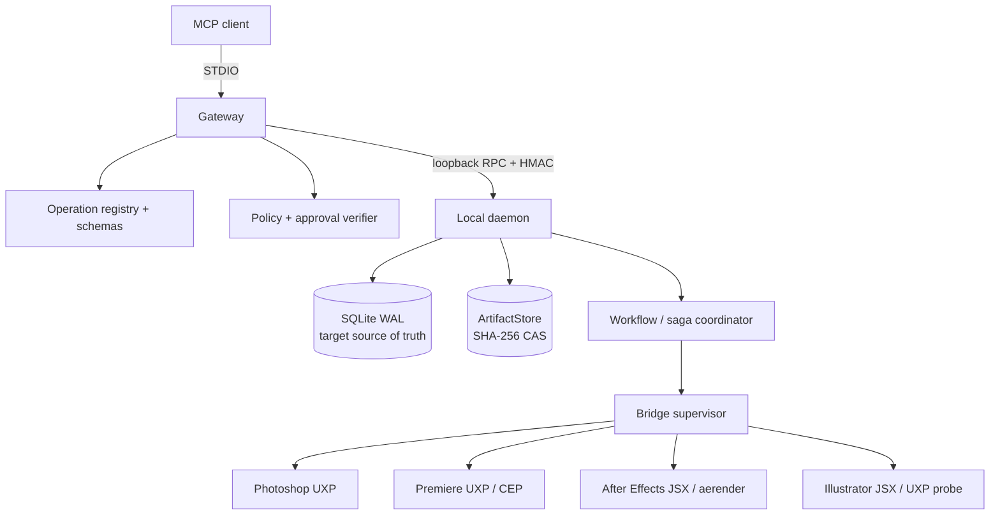
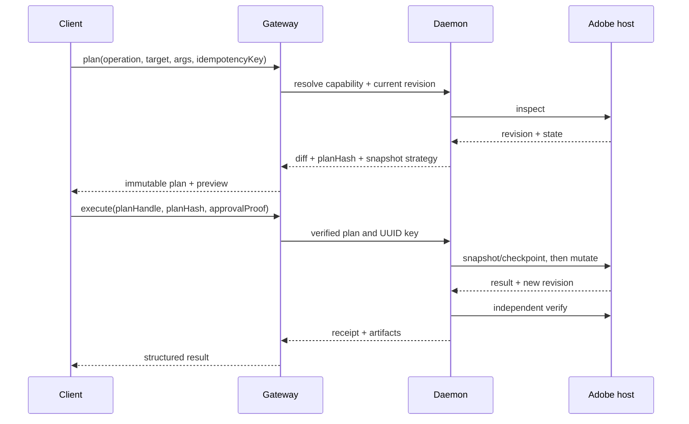

# Architecture and security

`kirei-adobe-mcp` separates the agent-facing protocol, durable orchestration, and Adobe host execution so each boundary can be authenticated, constrained, and audited independently.

[Back to README](../README.md) · [MCP protocol](mcp-protocol-2026.md)

## System model



The gateway owns MCP serialization, strict input/output validation, public error normalization, and policy evaluation. It does not load Adobe SDKs or spawn media tools. The daemon owns authenticated bridge sessions, routing, locks, jobs, artifacts, and recovery. Panels make outbound local connections and translate typed DTOs into host APIs.

## Trust boundaries

### MCP client → gateway

All input is untrusted. Public schemas are strict, bounded, and versioned. The gateway resolves tool/operation names from an allowlist, calculates effective risk from scope and content, and emits safe errors without local paths or stack traces.

### Gateway → daemon

The daemon listens on `127.0.0.1` only. The token never enters the URL or logs. A peer proves possession through:

```text
HMAC-SHA-256(
  token,
  "adobe-mcp" || protocolVersion || clientNonce || serverNonce || sessionId
)
```

Nonces have an expiry, comparison is constant-time, and replay is rejected. Frames are limited to 8 MiB; larger content moves through an artifact reference.

### Daemon → application bridge

Each bridge announces application, host version, adapter version, instance ID, capabilities, and limits. A production daemon intersects claims with a signed handler manifest and a host-evidence matrix. It does not trust an arbitrary capability string from a panel.

Methods and handlers are allowlisted. Photoshop Action Manager descriptors are generated internally; Premiere CEP passes only a fixed handler plus JSON; After Effects and Illustrator do not evaluate incoming JSX; `aerender` is spawned from an official path with `shell: false`.

## Risk model R0–R4

| Level | Meaning | Examples | Required control |
|---:|---|---|---|
| R0 | Read-only protocol or metadata | status, schemas, bounded inspection | validation and rate limits |
| R1 | Analysis, preview, or plan; no destructive mutation | preview, transcript read, plan compilation | revision capture and audit |
| R2 | Reversible document mutation | create layer, change property, add keyframes | immutable plan, revision check, tested undo/snapshot strategy |
| R3 | Destructive/bulk change, overwrite/export, cloud or credits | ripple delete, expanded trace, generative fill, bulk export | mandatory approval bound to plan, verified snapshot, scope/cost limits |
| R4 | Irreversible or privileged high-impact action | overwrite originals, sensitive egress, massive destructive batch | reinforced recent approval, hard ceilings, tested recovery; unattended deny by default |

Scope can elevate risk. More than 50 entities, 10 files, 5 GiB, or 10 minutes raises the baseline level in the v1 policy model.

## Plan-hash approvals

Approval authorizes one frozen plan, not a tool name in the abstract. Planning canonicalizes operation version, arguments, target IDs, expected revisions, scope, snapshot strategy, costs, and side effects. SHA-256 over the canonical representation yields `planHash`.

The approval proof binds:

```text
identity
+ planHash
+ target IDs and expected revision
+ snapshot digest
+ risk
+ maximum entities/files/bytes/duration/credits
+ allowed side effects and egress
+ expiry
+ single-use nonce
```

The proof is signed with a local approval secret. Before execution the gateway verifies signature, hash, scope hash, risk, expiry, and nonce, then atomically marks the nonce consumed. Reusing the proof for a different document, revision, operation, or enlarged batch fails with `PERMISSION_DENIED`.

The user-facing approval envelope includes the natural-language summary, structured diff, before/after evidence, affected IDs and time range, filesystem/network effects, cost estimate, and restore guarantee. “Approve batch” is always bounded.

## Safe mutation lifecycle



Any revision drift between plan and commit returns `CONFLICT`. The server never silently replans a destructive action because a new plan would have a different diff and approval hash.

## SQLite WAL persistence

SQLite in write-ahead logging mode is the target local source of truth for:

- bridge sessions and heartbeats;
- jobs, phases, and ordered progress events;
- immutable plan handles and expirations;
- operation receipts and postconditions;
- UUID idempotency records and input hashes;
- approval nonces and their consumed state;
- document leases and fencing tokens;
- workflow/saga instances, prepared/committed steps, and compensation state;
- artifact indexes, retention, and quota accounting.

Transactions commit state transitions before events become visible. Monotonic event sequence numbers support resume. Migrations are versioned and transactional. WAL allows readers such as status/resource requests to proceed while a worker records progress.

### Current implementation gap

`0.1.0` still keeps several structures in memory, stores daemon operation deduplication in a local JSON file, and uses an in-memory saga log. SQLite WAL, durable approval-nonce consumption, leases, and crash recovery are target architecture—not completed guarantees. Until that layer lands, do not claim that jobs, approvals, or cross-app rollback survive process restart.

## UUID idempotency

Every mutating request carries an `operationId` UUID (or a v2 `idempotencyKey`). The persistence key is scoped to the operation version and target. The first execution stores an input hash and receipt.

- Same key + same canonical input returns the original receipt.
- Same key + different input returns `CONFLICT`.
- A prepared-but-unconfirmed step is reconciled against the host revision or marker after restart.
- Compensation uses a different deterministic key so it cannot be mistaken for the forward operation.

Idempotency prevents duplicate side effects; it does not make a failed multi-application workflow atomic.

## Session and lease management

Bridge sessions have an authenticated identity, host instance, capabilities, start time, last heartbeat, and expiry. The lifecycle is:

```text
discovered → connecting → ready ⇄ busy
                  │          │
                  └────► degraded → disconnected → expired
```

Heartbeats detect degradation after 30 seconds and disconnection after 45 seconds in the v1 design. A mutation acquires a document/project lease with a fencing token. Stale workers cannot commit after losing a lease. Multiple reads are allowed up to bridge limits; only one mutation proceeds per root document.

Targets should name an explicit `instanceId` and root ID. Selection by “currently focused app” is permitted only as an initial convenience and resolves to a stable target before planning.

## Immutable content-addressed ArtifactStore

`packages/artifact-store` derives the key from the bytes:

```text
sha256 = SHA-256(bytes)
uri    = artifact://sha256-<sha256>
path   = <private-root>/sha256/<first-two-hex>/<sha256>
```

Data is written with create-if-absent semantics. If the digest already exists, stored bytes are rehashed. Metadata records media type, byte length, creation time, immutability, provenance, and the canonical URI. Every `get` verifies both bytes and metadata.

Artifacts carry previews, exports, manifests, reports, and restorable snapshots between applications without revealing filesystem paths. Identical bytes deduplicate automatically. Production hardening still needs quotas, garbage collection, atomic multi-file manifests, retention policy, and optional encryption for sensitive content.

An `ArtifactRef` is evidence, not automatically a snapshot. A receipt must separately declare whether restoration is tested, best-effort, or unavailable.

## Snapshot tiers

| Tier | Use | Guarantee |
|---|---|---|
| Undo token | small change while host/history remains open | fast but invalidated by history drift |
| Incremental snapshot | selected properties/layers/clips | targeted restore with entity hashes |
| Save-copy | complex document or project | stronger recovery at higher I/O cost |
| Full package | R4 or cross-app workflow | project plus dependencies and manifest |
| Compensation-only | naturally invertible operation | only when inverse and postcondition are tested |

Metadata-only inspection is never labeled a restorable snapshot.

## Cross-application sagas

`packages/workflow-engine` coordinates workflows such as:

```text
Photoshop layer export
  → Illustrator vector composition
  → After Effects motion graphics
  → Premiere timeline assembly
```

Adobe applications do not share an ACID transaction. A saga provides deterministic forward steps, idempotency, checkpoints, and reverse compensation:

1. Validate and topologically sort the workflow DAG.
2. Freeze operation/schema versions, targets, revisions, budgets, and compensation definitions.
3. Acquire leases in canonical order.
4. Persist `StepPrepared` and the selected snapshot before mutation.
5. Execute with a scoped idempotency key.
6. Verify the host postcondition, then persist `StepCommitted` and receipt.
7. On failure, compensate committed steps in reverse order.
8. Report `rolled_back`, `failed`, or `partially_compensated` honestly.

The current engine implements sequential steps, input validation, per-step idempotency in an in-memory log, and reverse compensation callbacks. Durable DAG scheduling, SQLite events, fencing, and restart reconciliation are the target production layer.

Rollback cannot always recreate lost user state. Each compensation declares its real guarantee and a workflow stops for human recovery if the expected revision has drifted.

## Threat model and controls

| Threat | Control |
|---|---|
| Tool/script injection | signed allowlisted registry; no raw eval/JSX/shell/`batchPlay` |
| Web-to-loopback attack | loopback bind, origin/plugin allowlist, challenge-HMAC |
| Replay | expiring challenge nonces and durable single-use approval nonces |
| Confused deputy between apps | owner/app/host-bound target refs and capability grants |
| Path traversal or symlink race | file grants, canonicalization, no-follow/open-time recheck |
| Shell/argv injection | typed argv and `shell: false`; official executable allowlist |
| SSRF or creative-data egress | network deny by default, provider allowlist, explicit R3 approval |
| Malicious media/ZIP bombs | byte, pixel, duration, depth, and decompression limits |
| Stale active document | stable IDs plus `expectedRevision` at commit |
| Secret/content leakage | structured redaction; no tokens, paths, prompts, or binaries in logs |
| Resource exhaustion | frame limits, pagination, concurrency quotas, timeouts, cancellation |
| Supply-chain compromise | pinned lockfile, SBOM/signatures/provenance target, handler hashes |

## Filesystem and egress policy

MCP schemas accept a `grantId` or artifact reference instead of an unrestricted path. The daemon resolves the grant inside an allowed root after canonicalization and verifies the access mode. Exports default to a new destination; overwriting and permanent deletion are denied or elevated.

Cloud operations—including generative fill or cloud Image Trace—are disabled by default. Enabling one requires provider-specific OAuth scope, endpoint allowlist, asset classification, retention disclosure, cost ceiling, and explicit approval.

## Observability

Safe telemetry correlates `traceId`, `requestId`, `operationId`, `jobId`, and `workflowId` with app, host/adapter version, risk, duration, and normalized outcome. It excludes creative payloads and secrets. Receipts provide audit evidence to the caller; logs support operations without becoming a second content store.

Target service objectives include local read p95 below 500 ms, cooperative cancellation acknowledgement below two seconds at safe points, and zero successful mutations without a receipt.

## Deployment checklist

- Bind daemon and panel transports only to loopback.
- Protect the 256-bit token with the OS credential store or user-only ACLs.
- Set and protect `ADOBE_MCP_APPROVAL_SECRET`; never reuse it as ordinary application data.
- Keep `adobe-mcp.policy.json` in the gateway working directory and review allowed roots/risk.
- Deny unknown tools, handlers, descriptor keys, origins, and capabilities.
- Back up or package source projects before R3/R4 work.
- Treat current in-memory jobs/sagas as non-durable until SQLite WAL recovery is implemented.
- Re-certify bridge manifests and host fixtures after each Adobe release.

For exact current v1 contracts, read [SPECS.md](../SPECS.md). For the audited target and implementation sequence, read the [master blueprint](../ULTIMATE_ADOBE_MCP_BLUEPRINT.md).
