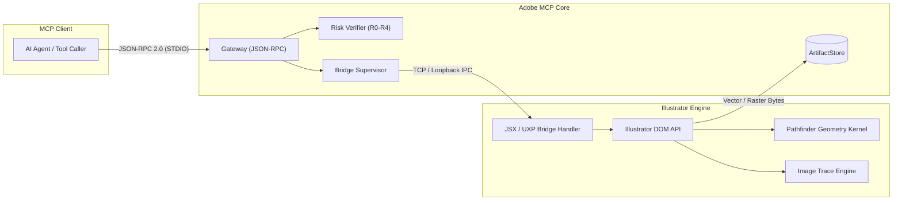
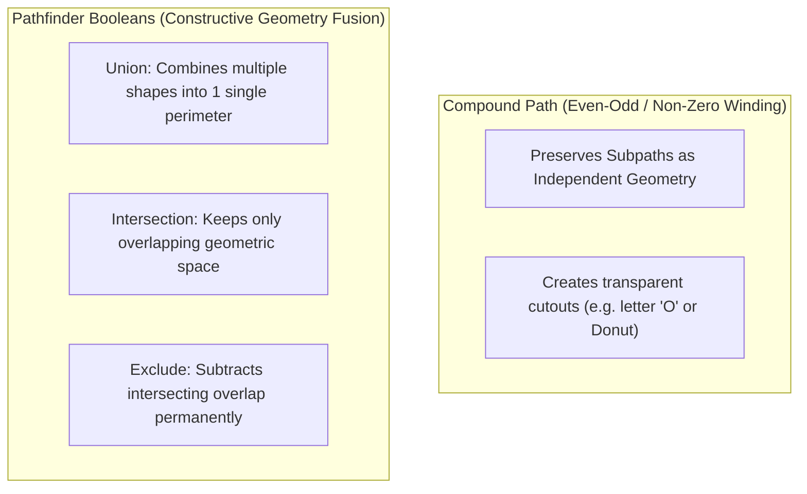

# Adobe Illustrator Automation & Vector MCP Bridge Guide

Construct, transform, vectorize, and export resolution-independent vector graphics through a hardened JSX compatibility bridge and experimental UXP runtime with exact geometric verification.

[Back to README](../README.md) · [Architecture & security](architecture-and-security.md) · [MCP protocol](mcp-protocol-2026.md)

---

## Capability Status Matrix

| Feature Area | Risk Tier | Public MCP Tool / Registry Entry | Implementation Notes |
|---|---|---|---|
| **Document & Artboard Inspection** | **R0** | `adobe.illustrator.inspect`, `adobe.illustrator.document` | Fully implemented. Returns artboards, vector item trees, coordinate systems, and revisions. |
| **Vector Geometry & Primitives** | **R2** | `adobe.illustrator.objects.edit` | Implemented. Handles point tuples, closed paths, stroke weights, fills, and grouping. |
| **Pathfinder & Compound Paths** | **R2** | `adobe.illustrator.objects.edit` (boolean) | Implemented. Native geometric Union, Intersection, and Exclusion with winding-rule preservation. |
| **Image Trace / Live Vectorization** | **R2** | `adobe.illustrator.imageTrace` | Implemented. Presets: `logo`, `silhouette`, `sketch`, `highFidelityPhoto` with threshold & palette quantization. |
| **Global Swatches & Harmonies** | **R1** | `adobe.illustrator.swatches.create` | Implemented. Creates global CMYK/RGB swatches and builds Triadic, Complementary, and Analogous palettes. |
| **Variable OpenType Typography** | **R1** | `adobe.illustrator.typography.variable`, `adobe.illustrator.text.edit` | Implemented. Programmatic control over Weight (`wght`), Width (`wdth`), and Slant (`slnt`) axes. |
| **Multi-Artboard Export** | **R2** | `adobe.illustrator.exportArtboards` | Implemented. Downscales with `maxDimension`, exports SVG/PNG, and writes SHA-256 CAS manifest. |
| **Document Export (AI / PDF / EPS)** | **R1** | `adobe.illustrator.export` | Implemented. Handles whole-document vector export under file grants. |
| **Symbols & Graphic Styles** | **R2** | `adobe.illustrator.symbols.manage` | Registry implemented. Manages reusable vector symbols and graphic style libraries. |

---

## Connection & Bridge Architecture

Adobe Illustrator integration operates through two primary channels:
1. **Hardened JSX Bridge (Default / Recommended)**: Executes hash-verified ExtendScript handlers located in `packages/bridge-illustrator/src/jsx/` with strict JSON parameter validation. Arbitrary string interpolation is strictly blocked.
2. **Experimental UXP Panel (`apps/illustrator-uxp/manifest.json`)**: Available for modern Illustrator builds with UXP Developer Tool.



---

## Document & Artboard Inspection

Inspection returns exact artboard dimensions, coordinate bounds, ruler origins, active layer hierarchies, and document color spaces (CMYK vs RGB):

```json
{
  "jsonrpc": "2.0",
  "id": 20,
  "method": "tools/call",
  "params": {
    "name": "adobe.illustrator.inspect",
    "arguments": {
      "target": { "app": "illustrator" },
      "options": { "depth": 2 }
    }
  }
}
```

---

## Vector Primitives & Geometry

The bridge accepts explicit Cartesian coordinates `[x, y]`, winding flags, and color space structures.

```json
{
  "jsonrpc": "2.0",
  "id": 21,
  "method": "tools/call",
  "params": {
    "name": "adobe.illustrator.objects.edit",
    "arguments": {
      "target": { "app": "illustrator", "documentId": "ai-doc-9041" },
      "commands": [
        {
          "op": "create-path",
          "tempId": "shape-hex-badge",
          "layerId": "layer-brand-marks",
          "closed": true,
          "points": [
            [200, 100],
            [350, 100],
            [425, 230],
            [350, 360],
            [200, 360],
            [125, 230]
          ],
          "style": {
            "fill": { "space": "cmyk", "components": [0.85, 0.45, 0.0, 0.1], "alpha": 1.0 },
            "stroke": { "space": "cmyk", "components": [0.0, 0.0, 0.0, 1.0], "alpha": 1.0 },
            "strokeWidth": 4.0
          }
        }
      ],
      "options": {
        "operationId": "f1a2b3c4-0001-4000-8000-000000000001",
        "expectedRevision": "ai-rev-4410",
        "verification": "state"
      }
    }
  }
}
```

---

## Compound Paths vs. Pathfinder Boolean Operations



### Executing a Boolean Union:
```json
{
  "jsonrpc": "2.0",
  "id": 22,
  "method": "tools/call",
  "params": {
    "name": "adobe.illustrator.objects.edit",
    "arguments": {
      "target": { "app": "illustrator", "documentId": "ai-doc-9041" },
      "commands": [
        {
          "op": "boolean",
          "operation": "union",
          "itemIds": ["shape-hex-badge", "shape-inner-crest"]
        }
      ],
      "options": {
        "operationId": "f1a2b3c4-0002-4000-8000-000000000002",
        "expectedRevision": "ai-rev-4411"
      }
    }
  }
}
```

---

## Vectorization with Image Trace

The `adobe.illustrator.imageTrace` tool converts placed raster bitmaps into clean vector paths using specialized presets (`logo`, `silhouette`, `sketch`, `highFidelityPhoto`):

```json
{
  "jsonrpc": "2.0",
  "id": 24,
  "method": "tools/call",
  "params": {
    "name": "adobe.illustrator.imageTrace",
    "arguments": {
      "target": { "app": "illustrator", "documentId": "ai-doc-9041" },
      "imageId": "raster-scanned-logo",
      "preset": "logo",
      "threshold": 128,
      "options": {
        "operationId": "f1a2b3c4-0004-4000-8000-000000000004",
        "expectedRevision": "ai-rev-4413",
        "verification": "state"
      }
    }
  }
}
```

---

## Global Swatches & Harmonic Color Palettes

Global swatches link document items to a centralized palette entry: altering the global swatch automatically cascades throughout the entire artwork.

### Curated Color Harmony Palettes:
- **Retro Synthwave**: Neon Magenta `RGB [1.0, 0.05, 0.55]`, Cyber Cyan `RGB [0.0, 0.95, 1.0]`, Sunset Violet `RGB [0.35, 0.05, 0.75]`
- **Vintage Horror**: Crimson Red `CMYK [0.15, 1.0, 0.9, 0.25]`, Acid Ochre `CMYK [0.35, 0.0, 1.0, 0.15]`, Pitch Black `CMYK [0.75, 0.65, 0.65, 0.95]`
- **Corporate Executive**: Navy Blue `CMYK [1.0, 0.82, 0.35, 0.3]`, Slate Gray `CMYK [0.45, 0.35, 0.35, 0.05]`

```json
{
  "jsonrpc": "2.0",
  "id": 25,
  "method": "tools/call",
  "params": {
    "name": "adobe.illustrator.swatches.create",
    "arguments": {
      "target": { "app": "illustrator", "documentId": "ai-doc-9041" },
      "colors": [
        {
          "name": "Synthwave_Neon_Magenta",
          "color": { "space": "rgb", "components": [1.0, 0.05, 0.55], "alpha": 1.0 },
          "global": true
        },
        {
          "name": "Synthwave_Cyber_Cyan",
          "color": { "space": "rgb", "components": [0.0, 0.95, 1.0], "alpha": 1.0 },
          "global": true
        }
      ],
      "harmony": "triadic",
      "options": {
        "operationId": "f1a2b3c4-0005-4000-8000-000000000005",
        "expectedRevision": "ai-rev-4414"
      }
    }
  }
}
```

---

## Variable OpenType Typography

The `adobe.illustrator.typography.variable` tool controls continuous variation axes in modern variable fonts:

- **Weight (`wght`)**: $1\text{--}1000$ (Thin $\rightarrow$ UltraBlack)
- **Width (`wdth`)**: $1\text{--}1000$ (UltraCondensed $\rightarrow$ UltraExpanded)
- **Slant (`slnt`)**: $-90^\circ\text{ to }+90^\circ$

```json
{
  "jsonrpc": "2.0",
  "id": 26,
  "method": "tools/call",
  "params": {
    "name": "adobe.illustrator.typography.variable",
    "arguments": {
      "target": { "app": "illustrator", "documentId": "ai-doc-9041" },
      "textItemId": "text-brand-headline",
      "fontFamily": "Acumin Variable Concept",
      "axes": {
        "weight": 850,
        "width": 115,
        "slant": -8
      },
      "options": {
        "operationId": "f1a2b3c4-0006-4000-8000-000000000006",
        "expectedRevision": "ai-rev-4415"
      }
    }
  }
}
```

---

## Multi-Artboard Export & Brand Kit Pipeline

```json
{
  "jsonrpc": "2.0",
  "id": 27,
  "method": "tools/call",
  "params": {
    "name": "adobe.illustrator.exportArtboards",
    "arguments": {
      "target": { "app": "illustrator", "documentId": "ai-doc-9041" },
      "artboardIds": ["artboard-logo-primary", "artboard-symbol-square"],
      "format": "png",
      "scale": 2.0,
      "maxDimension": 2160,
      "destination": {
        "grantId": "grant-brand-kit-output",
        "access": "write",
        "suggestedName": "brand-package"
      },
      "mutation": {
        "operationId": "f1a2b3c4-0007-4000-8000-000000000007",
        "expectedRevision": "ai-rev-4415",
        "dryRun": false,
        "atomic": true,
        "verification": "render-proof"
      }
    }
  }
}
```
