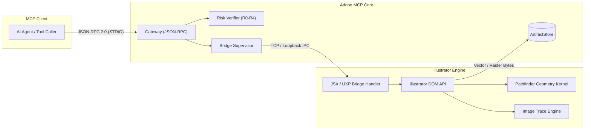
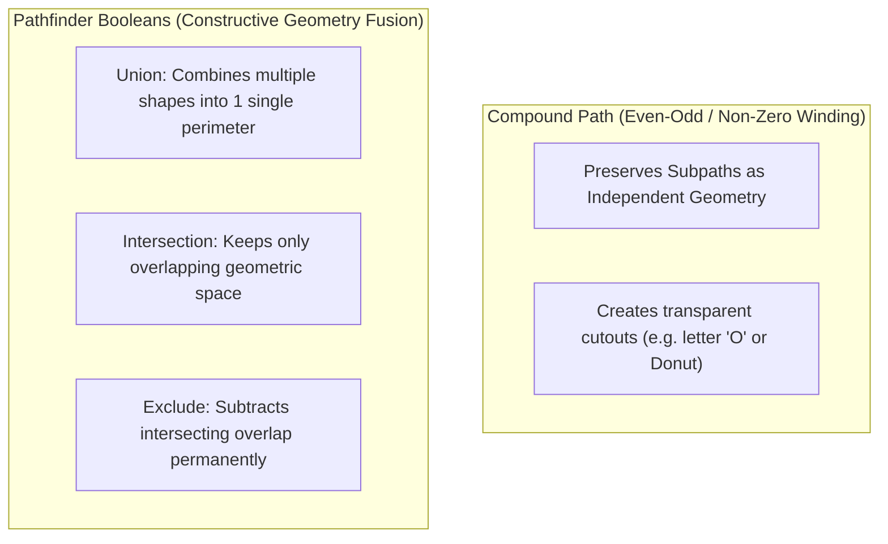
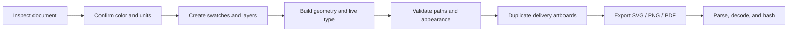

# Adobe Illustrator Automation & Vector MCP Bridge Guide

Construct, transform, vectorize, and export resolution-independent vector graphics through a hardened JSX compatibility bridge and experimental UXP runtime with exact geometric verification.

[Back to README](../README.md) · [Architecture & security](architecture-and-security.md) · [MCP protocol](mcp-protocol-2026.md)

---

## Capability Status Matrix

| Feature Area | Risk Tier | Public MCP Tool / Registry Entry | Implementation Notes |
|---|---|---|---|
| **Document & Artboard Inspection** | **R0** | `adobe.illustrator.inspect`, `adobe.illustrator.document` | Fully implemented. Returns artboards, vector item trees, coordinate systems, and revisions. |
| **Vector Geometry & Primitives** | **R2** | `adobe.illustrator.objects.edit` | Implemented. Handles point tuples, closed paths, stroke weights, fills, and grouping. |
| **Pathfinder & Compound Paths** | **R2** | `adobe.illustrator.objects.edit` (boolean) | Implemented. Native geometric Union, Intersection, and Exclusion with winding-rule preservation. |
| **Image Trace / Live Vectorization** | **R2** | `adobe.illustrator.imageTrace` | Experimental. Presets and controls require host capability evidence and geometry verification. |
| **Global Swatches & Harmonies** | **R1** | `adobe.illustrator.swatches.create` | Implemented. Creates global CMYK/RGB swatches and builds Triadic, Complementary, and Analogous palettes. |
| **Variable OpenType Typography** | **R1** | `adobe.illustrator.typography.variable`, `adobe.illustrator.text.edit` | Experimental/capability-gated. Axis availability and ranges come from the actual font and host. |
| **Multi-Artboard Export** | **R2** | `adobe.illustrator.exportArtboards` | Implemented. Downscales with `maxDimension`, exports SVG/PNG, and writes SHA-256 CAS manifest. |
| **Document Export (AI / PDF / EPS)** | **R1** | `adobe.illustrator.export` | Implemented. Handles whole-document vector export under file grants. |
| **Symbols & Graphic Styles** | **R2** | `adobe.illustrator.symbols.manage` | Experimental registry surface; connected-host verification is required. |

> [!IMPORTANT]
> A catalog entry or schema is not proof of host support. The Illustrator UXP panel remains experimental, and advanced JSX operations require a versioned, hash-verified handler plus real-host capability evidence. Return `UNSUPPORTED_CAPABILITY` instead of substituting grouping, flattening, or another destructive approximation.

---

## Connection & Bridge Architecture

Adobe Illustrator integration operates through two primary channels:
1. **Hardened JSX Bridge (Default / Recommended)**: Executes hash-verified ExtendScript handlers located in `packages/bridge-illustrator/src/jsx/` with strict JSON parameter validation. Arbitrary string interpolation is strictly blocked.
2. **Experimental UXP Panel (`apps/illustrator-uxp/manifest.json`)**: Available for modern Illustrator builds with UXP Developer Tool.



---

## Document & Artboard Inspection

Inspection returns exact artboard dimensions, coordinate bounds, ruler origins, active layer hierarchies, and document color spaces (CMYK vs RGB):

```json
{
  "jsonrpc": "2.0",
  "id": 20,
  "method": "tools/call",
  "params": {
    "name": "adobe.illustrator.inspect",
    "arguments": {
      "target": { "app": "illustrator" },
      "options": { "depth": 2 }
    }
  }
}
```

---

## Vector Primitives & Geometry

The bridge accepts explicit Cartesian coordinates `[x, y]`, winding flags, and color space structures.

```json
{
  "jsonrpc": "2.0",
  "id": 21,
  "method": "tools/call",
  "params": {
    "name": "adobe.illustrator.objects.edit",
    "arguments": {
      "target": { "app": "illustrator", "documentId": "ai-doc-9041" },
      "commands": [
        {
          "op": "create-path",
          "tempId": "shape-hex-badge",
          "layerId": "layer-brand-marks",
          "closed": true,
          "points": [
            [200, 100],
            [350, 100],
            [425, 230],
            [350, 360],
            [200, 360],
            [125, 230]
          ],
          "style": {
            "fill": { "space": "cmyk", "components": [0.85, 0.45, 0.0, 0.1], "alpha": 1.0 },
            "stroke": { "space": "cmyk", "components": [0.0, 0.0, 0.0, 1.0], "alpha": 1.0 },
            "strokeWidth": 4.0
          }
        }
      ],
      "options": {
        "operationId": "f1a2b3c4-0001-4000-8000-000000000001",
        "expectedRevision": "ai-rev-4410",
        "verification": "state"
      }
    }
  }
}
```

---

## Compound Paths vs. Pathfinder Boolean Operations



### Executing a Boolean Union:
```json
{
  "jsonrpc": "2.0",
  "id": 22,
  "method": "tools/call",
  "params": {
    "name": "adobe.illustrator.objects.edit",
    "arguments": {
      "target": { "app": "illustrator", "documentId": "ai-doc-9041" },
      "commands": [
        {
          "op": "boolean",
          "operation": "union",
          "itemIds": ["shape-hex-badge", "shape-inner-crest"]
        }
      ],
      "options": {
        "operationId": "f1a2b3c4-0002-4000-8000-000000000002",
        "expectedRevision": "ai-rev-4411"
      }
    }
  }
}
```

---

## Vectorization with Image Trace

The `adobe.illustrator.imageTrace` tool converts placed raster bitmaps into clean vector paths using specialized presets (`logo`, `silhouette`, `sketch`, `highFidelityPhoto`):

```json
{
  "jsonrpc": "2.0",
  "id": 24,
  "method": "tools/call",
  "params": {
    "name": "adobe.illustrator.imageTrace",
    "arguments": {
      "target": { "app": "illustrator", "documentId": "ai-doc-9041" },
      "imageId": "raster-scanned-logo",
      "preset": "logo",
      "threshold": 128,
      "options": {
        "operationId": "f1a2b3c4-0004-4000-8000-000000000004",
        "expectedRevision": "ai-rev-4413",
        "verification": "state"
      }
    }
  }
}
```

---

## Global Swatches & Harmonic Color Palettes

Global swatches link document items to a centralized palette entry: altering the global swatch automatically cascades throughout the entire artwork.

### Curated Color Harmony Palettes:
- **Retro Synthwave**: Neon Magenta `RGB [1.0, 0.05, 0.55]`, Cyber Cyan `RGB [0.0, 0.95, 1.0]`, Sunset Violet `RGB [0.35, 0.05, 0.75]`
- **Vintage Horror**: Crimson Red `CMYK [0.15, 1.0, 0.9, 0.25]`, Acid Ochre `CMYK [0.35, 0.0, 1.0, 0.15]`, Pitch Black `CMYK [0.75, 0.65, 0.65, 0.95]`
- **Corporate Executive**: Navy Blue `CMYK [1.0, 0.82, 0.35, 0.3]`, Slate Gray `CMYK [0.45, 0.35, 0.35, 0.05]`

```json
{
  "jsonrpc": "2.0",
  "id": 25,
  "method": "tools/call",
  "params": {
    "name": "adobe.illustrator.swatches.create",
    "arguments": {
      "target": { "app": "illustrator", "documentId": "ai-doc-9041" },
      "colors": [
        {
          "name": "Synthwave_Neon_Magenta",
          "color": { "space": "rgb", "components": [1.0, 0.05, 0.55], "alpha": 1.0 },
          "global": true
        },
        {
          "name": "Synthwave_Cyber_Cyan",
          "color": { "space": "rgb", "components": [0.0, 0.95, 1.0], "alpha": 1.0 },
          "global": true
        }
      ],
      "harmony": "triadic",
      "options": {
        "operationId": "f1a2b3c4-0005-4000-8000-000000000005",
        "expectedRevision": "ai-rev-4414"
      }
    }
  }
}
```

---

## Variable OpenType Typography

The `adobe.illustrator.typography.variable` tool controls continuous variation axes in modern variable fonts:

- **Weight (`wght`)**: $1\text{--}1000$ (Thin $\rightarrow$ UltraBlack)
- **Width (`wdth`)**: $1\text{--}1000$ (UltraCondensed $\rightarrow$ UltraExpanded)
- **Slant (`slnt`)**: $-90^\circ\text{ to }+90^\circ$

```json
{
  "jsonrpc": "2.0",
  "id": 26,
  "method": "tools/call",
  "params": {
    "name": "adobe.illustrator.typography.variable",
    "arguments": {
      "target": { "app": "illustrator", "documentId": "ai-doc-9041" },
      "textItemId": "text-brand-headline",
      "fontFamily": "Acumin Variable Concept",
      "axes": {
        "weight": 850,
        "width": 115,
        "slant": -8
      },
      "options": {
        "operationId": "f1a2b3c4-0006-4000-8000-000000000006",
        "expectedRevision": "ai-rev-4415"
      }
    }
  }
}
```

---

## Multi-Artboard Export & Brand Kit Pipeline

```json
{
  "jsonrpc": "2.0",
  "id": 27,
  "method": "tools/call",
  "params": {
    "name": "adobe.illustrator.exportArtboards",
    "arguments": {
      "target": { "app": "illustrator", "documentId": "ai-doc-9041" },
      "artboardIds": ["artboard-logo-primary", "artboard-symbol-square"],
      "format": "png",
      "scale": 2.0,
      "maxDimension": 2160,
      "destination": {
        "grantId": "grant-brand-kit-output",
        "access": "write",
        "suggestedName": "brand-package"
      },
      "mutation": {
        "operationId": "f1a2b3c4-0007-4000-8000-000000000007",
        "expectedRevision": "ai-rev-4415",
        "dryRun": false,
        "atomic": true,
        "verification": "render-proof"
      }
    }
  }
}
```

---

## Production Workflow: Brief to Verified Brand Package



Establish the document contract first: artboard sizes, bleed, ruler units, RGB/CMYK mode, assigned profile, raster-effects resolution, and required delivery formats. Use a predictable layer hierarchy such as `GUIDES`, `TYPE`, `ARTWORK`, `IMAGES`, `BACKGROUND`, and keep guides/nonprinting construction geometry out of export bounds.

Create named global swatches before styling objects. Global colors make palette changes auditable and reduce nearly-identical fills. Preserve live text in the master and produce an outlined delivery copy only when requested and approved. Outlining is not a substitute for font licensing or embedding decisions.

### Geometry quality gates

- Closed shapes have intentional winding and no accidental self-intersections.
- Pathfinder output is expanded only when the delivery contract requires expanded paths.
- Strokes, brushes, appearances, clipping masks, and transparency are tested in the target export format.
- Hidden objects, stray points, overset text, missing links, and off-artboard artifacts are reported.
- Pixel-aligned variants are reviewed at their actual raster sizes rather than only at high zoom.

## Detailed Recipe: 1980s Horror Poster System

This vector recipe creates a reusable title, badge, and key-art frame that can move cleanly between Illustrator, Photoshop, Premiere Pro, and After Effects.

### Palette

| Swatch | RGB/hex starting point | Role |
|---|---:|---|
| `Horror/Ink` | `#08070D` | near-black ground |
| `Horror/Midnight` | `#10243E` | cool shadow |
| `Horror/Cyan` | `#2B9AA0` | edge light and secondary type |
| `Horror/Violet` | `#56345F` | bridge tone |
| `Horror/Blood` | `#B51F2E` | focal accent |
| `Horror/Amber` | `#E38A3A` | highlight and rim |
| `Horror/Bone` | `#E6D7B8` | primary title face |

For CMYK delivery, convert through the printer-supplied profile and inspect the result; the hex values are creative references, not press recipes.

### Title construction

1. Set the title in a licensed condensed or angular display face and keep a live-text master.
2. Duplicate to a delivery layer before outlining. Clean compound paths and verify counters after conversion.
3. Create a dark red extrusion by offsetting a duplicate down/right. Use a Pathfinder union only if a single expanded silhouette is required.
4. Add a cyan fringe offset up/left by a smaller distance to suggest chromatic misregistration.
5. Apply a bone-to-amber face gradient with restrained contrast; avoid hairline gradient bands in small exports.
6. Add a thin `Horror/Ink` keyline to preserve the silhouette over both light and dark imagery.
7. Create a separate roughness mask or texture object so distress can be removed for small-format versions.

```text
TYPE — MASTER LIVE
TYPE — DELIVERY
  ├─ Face — bone/amber
  ├─ Keyline — ink
  ├─ Extrusion — blood
  └─ Fringe — cyan
TEXTURE
  ├─ Speckle mask
  ├─ Scratches
  └─ Paper grain
```

### Sunburst and frame

Build the background from one wedge rotated around a measured center, then expand only after the wedge count and bounds are correct. Alternate `Horror/Ink` and `Horror/Midnight`; reserve blood red for a small number of focal wedges. For the frame, use a compound path or clipping mask with a verified inner hole—grouping two rectangles does not create a punched frame.

### Vector film-grain texture

Do not create millions of unbounded points. Use a clipped, seeded set of small shapes, a raster-effect texture at the declared raster-effects resolution, or an authorized texture artifact. Separate fine grain, dust, and scratches into distinct groups. A print-style starting density is 2–5% coverage for fine speckle and well below 1% for prominent dust/scratches.

Record seed, object count, clipping bounds, opacity, blend mode, and raster-effects resolution. For SVG, test whether masks, filters, and blend modes survive the consuming renderer; simplify or rasterize only the delivery copy when required.

## Responsive Logo and Icon Workflow

One master mark rarely works at every size. Maintain explicit variants:

| Variant | Intended use | Simplification |
|---|---|---|
| Full | print, title card, large web | complete wordmark and detail |
| Compact | social avatar, small lockup | shorter wording, reduced texture |
| Micro | favicon, tiny UI | silhouette only; no fine counters or grain |
| One-color | engraving, vinyl, accessibility | one compound silhouette with verified holes |

Derive variants from shared global swatches and measured construction, but give each its own artboard and stable item IDs. Optical corrections at small sizes are legitimate; do not force a mathematically scaled full mark when counters collapse.

## Typography Handoff

Before delivery, report font family, style, PostScript name where available, variable-axis values, OpenType features, tracking, leading, and missing-glyph state. Test representative accented characters and the longest localized strings. If a variable axis is unsupported, fail explicitly rather than silently substituting a static face.

When outlining is approved:

1. Duplicate the artboard or text layer.
2. Preserve the live-text source.
3. Convert only the delivery copy.
4. Verify counters, path count, bounds, appearance, and reading order metadata requirements.
5. Record the font fingerprint and outlined item IDs in the receipt.

## Export Matrix and Verification

| Format | Use | Verify |
|---|---|---|
| AI | editable master | links, fonts, profile, artboards, live appearances |
| PDF | print/review | trim/bleed boxes, embedded profile/fonts, overprint, transparency |
| SVG | web/vector handoff | parsed XML, viewBox, dimensions, masks, IDs, no unintended external links |
| PNG | raster delivery | decoded width/height, alpha, profile, edge quality |
| EPS | legacy handoff | flattened compatibility and explicit loss of modern features |

Use actual artboard bounds, not incidental artwork selection, unless the contract specifically requests item export. After export, reopen or parse every result independently. Compare a raster proof against the source artboard and store the bytes in content-addressed storage.

### Troubleshooting

| Symptom | Likely cause | Correction |
|---|---|---|
| Boolean result has no hole | group used instead of compound path, or winding is wrong | rebuild native compound/Pathfinder geometry and verify winding |
| SVG looks different in browser | unsupported appearance, filter, or blend mode | expand/simplify a delivery copy and test target renderers |
| Thin seams between shapes | antialiasing or fractional coordinates | overlap safely or align delivery geometry to the target pixel grid |
| CMYK reds turn dull | out-of-gamut RGB palette | soft-proof and tune through the supplied press profile |
| Grain makes files huge | excessive vector point count | use bounded seeded texture or rasterize texture in a delivery copy |
| Font unexpectedly changes | missing font/axis/feature | require exact font capability; never silently substitute |
| Artboard export is clipped | effects exceed bounds | include intended bleed/effect bounds and verify decoded output |
