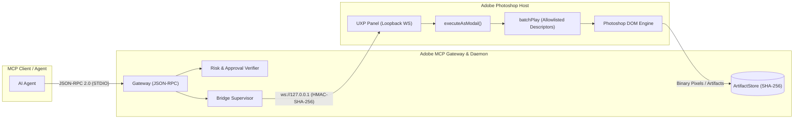
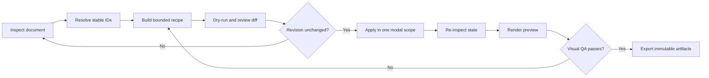
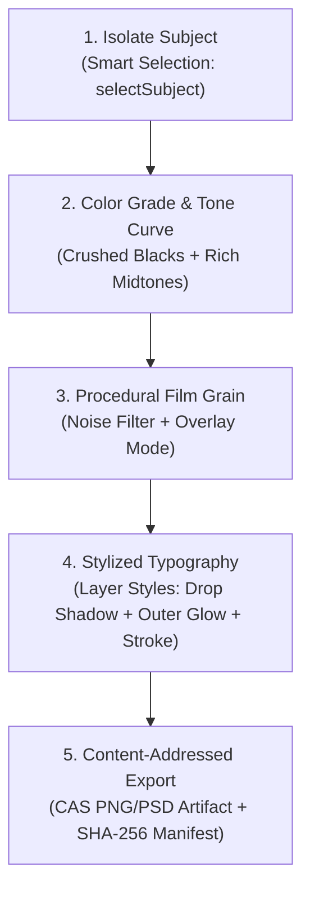
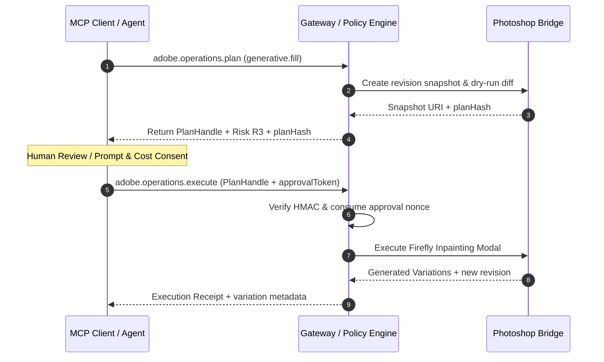

# Adobe Photoshop Automation & MCP Bridge Guide

Automate Adobe Photoshop through a secure, typed UXP bridge with zero raw script execution, strict Action Manager sandboxing, content-addressed artifact exports, and policy-guarded AI generation.

[Back to README](../README.md) · [Architecture & security](architecture-and-security.md) · [MCP protocol](mcp-protocol-2026.md)

---

## Capability Status Matrix

| Feature Area | Risk Tier | Public MCP Tool / Registry Entry | Bridge Status & Implementation Notes |
|---|---|---|---|
| **Document & Layer Inspection** | **R0** | `adobe.photoshop.inspect`, `adobe.photoshop.document` | Fully implemented. Returns bounds, color profiles, hierarchy, opaque IDs, and document revision. |
| **Layer Manipulation & Transforms** | **R2** | `adobe.photoshop.layers.edit`, `adobe.photoshop.transform.apply` | Implemented. Supports create, set, opacity, blend modes, matrix transforms, warp grids, and bicubic interpolation. |
| **Layer Content & Rasterization** | **R2** | `adobe.photoshop.layers.content` | Implemented. Handles solid fills, artifact placing, Smart Object conversion, and rasterization. |
| **Smart Selection AI** | **R2** | `adobe.photoshop.selection.smart` | Experimental registry surface. Supports typed subject, color-range, and bounded-object selection where the connected host advertises the required capability. |
| **Layer Styles & FX** | **R2** | `adobe.photoshop.layer.styles` | Experimental. Typed, allowlisted style descriptors; host-version probing and render verification are required. |
| **Channel & Luminosity Masks** | **R2** | `adobe.photoshop.channel.mask` | Experimental. Capability-gated luminosity/alpha-channel mask generation. |
| **Adjustment Layers** | **R2** | `adobe.photoshop.layers.content` (Curves/Levels) | Implemented via typed bridge builders for Curves, Levels, Hue/Saturation, and Color Balance. |
| **Content-Addressed Layer Export** | **R3** | `adobe.photoshop.exportLayers` | Implemented. Non-destructive layer isolation, real PNG/PSD binary generation, and SHA-256 CAS manifest. |
| **Document Export** | **R1** | `adobe.photoshop.export` | Implemented. Exports PSD, PSB, PNG, JPEG, TIFF, or WebP with file grant binding and dimension checks. |
| **Firefly Generative Fill** | **R3** | `adobe.photoshop.generative.fill` | Guarded R3 pipeline. Requires `approvalToken`, snapshot generation, cost/credit disclosure, and rollback. |
| **Filters & Camera Raw** | **R3** | `adobe.photoshop.filters.apply` | Capability-gated. Typed allowlists for Camera Raw, Gaussian Blur, Unsharp Mask, and procedural Noise. |

> [!NOTE]
> All mutations enforce revision checking (`expectedRevision`). If a human designer edits the canvas between plan compilation and execution, the bridge aborts with `CONFLICT` to prevent state corruption.

> [!IMPORTANT]
> “Implemented” means that a repository contract or adapter path exists. It is not a certification claim for every Photoshop release. Read `adobe.system.status` and `adobe.system.capabilities`, perform a dry-run, and require state or render verification before relying on a host-specific operation.

---

## Architecture & UXP Connection

The Photoshop bridge runs as a sandboxed UXP panel (`apps/photoshop-uxp/manifest.json`) communicating exclusively over loopback WebSockets (`ws://127.0.0.1:49152`) using HMAC-SHA-256 challenge-response authentication.



---

## End-to-End Production Workflow

Treat a Photoshop automation as a revision-bound loop rather than a one-shot macro:



### Recommended non-destructive layer order

```text
OUTPUT CHECKS       temporary proof and gamut-warning layers
TEXTURE             grain, dust, halation, vignette
LOOK                split tone, palette mapping, selective color
CONTRAST            curves, levels, dodge and burn
CORRECTION          white balance, exposure, lens cleanup
SUBJECT / PLATES    Smart Objects and retouch layers
SOURCE              locked original or linked master
```

Record mode, bit depth, profile, dimensions, active layer, document ID, and revision before planning. Sixteen bits/channel generally gives aggressive Curves and gradients more headroom, but changing bit depth or color profile is a document-wide decision and must be explicit. Name layers by purpose (`LOOK — cyan shadows`) and persist their returned IDs; re-running a recipe should patch its existing group rather than duplicate it.

## Detailed Recipe: 1980s Horror Key Art

The target is a theatrical print look: cool cyan shadows, bruised violet midtones, hot red practicals, dense blacks, restrained warm bloom, and tactile film texture. Normalize exposure before stylizing and protect believable skin.

| Role | Starting color | Purpose |
|---|---:|---|
| Ink black | `#08070D` | background and title shadow |
| Midnight blue | `#10243E` | shadow bias |
| Corpse cyan | `#2B9AA0` | cool reflected light |
| Bruised violet | `#56345F` | midtone separation |
| Blood red | `#B51F2E` | focal practicals |
| Sodium amber | `#E38A3A` | rim light and title highlights |
| Bone | `#E6D7B8` | restrained paper white |

1. **Normalize:** establish black and white points without clipping important texture. Avoid adding the look while exposure and white balance are still unstable.
2. **Shape contrast:** add a gentle RGB S-curve. Useful normalized points are `(0,0)`, `(32,22)`, `(96,82)`, `(160,176)`, `(224,238)`, `(255,250)`.
3. **Split channels:** lower red slightly in the shadows and lift it in upper midtones; lift blue in shadows and lower it in highlights. Keep endpoints conservative to prevent colored clipping.
4. **Bias the palette:** push shadows toward cyan/blue, midtones gently toward magenta, and highlights toward yellow/red. Preserve luminosity when the supported operation exposes that option.
5. **Protect skin:** clip a corrective Hue/Saturation or Curves layer to the subject. Remove excess magenta/cyan from skin without neutralizing red props and practicals.
6. **Motivate red light:** paint or composite glow on its own layer using `Screen` or `Linear Dodge (Add)`, blur it, and mask it to a believable source.
7. **Build halation:** isolate only bright boundaries, blur roughly 6–30 px according to image size, tint warm red-orange, and blend at 5–20%. Halation is not a full-frame haze.
8. **Finish:** apply output-scale grain, a restrained vignette, and optional dust. Check title counters, eyes, and fine silhouettes at 100%.

Dedicated color controls remain host- and capability-dependent. Create or update individual adjustment layers when supported and stop at a documented handoff when a required typed builder is unavailable; do not silently replace the look with destructive pixel edits.

## Detailed Recipe: Vintage Film Grain

Convincing grain is luminance-aware, scale-aware, and reproducible. Grain, dust, scratches, gate weave, bloom, and chromatic misregistration are separate effects and belong on separate layers.

1. Create `TEXTURE — film grain`, fill it with 50% gray, and use `Soft Light` or `Overlay`.
2. Convert the layer to a Smart Object when supported.
3. Apply monochromatic Gaussian noise at final output scale.
4. Add a 0.2–0.9 px Gaussian blur to remove brittle single-pixel noise.
5. Shape density with Levels/Curves and reduce opacity until texture is visible in flat midtones without hiding fine detail.
6. Use a luminosity mask to reduce uniform noise in near-black shadows and specular highlights.
7. Review at 100% and at delivery size. Resize before the final grain pass, or scale radius and amplitude with the output.

| Character | Noise starting point | Blur | Blend / opacity |
|---|---:|---:|---|
| Fine 35 mm print | 2–4% | 0.2–0.4 px | Soft Light, 15–35% |
| Fast 35 mm negative | 4–7% | 0.3–0.6 px | Overlay, 15–30% |
| Rough 16 mm horror | 6–12% | 0.4–0.9 px | Overlay, 20–45% |
| Photocopied poster | 8–18% | 0–0.4 px | Multiply/Overlay mix |

Save exact filter parameters, source texture digest or random seed, blend mode, opacity, and final dimensions. A label such as “20% grain” is not reproducible by itself.

## Export and Visual QA

For web, resolve final dimensions before output sharpening and grain, convert/export to the requested color space, embed the profile, and decode the exported file to verify dimensions and alpha. For an archival master, retain adjustment layers, masks, Smart Objects, profile, and high bit depth. For print, obtain the printer profile, total ink limit, bleed, and proofing requirements instead of guessing a CMYK conversion.

| Symptom | Likely cause | Correction |
|---|---|---|
| Banding in fog or gradients | low bit depth or excessive curve moves | increase working precision, simplify curves, add subtle dither |
| Cyan faces | global split tone is too broad | mask a skin correction; reduce midtone cyan |
| Muddy horror grade | blacks crushed before hue separation | reopen lower shadows and shape contrast first |
| Grain changes after export | texture added before resizing | apply or rescale grain at delivery dimensions |
| Flat clipped reds | saturation exceeds output gamut | reduce red luminance/saturation and soft-proof |
| Export differs from canvas | profile or blend-mode mismatch | compare color-managed previews and embed intentionally |
| Recipe duplicates itself | layers matched by names | persist and reuse group/layer IDs |

Capture both a fit-to-screen preview for composition and a 100% crop for texture, masks, and edge quality. A state receipt proves that parameters were written; a render proof shows what those parameters actually produced.

### Setup & Verification

1. Start the local daemon: `pnpm --filter @adobe-mcp/daemon start` (or launch via `npx kirei-adobe-mcp`).
2. Open **Adobe UXP Developer Tool (UDT)**.
3. Click **Add Plugin**, select `apps/photoshop-uxp/manifest.json`, and click **Load**.
4. Verify the bridge connection via MCP:

```json
{
  "jsonrpc": "2.0",
  "id": 1,
  "method": "tools/call",
  "params": {
    "name": "adobe.system.status",
    "arguments": {
      "target": { "app": "photoshop" },
      "includeBridges": true
    }
  }
}
```

---

## Document & Layer Inspection

Inspection returns opaque, revision-bound identifiers (`docId`, `layerId`, `revision`). Never hardcode or rely on localized layer names or array indices.

```json
{
  "jsonrpc": "2.0",
  "id": 2,
  "method": "tools/call",
  "params": {
    "name": "adobe.photoshop.inspect",
    "arguments": {
      "target": { "app": "photoshop" },
      "options": { "depth": 3, "includeHidden": true }
    }
  }
}
```

---

## Smart Selection with AI

The `adobe.photoshop.selection.smart` tool provides three AI-accelerated selection mechanisms without exposing unstructured Action Manager code:

### 1. Select Subject (`selectSubject`)
Uses Photoshop's Sensei cutout model to isolate foreground subjects with automatic edge refinement.

```json
{
  "jsonrpc": "2.0",
  "id": 3,
  "method": "tools/call",
  "params": {
    "name": "adobe.photoshop.selection.smart",
    "arguments": {
      "target": { "app": "photoshop", "documentId": "ps-doc-8821" },
      "mode": "selectSubject",
      "options": {
        "operationId": "a1b2c3d4-0001-4000-8000-000000000001",
        "expectedRevision": "rev-10492",
        "dryRun": false,
        "verification": "state"
      }
    }
  }
}
```

### 2. Color Range Selection (`colorRange`)
Selects specific tonal or color clusters using Lab/RGB targets and a fuzziness threshold ($0\text{--}200$).

```json
{
  "jsonrpc": "2.0",
  "id": 4,
  "method": "tools/call",
  "params": {
    "name": "adobe.photoshop.selection.smart",
    "arguments": {
      "target": { "app": "photoshop", "documentId": "ps-doc-8821" },
      "mode": "colorRange",
      "colorRange": {
        "color": { "space": "rgb", "components": [0.85, 0.05, 0.05], "alpha": 1.0 },
        "fuzziness": 45,
        "hue": 0
      },
      "options": {
        "operationId": "a1b2c3d4-0002-4000-8000-000000000002",
        "expectedRevision": "rev-10493"
      }
    }
  }
}
```

### 3. Object Selection (`objectSelection`)
Pins an exact bounding box in pixels, points, or percentages to isolate specific entities within cluttered compositions.

```json
{
  "jsonrpc": "2.0",
  "id": 5,
  "method": "tools/call",
  "params": {
    "name": "adobe.photoshop.selection.smart",
    "arguments": {
      "target": { "app": "photoshop", "documentId": "ps-doc-8821" },
      "mode": "objectSelection",
      "boundingBox": { "x": 500, "y": 1200, "width": 1800, "height": 2600, "unit": "px" },
      "options": {
        "operationId": "a1b2c3d4-0003-4000-8000-000000000003",
        "expectedRevision": "rev-10494"
      }
    }
  }
}
```

---

## Stylistic Poster Grading & Layer FX Recipes

This recipe demonstrates multi-step stylistic poster creation: combining Curves tonal mapping, procedural noise/grain overlays, and typography styling.



### Step 1: Inject Procedural Film Grain Overlay
Generates a monochromatic grain texture set to `overlay` blend mode at 65% opacity:

```json
{
  "jsonrpc": "2.0",
  "id": 7,
  "method": "tools/call",
  "params": {
    "name": "adobe.photoshop.filters.apply",
    "arguments": {
      "target": { "app": "photoshop", "documentId": "ps-doc-8821" },
      "commands": [
        {
          "op": "apply",
          "layerIds": ["layer-grain-overlay"],
          "filter": "noise",
          "parameters": {
            "amount": 32.5,
            "distribution": 1,
            "monochromatic": 1
          }
        }
      ],
      "options": {
        "operationId": "b2c3d4e5-0002-4000-8000-000000000002",
        "expectedRevision": "rev-10496"
      }
    }
  }
}
```

### Step 2: Style Headline Typography (Layer Styles)
Applies a dramatic fill, Outer Glow, and offset Drop Shadow:

```json
{
  "jsonrpc": "2.0",
  "id": 8,
  "method": "tools/call",
  "params": {
    "name": "adobe.photoshop.layer.styles",
    "arguments": {
      "target": { "app": "photoshop", "documentId": "ps-doc-8821" },
      "layerId": "layer-title-text",
      "style": "outerGlow",
      "enabled": true,
      "opacity": 88,
      "size": 42,
      "spread": 18,
      "color": { "space": "rgb", "components": [1.0, 0.08, 0.18], "alpha": 1.0 },
      "options": {
        "operationId": "b2c3d4e5-0003-4000-8000-000000000003",
        "expectedRevision": "rev-10497"
      }
    }
  }
}
```

---

## Luminosity Masks & Channel Isolation

Luminosity masking permits targeted adjustments based on image brightness without manual path tracing.

```json
{
  "jsonrpc": "2.0",
  "id": 10,
  "method": "tools/call",
  "params": {
    "name": "adobe.photoshop.channel.mask",
    "arguments": {
      "target": { "app": "photoshop", "documentId": "ps-doc-8821" },
      "layerId": "layer-curves-grade",
      "source": "shadows",
      "invert": false,
      "featherPixels": 12.0,
      "options": {
        "operationId": "c3d4e5f6-0001-4000-8000-000000000001",
        "expectedRevision": "rev-10499"
      }
    }
  }
}
```

---

## Firefly Generative Fill (R3 Guarded Workflow)

Generative Fill is categorized as an **R3 Risk Tier** operation due to cloud egress, AI credit consumption, and generative canvas alteration. It mandates a two-phase Plan $\rightarrow$ Approve $\rightarrow$ Execute lifecycle with snapshot rollback guarantees.



---

## Content-Addressed Layer & Artifact Export

The `adobe.photoshop.exportLayers` tool isolates specified layers or layer groups, exports high-fidelity raster bytes (PNG or PSD), writes the output directly into the SHA-256 Content-Addressed Storage (`ArtifactStore`), and emits an immutable manifest.

```json
{
  "jsonrpc": "2.0",
  "id": 13,
  "method": "tools/call",
  "params": {
    "name": "adobe.photoshop.exportLayers",
    "arguments": {
      "target": { "app": "photoshop", "documentId": "ps-doc-8821" },
      "layerIds": [
        "layer-hero-character",
        "layer-title-text",
        "layer-grain-overlay"
      ],
      "format": "png",
      "scale": 1.0,
      "includeHidden": false,
      "isolate": true,
      "destination": {
        "grantId": "grant-poster-deliverables",
        "access": "write",
        "suggestedName": "poster-layers"
      },
      "options": {
        "operationId": "e5f6a7b8-0001-4000-8000-000000000001",
        "expectedRevision": "rev-10500",
        "verification": "render-proof"
      }
    }
  }
}
```
