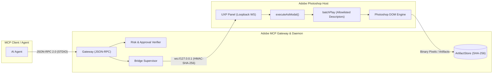
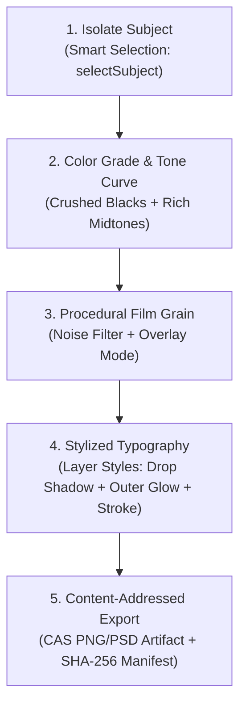
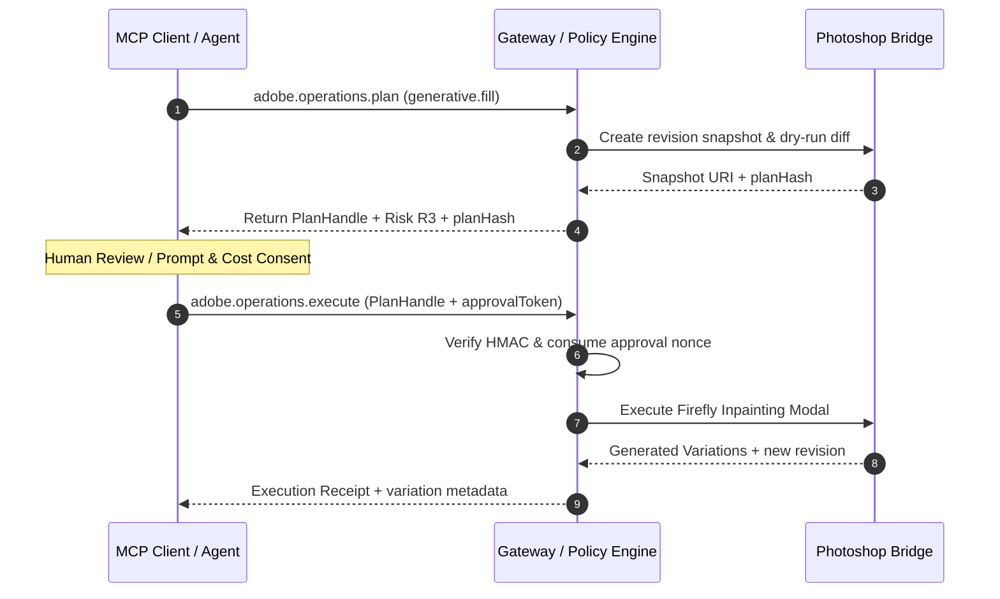

# Adobe Photoshop Automation & MCP Bridge Guide

Automate Adobe Photoshop through a secure, typed UXP bridge with zero raw script execution, strict Action Manager sandboxing, content-addressed artifact exports, and policy-guarded AI generation.

[Back to README](../README.md) · [Architecture & security](architecture-and-security.md) · [MCP protocol](mcp-protocol-2026.md)

---

## Capability Status Matrix

| Feature Area | Risk Tier | Public MCP Tool / Registry Entry | Bridge Status & Implementation Notes |
|---|---|---|---|
| **Document & Layer Inspection** | **R0** | `adobe.photoshop.inspect`, `adobe.photoshop.document` | Fully implemented. Returns bounds, color profiles, hierarchy, opaque IDs, and document revision. |
| **Layer Manipulation & Transforms** | **R2** | `adobe.photoshop.layers.edit`, `adobe.photoshop.transform.apply` | Implemented. Supports create, set, opacity, blend modes, matrix transforms, warp grids, and bicubic interpolation. |
| **Layer Content & Rasterization** | **R2** | `adobe.photoshop.layers.content` | Implemented. Handles solid fills, artifact placing, Smart Object conversion, and rasterization. |
| **Smart Selection AI** | **R2** | `adobe.photoshop.selection.smart` | Implemented in registry. Supports *Select Subject*, *Color Range*, and *Object Selection* via typed `batchPlay`. |
| **Layer Styles & FX** | **R2** | `adobe.photoshop.layer.styles` | Implemented. Typed descriptors for Drop Shadow, Outer/Inner Glow, Bevel & Emboss, Stroke, and Color Overlay. |
| **Channel & Luminosity Masks** | **R2** | `adobe.photoshop.channel.mask` | Implemented. Generates non-destructive masks targeting Lights, Midtones, Shadows, or discrete Alpha channels. |
| **Adjustment Layers** | **R2** | `adobe.photoshop.layers.content` (Curves/Levels) | Implemented via typed bridge builders for Curves, Levels, Hue/Saturation, and Color Balance. |
| **Content-Addressed Layer Export** | **R3** | `adobe.photoshop.exportLayers` | Implemented. Non-destructive layer isolation, real PNG/PSD binary generation, and SHA-256 CAS manifest. |
| **Document Export** | **R1** | `adobe.photoshop.export` | Implemented. Exports PSD, PSB, PNG, JPEG, TIFF, or WebP with file grant binding and dimension checks. |
| **Firefly Generative Fill** | **R3** | `adobe.photoshop.generative.fill` | Guarded R3 pipeline. Requires `approvalToken`, snapshot generation, cost/credit disclosure, and rollback. |
| **Filters & Camera Raw** | **R3** | `adobe.photoshop.filters.apply` | Capability-gated. Typed allowlists for Camera Raw, Gaussian Blur, Unsharp Mask, and procedural Noise. |

> [!NOTE]
> All mutations enforce revision checking (`expectedRevision`). If a human designer edits the canvas between plan compilation and execution, the bridge aborts with `CONFLICT` to prevent state corruption.

---

## Architecture & UXP Connection

The Photoshop bridge runs as a sandboxed UXP panel (`apps/photoshop-uxp/manifest.json`) communicating exclusively over loopback WebSockets (`ws://127.0.0.1:49152`) using HMAC-SHA-256 challenge-response authentication.



### Setup & Verification

1. Start the local daemon: `pnpm --filter @adobe-mcp/daemon start` (or launch via `npx kirei-adobe-mcp`).
2. Open **Adobe UXP Developer Tool (UDT)**.
3. Click **Add Plugin**, select `apps/photoshop-uxp/manifest.json`, and click **Load**.
4. Verify the bridge connection via MCP:

```json
{
  "jsonrpc": "2.0",
  "id": 1,
  "method": "tools/call",
  "params": {
    "name": "adobe.system.status",
    "arguments": {
      "target": { "app": "photoshop" },
      "includeBridges": true
    }
  }
}
```

---

## Document & Layer Inspection

Inspection returns opaque, revision-bound identifiers (`docId`, `layerId`, `revision`). Never hardcode or rely on localized layer names or array indices.

```json
{
  "jsonrpc": "2.0",
  "id": 2,
  "method": "tools/call",
  "params": {
    "name": "adobe.photoshop.inspect",
    "arguments": {
      "target": { "app": "photoshop" },
      "options": { "depth": 3, "includeHidden": true }
    }
  }
}
```

---

## Smart Selection with AI

The `adobe.photoshop.selection.smart` tool provides three AI-accelerated selection mechanisms without exposing unstructured Action Manager code:

### 1. Select Subject (`selectSubject`)
Uses Photoshop's Sensei cutout model to isolate foreground subjects with automatic edge refinement.

```json
{
  "jsonrpc": "2.0",
  "id": 3,
  "method": "tools/call",
  "params": {
    "name": "adobe.photoshop.selection.smart",
    "arguments": {
      "target": { "app": "photoshop", "documentId": "ps-doc-8821" },
      "mode": "selectSubject",
      "options": {
        "operationId": "a1b2c3d4-0001-4000-8000-000000000001",
        "expectedRevision": "rev-10492",
        "dryRun": false,
        "verification": "state"
      }
    }
  }
}
```

### 2. Color Range Selection (`colorRange`)
Selects specific tonal or color clusters using Lab/RGB targets and a fuzziness threshold ($0\text{--}200$).

```json
{
  "jsonrpc": "2.0",
  "id": 4,
  "method": "tools/call",
  "params": {
    "name": "adobe.photoshop.selection.smart",
    "arguments": {
      "target": { "app": "photoshop", "documentId": "ps-doc-8821" },
      "mode": "colorRange",
      "colorRange": {
        "color": { "space": "rgb", "components": [0.85, 0.05, 0.05], "alpha": 1.0 },
        "fuzziness": 45,
        "hue": 0
      },
      "options": {
        "operationId": "a1b2c3d4-0002-4000-8000-000000000002",
        "expectedRevision": "rev-10493"
      }
    }
  }
}
```

### 3. Object Selection (`objectSelection`)
Pins an exact bounding box in pixels, points, or percentages to isolate specific entities within cluttered compositions.

```json
{
  "jsonrpc": "2.0",
  "id": 5,
  "method": "tools/call",
  "params": {
    "name": "adobe.photoshop.selection.smart",
    "arguments": {
      "target": { "app": "photoshop", "documentId": "ps-doc-8821" },
      "mode": "objectSelection",
      "boundingBox": { "x": 500, "y": 1200, "width": 1800, "height": 2600, "unit": "px" },
      "options": {
        "operationId": "a1b2c3d4-0003-4000-8000-000000000003",
        "expectedRevision": "rev-10494"
      }
    }
  }
}
```

---

## Stylistic Poster Grading & Layer FX Recipes

This recipe demonstrates multi-step stylistic poster creation: combining Curves tonal mapping, procedural noise/grain overlays, and typography styling.



### Step 1: Inject Procedural Film Grain Overlay
Generates a monochromatic grain texture set to `overlay` blend mode at 65% opacity:

```json
{
  "jsonrpc": "2.0",
  "id": 7,
  "method": "tools/call",
  "params": {
    "name": "adobe.photoshop.filters.apply",
    "arguments": {
      "target": { "app": "photoshop", "documentId": "ps-doc-8821" },
      "commands": [
        {
          "op": "apply",
          "layerIds": ["layer-grain-overlay"],
          "filter": "noise",
          "parameters": {
            "amount": 32.5,
            "distribution": 1,
            "monochromatic": 1
          }
        }
      ],
      "options": {
        "operationId": "b2c3d4e5-0002-4000-8000-000000000002",
        "expectedRevision": "rev-10496"
      }
    }
  }
}
```

### Step 2: Style Headline Typography (Layer Styles)
Applies a dramatic fill, Outer Glow, and offset Drop Shadow:

```json
{
  "jsonrpc": "2.0",
  "id": 8,
  "method": "tools/call",
  "params": {
    "name": "adobe.photoshop.layer.styles",
    "arguments": {
      "target": { "app": "photoshop", "documentId": "ps-doc-8821" },
      "layerId": "layer-title-text",
      "style": "outerGlow",
      "enabled": true,
      "opacity": 88,
      "size": 42,
      "spread": 18,
      "color": { "space": "rgb", "components": [1.0, 0.08, 0.18], "alpha": 1.0 },
      "options": {
        "operationId": "b2c3d4e5-0003-4000-8000-000000000003",
        "expectedRevision": "rev-10497"
      }
    }
  }
}
```

---

## Luminosity Masks & Channel Isolation

Luminosity masking permits targeted adjustments based on image brightness without manual path tracing.

```json
{
  "jsonrpc": "2.0",
  "id": 10,
  "method": "tools/call",
  "params": {
    "name": "adobe.photoshop.channel.mask",
    "arguments": {
      "target": { "app": "photoshop", "documentId": "ps-doc-8821" },
      "layerId": "layer-curves-grade",
      "source": "shadows",
      "invert": false,
      "featherPixels": 12.0,
      "options": {
        "operationId": "c3d4e5f6-0001-4000-8000-000000000001",
        "expectedRevision": "rev-10499"
      }
    }
  }
}
```

---

## Firefly Generative Fill (R3 Guarded Workflow)

Generative Fill is categorized as an **R3 Risk Tier** operation due to cloud egress, AI credit consumption, and generative canvas alteration. It mandates a two-phase Plan $\rightarrow$ Approve $\rightarrow$ Execute lifecycle with snapshot rollback guarantees.



---

## Content-Addressed Layer & Artifact Export

The `adobe.photoshop.exportLayers` tool isolates specified layers or layer groups, exports high-fidelity raster bytes (PNG or PSD), writes the output directly into the SHA-256 Content-Addressed Storage (`ArtifactStore`), and emits an immutable manifest.

```json
{
  "jsonrpc": "2.0",
  "id": 13,
  "method": "tools/call",
  "params": {
    "name": "adobe.photoshop.exportLayers",
    "arguments": {
      "target": { "app": "photoshop", "documentId": "ps-doc-8821" },
      "layerIds": [
        "layer-hero-character",
        "layer-title-text",
        "layer-grain-overlay"
      ],
      "format": "png",
      "scale": 1.0,
      "includeHidden": false,
      "isolate": true,
      "destination": {
        "grantId": "grant-poster-deliverables",
        "access": "write",
        "suggestedName": "poster-layers"
      },
      "options": {
        "operationId": "e5f6a7b8-0001-4000-8000-000000000001",
        "expectedRevision": "rev-10500",
        "verification": "render-proof"
      }
    }
  }
}
```
