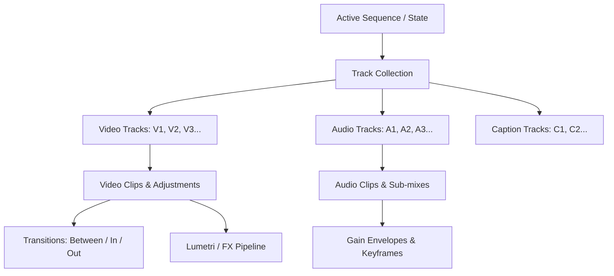
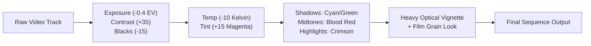
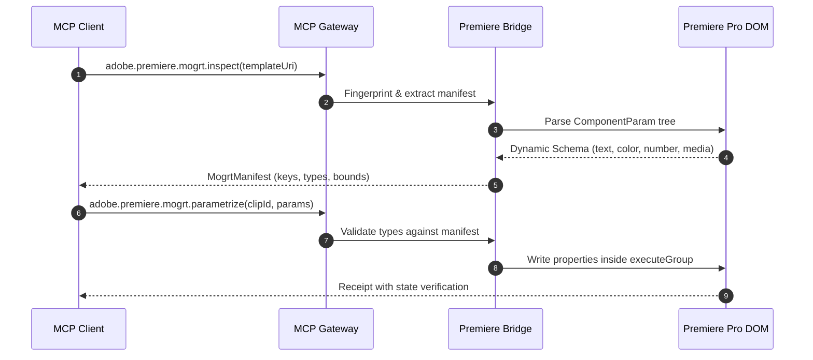

# Premiere Pro Automation & MCP Workflow Guide

Automate timeline composition, audio engineering, intelligent color grading, MOGRT templating, and media pipelines through a typed UXP-first bridge with CEP fallback.

[Back to README](../README.md) · [Architecture & Security](architecture-and-security.md) · [MCP Protocol 2026](mcp-protocol-2026.md)

---

## 1. Architectural Overview & Transport Model

The Premiere Pro MCP subsystem provides deterministic timeline manipulation and media pipeline automation across a dual-transport bridge architecture.

```
┌─────────────────────────────────────────────────────────────────────────┐
│                           MCP Client / LLM                              │
└────────────────────────────────────┬────────────────────────────────────┘
                                     │ JSON-RPC 2.0 (stdio / SSE)
                                     ▼
┌─────────────────────────────────────────────────────────────────────────┐
│                    @adobe-mcp/gateway (Policy / R0-R4)                  │
└────────────────────────────────────┬────────────────────────────────────┘
                                     │ Local Loopback WebSocket
                                     ▼
┌─────────────────────────────────────────────────────────────────────────┐
│               @adobe-mcp/daemon (Session & Capability Router)           │
└───────────────────┬─────────────────────────────────┬───────────────────┘
                    │ ws://127.0.0.1 (HMAC-SHA256)    │ ws://127.0.0.1
                    ▼                                 ▼
   ┌─────────────────────────────────┐   ┌────────────────────────────────┐
   │    apps/premiere-uxp (Primary)  │   │   apps/premiere-cep (Fallback) │
   │  • Unified Extensibility Mod.   │   │  • CSInterface Dispatcher      │
   │  • High-performance DOM access  │   │  • Allowlisted JSX Handlers    │
   │  • Direct memory buffer access  │   │  • Zero Free-form eval()       │
   └─────────────────────────────────┘   └────────────────────────────────┘
```

### 1.1 Dual-Transport Lifecycle & Security
1. **Primary Transport (UXP)**: The primary bridge operates within Adobe UXP (Unified Extensibility Platform). Communication is strictly confined to loopback WebSocket (`ws://127.0.0.1` or `ws://[::1]`) with challenge-response HMAC-SHA-256 mutual authentication.
2. **Compatibility Fallback (CEP)**: For Premiere Pro versions or headless environments lacking native UXP coverage for specialized timeline APIs, `apps/premiere-cep` executes allowlisted, version-pinned ActionScript/ExtendScript handlers. Free-form string interpolation into `evalScript` is strictly forbidden.
3. **Optimistic Locking & State Validation**: Every destructive mutation requires an `expectedRevision` identifier. If the user modifies the timeline between plan calculation and command execution, the bridge aborts with `CONFLICT`, preserving project integrity.

---

## 2. Timeline DOM Architecture & Mathematical Model

Premiere Pro's Timeline DOM is abstracted into a continuous coordinate space governed by rational ticks and bounded seconds.



### 2.1 Coordinate System & Timeline Math
* **Rational Timebase**: Internal calculations use integer ticks ($1\text{ tick} = 1/254016000000\text{ s}$) converted to floating-point seconds bounded to sequence framerates ($23.976$, $25.0$, $29.97$, $59.94$, $60.0$).
* **Clip Splitting**: A split at $T_{\text{split}}$ transforms clip $C(T_{\text{start}}, T_{\text{end}})$ into $C_a(T_{\text{start}}, T_{\text{split}})$ and $C_b(T_{\text{split}}, T_{\text{end}})$ with preserved media references.
* **Ripple Deletion**: Deleting range $[T_1, T_2]$ with duration $\Delta = T_2 - T_1$ adjusts subsequent clip boundaries:
  $$\forall C \text{ where } T_{\text{start}}(C) \ge T_2 \implies T'_{\text{start}}(C) = T_{\text{start}}(C) - \Delta, \quad T'_{\text{end}}(C) = T_{\text{end}}(C) - \Delta$$

---

## 3. Stylistic Color Grading & Film Look Recipes

The `adobe.premiere.lumetri.grade` tool applies declarative color models directly to the Lumetri Color engine using deterministic parameter manifests rather than localized UI indices.

### 3.1 Creative Grading Profiles
* **80s Retro Horror / Slasher Aesthetic**:
  - High-contrast, underexposed baseline with crushed blacks evoking 1980s 35mm film stock (Kodak 5247/5294).
  - Cool cyan-green shadow bias with saturated blood-red midtone casts and heavy optical vignette.
* **Cyberpunk Neon**:
  - Deep violet/indigo shadows with electric magenta and cyan highlight splits.
* **Nordic Documentary**:
  - Cool desaturation, softened highlights, and natural skin tone separation.



### 3.2 Lumetri Grade Parameter Blueprint
| Parameter Category | Field Key | Value | Technical Rationale |
|---|---|---|---|
| Basic Correction | `exposure` | `-0.40` | Deepens midtones for moody cinematic atmosphere |
| Basic Correction | `contrast` | `+35.0` | Accentuates silhouette edges and dramatic lighting |
| Basic Correction | `blacks` | `-15.0` | Crushes low-end pedestal into shadowy silhouettes |
| Basic Correction | `whites` | `-10.0` | Softens harsh highlights and blown-out practical lights |
| White Balance | `temperature` | `-10.0` | Cools overall scene with an eerie blue-green undertone |
| White Balance | `tint` | `+15.0` | Adds magenta/crimson bias characteristic of chemical film aging |
| 3-Way Shadows | `wheels.shadows` | `[0.12, 0.48, 0.42]` | Deep murky teal/green in shadows |
| 3-Way Midtones | `wheels.midtones` | `[0.82, 0.12, 0.14]` | Saturated warm red in skin tones and atmospheric lighting |
| 3-Way Highlights | `wheels.highlights`| `[0.92, 0.28, 0.18]` | Amber/crimson rim lighting |

---

## 4. Film Grain & Procedural Texture Workflows

Authentic analog texture and film emulation can be achieved through two supported pipelines:

### 4.1 Lumetri Creative Look Injection
Assign a cryptographic artifact reference to Lumetri's Creative look module:
```json
{
  "lut": {
    "uri": "artifact://sha256-e3b0c44298fc1c149afbf4c8996fb92427ae41e4649b934ca495991b7852b855",
    "format": "look",
    "intensity": 0.85
  }
}
```

### 4.2 Effect Overlay & Adjustment Layer Stacking
1. Create a dedicated top-level Adjustment Layer spanning track $V_2$ or $V_3$.
2. Target the layer with `adobe.premiere.effects.edit` applying an allowlisted grain composite.
3. Configure `Overlay` or `Soft Light` blend modes with opacity modulation ($65\%\text{--}80\%$) to inject high-frequency optical noise without clipping dynamic range.

---

## 5. MOGRT Inspection & Dynamic Parameter Manifests

Motion Graphics Templates (.mogrt) are treated as strictly typed component interfaces, rejecting unstructured UI automation.



### 5.1 Parameter Manifest Structure
```typescript
export interface MogrtManifestParameter {
  readonly key: string;
  readonly type: "text" | "color" | "number" | "boolean" | "media";
  readonly writable: boolean;
  readonly mediaSlot?: boolean;
}
```

---

## 6. Automated Editorial Workflows (`EditPlan` Engine)

The `EditPlan` engine compiles declarative editorial workflows into atomic timeline execution sequences.

### 6.1 Silence Detection & Elimination (`cutSilences`)
* Analyzes raw audio stream decibel energy against a threshold (e.g., $-48\text{ dBFS}$).
* Groups silence segments exceeding minimum duration ($0.25\text{s}$).
* Emits deterministic `rippleDelete` operations from right-to-left (reverse timeline order) to prevent temporal drift.

### 6.2 Sidechain Auto-Ducking (`autoDucking`)
* Detects dialogue activity intervals on speech tracks ($A_1$).
* Calculates gain envelope keyframes for background music tracks ($A_2$):
  * **Lead-in (Attack)**: $0.25\text{s}$ before voice start ($0\text{ dB} \to -18\text{ dB}$).
  * **Sustain**: Constant $-18\text{ dB}$ attenuation throughout speech.
  * **Lead-out (Release)**: $0.60\text{s}$ smooth ramp back to $0\text{ dB}$.

### 6.3 Transcription Sync & Proxy Pipeline
* **`adobe.premiere.transcript.sync`**: Dispatches speech-to-text transcription and populates native Caption Tracks with word-boundary wrapping.
* **`adobe.premiere.proxies.manage`**: Programmatically attaches, detaches, or toggles ProRes Proxy / DNxHR low-resolution media for fluid remote editing.

---

## 7. Ready-to-Use JSON-RPC 2.0 Payloads

### 7.1 Apply Cinematic Stylized Color Grade
```json
{
  "jsonrpc": "2.0",
  "id": "req-pr-001",
  "method": "tools/call",
  "params": {
    "name": "adobe.premiere.lumetri.grade",
    "arguments": {
      "target": {
        "app": "premiere-pro",
        "projectId": "proj-feature-01",
        "entityId": "seq-night-scene"
      },
      "clipIds": ["clip-v1-004", "clip-v1-005"],
      "basic": {
        "exposure": -0.4,
        "contrast": 35.0,
        "blacks": -15.0,
        "whites": -10.0,
        "temperature": -10.0,
        "tint": 15.0
      },
      "wheels": {
        "shadows": {
          "space": "rgb",
          "components": [0.12, 0.48, 0.42],
          "alpha": 1.0
        },
        "midtones": {
          "space": "rgb",
          "components": [0.82, 0.12, 0.14],
          "alpha": 1.0
        },
        "highlights": {
          "space": "rgb",
          "components": [0.92, 0.28, 0.18],
          "alpha": 1.0
        }
      },
      "lut": {
        "uri": "artifact://sha256-7a8b9c0d1e2f3a4b5c6d7e8f9a0b1c2d3e4f5a6b7c8d9e0f1a2b3c4d5e6f7a8b",
        "format": "look",
        "intensity": 0.85
      },
      "options": {
        "operationId": "6a9b4c2e-8f1d-4e5a-9c3b-7d1e2f3a4b5c",
        "expectedRevision": "rev-seq-1048",
        "dryRun": false,
        "atomic": true,
        "conflictPolicy": "fail",
        "verification": "state"
      }
    }
  }
}
```

### 7.2 MOGRT Parameter Injection with Media Replacement
```json
{
  "jsonrpc": "2.0",
  "id": "req-pr-002",
  "method": "tools/call",
  "params": {
    "name": "adobe.premiere.mogrt.parametrize",
    "arguments": {
      "target": {
        "app": "premiere-pro",
        "projectId": "proj-feature-01"
      },
      "clipId": "clip-mogrt-title",
      "templateFingerprint": "fp-synthwave-title-v2",
      "parameters": [
        { "key": "TitleText", "type": "text", "value": "EPISODE 1: THE BEGINNING" },
        { "key": "GlowColor", "type": "color", "value": { "space": "rgb", "components": [1.0, 0.08, 0.2], "alpha": 1.0 } },
        { "key": "FlickerSpeed", "type": "number", "value": 14.5 },
        { "key": "ShowScanlines", "type": "boolean", "value": true },
        { "key": "BackgroundSlot", "type": "media", "value": "custom-plate", "mediaArtifactUri": "artifact://sha256-4b5c6d7e8f9a0b1c2d3e4f5a6b7c8d9e0f1a2b3c4d5e6f7a8b9c0d1e2f3a4b5c" }
      ],
      "options": {
        "operationId": "b1c2d3e4-f5a6-4b7c-8d9e-0f1a2b3c4d5e",
        "expectedRevision": "rev-seq-1049",
        "dryRun": false,
        "atomic": true,
        "conflictPolicy": "fail",
        "verification": "state"
      }
    }
  }
}
```
