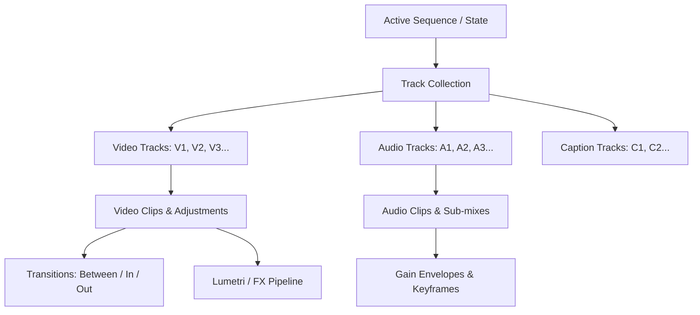
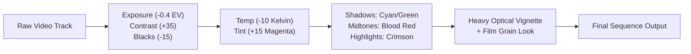
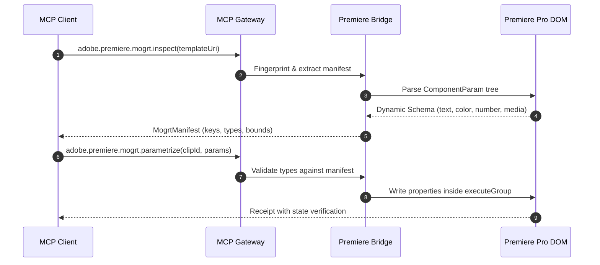

# Premiere Pro Automation & MCP Workflow Guide

Automate timeline composition, audio engineering, intelligent color grading, MOGRT templating, and media pipelines through a typed UXP-first bridge with CEP fallback.

[Back to README](../README.md) · [Architecture & Security](architecture-and-security.md) · [MCP Protocol 2026](mcp-protocol-2026.md)

---

## 1. Architectural Overview & Transport Model

The Premiere Pro MCP subsystem provides deterministic timeline manipulation and media pipeline automation across a dual-transport bridge architecture.

```
┌─────────────────────────────────────────────────────────────────────────┐
│                           MCP Client / LLM                              │
└────────────────────────────────────┬────────────────────────────────────┘
                                     │ JSON-RPC 2.0 (stdio / SSE)
                                     ▼
┌─────────────────────────────────────────────────────────────────────────┐
│                    @adobe-mcp/gateway (Policy / R0-R4)                  │
└────────────────────────────────────┬────────────────────────────────────┘
                                     │ Local Loopback WebSocket
                                     ▼
┌─────────────────────────────────────────────────────────────────────────┐
│               @adobe-mcp/daemon (Session & Capability Router)           │
└───────────────────┬─────────────────────────────────┬───────────────────┘
                    │ ws://127.0.0.1 (HMAC-SHA256)    │ ws://127.0.0.1
                    ▼                                 ▼
   ┌─────────────────────────────────┐   ┌────────────────────────────────┐
   │    apps/premiere-uxp (Primary)  │   │   apps/premiere-cep (Fallback) │
   │  • Unified Extensibility Mod.   │   │  • CSInterface Dispatcher      │
   │  • High-performance DOM access  │   │  • Allowlisted JSX Handlers    │
   │  • Direct memory buffer access  │   │  • Zero Free-form eval()       │
   └─────────────────────────────────┘   └────────────────────────────────┘
```

### 1.1 Dual-Transport Lifecycle & Security
1. **Primary Transport (UXP)**: The primary bridge operates within Adobe UXP (Unified Extensibility Platform). Communication is strictly confined to loopback WebSocket (`ws://127.0.0.1` or `ws://[::1]`) with challenge-response HMAC-SHA-256 mutual authentication.
2. **Compatibility Fallback (CEP)**: For Premiere Pro versions or headless environments lacking native UXP coverage for specialized timeline APIs, `apps/premiere-cep` executes allowlisted, version-pinned ActionScript/ExtendScript handlers. Free-form string interpolation into `evalScript` is strictly forbidden.
3. **Optimistic Locking & State Validation**: Every destructive mutation requires an `expectedRevision` identifier. If the user modifies the timeline between plan calculation and command execution, the bridge aborts with `CONFLICT`, preserving project integrity.

---

## 2. Timeline DOM Architecture & Mathematical Model

Premiere Pro's Timeline DOM is abstracted into a continuous coordinate space governed by rational ticks and bounded seconds.



### 2.1 Coordinate System & Timeline Math
* **Rational Timebase**: Internal calculations use integer ticks ($1\text{ tick} = 1/254016000000\text{ s}$) converted to floating-point seconds bounded to sequence framerates ($23.976$, $25.0$, $29.97$, $59.94$, $60.0$).
* **Clip Splitting**: A split at $T_{\text{split}}$ transforms clip $C(T_{\text{start}}, T_{\text{end}})$ into $C_a(T_{\text{start}}, T_{\text{split}})$ and $C_b(T_{\text{split}}, T_{\text{end}})$ with preserved media references.
* **Ripple Deletion**: Deleting range $[T_1, T_2]$ with duration $\Delta = T_2 - T_1$ adjusts subsequent clip boundaries:
  $$\forall C \text{ where } T_{\text{start}}(C) \ge T_2 \implies T'_{\text{start}}(C) = T_{\text{start}}(C) - \Delta, \quad T'_{\text{end}}(C) = T_{\text{end}}(C) - \Delta$$

---

## 3. Stylistic Color Grading & Film Look Recipes

The `adobe.premiere.lumetri.grade` tool applies declarative color models directly to the Lumetri Color engine using deterministic parameter manifests rather than localized UI indices.

> [!IMPORTANT]
> This Lumetri surface is experimental and requires `premiere.lumetri@1`. The values below are creative starting points, not a promise that every Premiere build exposes each control. Planning must fail with `UNSUPPORTED_CAPABILITY` when the connected adapter cannot map a field deterministically.

### 3.1 Creative Grading Profiles
* **80s Retro Horror / Slasher Aesthetic**:
  - High-contrast, underexposed baseline with crushed blacks evoking 1980s 35mm film stock (Kodak 5247/5294).
  - Cool cyan-green shadow bias with saturated blood-red midtone casts and heavy optical vignette.
* **Cyberpunk Neon**:
  - Deep violet/indigo shadows with electric magenta and cyan highlight splits.
* **Nordic Documentary**:
  - Cool desaturation, softened highlights, and natural skin tone separation.



### 3.2 Lumetri Grade Parameter Blueprint
| Parameter Category | Field Key | Value | Technical Rationale |
|---|---|---|---|
| Basic Correction | `exposure` | `-0.40` | Deepens midtones for moody cinematic atmosphere |
| Basic Correction | `contrast` | `+35.0` | Accentuates silhouette edges and dramatic lighting |
| Basic Correction | `blacks` | `-15.0` | Crushes low-end pedestal into shadowy silhouettes |
| Basic Correction | `whites` | `-10.0` | Softens harsh highlights and blown-out practical lights |
| White Balance | `temperature` | `-10.0` | Cools overall scene with an eerie blue-green undertone |
| White Balance | `tint` | `+15.0` | Adds magenta/crimson bias characteristic of chemical film aging |
| 3-Way Shadows | `wheels.shadows` | `[0.12, 0.48, 0.42]` | Deep murky teal/green in shadows |
| 3-Way Midtones | `wheels.midtones` | `[0.82, 0.12, 0.14]` | Saturated warm red in skin tones and atmospheric lighting |
| 3-Way Highlights | `wheels.highlights`| `[0.92, 0.28, 0.18]` | Amber/crimson rim lighting |

---

## 4. Film Grain & Procedural Texture Workflows

Authentic analog texture and film emulation can be achieved through two supported pipelines:

### 4.1 Lumetri Creative Look Injection
Assign a cryptographic artifact reference to Lumetri's Creative look module:
```json
{
  "lut": {
    "uri": "artifact://sha256-e3b0c44298fc1c149afbf4c8996fb92427ae41e4649b934ca495991b7852b855",
    "format": "look",
    "intensity": 0.85
  }
}
```

### 4.2 Effect Overlay & Adjustment Layer Stacking
1. Create a dedicated top-level Adjustment Layer spanning track $V_2$ or $V_3$.
2. Target the layer with `adobe.premiere.effects.edit` applying an allowlisted grain composite.
3. Configure `Overlay` or `Soft Light` blend modes with opacity modulation ($65\%\text{--}80\%$) to inject high-frequency optical noise without clipping dynamic range.

---

## 5. MOGRT Inspection & Dynamic Parameter Manifests

Motion Graphics Templates (.mogrt) are treated as strictly typed component interfaces, rejecting unstructured UI automation.



### 5.1 Parameter Manifest Structure
```typescript
export interface MogrtManifestParameter {
  readonly key: string;
  readonly type: "text" | "color" | "number" | "boolean" | "media";
  readonly writable: boolean;
  readonly mediaSlot?: boolean;
}
```

---

## 6. Automated Editorial Workflows (`EditPlan` Engine)

The `EditPlan` engine compiles declarative editorial workflows into atomic timeline execution sequences.

### 6.1 Silence Detection & Elimination (`cutSilences`)
* Accepts reviewed silence intervals produced by an explicit analysis step; the compiler does not implicitly analyze audio.
* Sorts and merges qualifying intervals (for example, regions longer than $0.25\text{s}$).
* Emits deterministic `rippleDelete` operations from right-to-left (reverse timeline order) to prevent temporal drift.

### 6.2 Sidechain Auto-Ducking (`autoDucking`)
* Detects dialogue activity intervals on speech tracks ($A_1$).
* Calculates gain envelope keyframes for background music tracks ($A_2$):
  * **Lead-in (Attack)**: $0.25\text{s}$ before voice start ($0\text{ dB} \to -18\text{ dB}$).
  * **Sustain**: Constant $-18\text{ dB}$ attenuation throughout speech.
  * **Lead-out (Release)**: $0.60\text{s}$ smooth ramp back to $0\text{ dB}$.

### 6.3 Transcription Sync & Proxy Pipeline
* **`adobe.premiere.transcript.sync`**: Experimental, capability-gated transcription/caption synchronization surface.
* **`adobe.premiere.proxies.manage`**: Experimental, capability-gated proxy attachment and toggling surface.

The `EditPlan` compiler is useful for dry-run development, but direct `adobe.premiere.editPlan.execute` remains blocked where the R3 gateway cannot bind the stored plan and approval proof. Production execution must use the repository's approved plan/execute flow.

---

## 7. Ready-to-Use JSON-RPC 2.0 Payloads

### 7.1 Apply Cinematic Stylized Color Grade
```json
{
  "jsonrpc": "2.0",
  "id": "req-pr-001",
  "method": "tools/call",
  "params": {
    "name": "adobe.premiere.lumetri.grade",
    "arguments": {
      "target": {
        "app": "premiere-pro",
        "projectId": "proj-feature-01",
        "entityId": "seq-night-scene"
      },
      "clipIds": ["clip-v1-004", "clip-v1-005"],
      "basic": {
        "exposure": -0.4,
        "contrast": 35.0,
        "blacks": -15.0,
        "whites": -10.0,
        "temperature": -10.0,
        "tint": 15.0
      },
      "wheels": {
        "shadows": {
          "space": "rgb",
          "components": [0.12, 0.48, 0.42],
          "alpha": 1.0
        },
        "midtones": {
          "space": "rgb",
          "components": [0.82, 0.12, 0.14],
          "alpha": 1.0
        },
        "highlights": {
          "space": "rgb",
          "components": [0.92, 0.28, 0.18],
          "alpha": 1.0
        }
      },
      "lut": {
        "uri": "artifact://sha256-7a8b9c0d1e2f3a4b5c6d7e8f9a0b1c2d3e4f5a6b7c8d9e0f1a2b3c4d5e6f7a8b",
        "format": "look",
        "intensity": 0.85
      },
      "options": {
        "operationId": "6a9b4c2e-8f1d-4e5a-9c3b-7d1e2f3a4b5c",
        "expectedRevision": "rev-seq-1048",
        "dryRun": false,
        "atomic": true,
        "conflictPolicy": "fail",
        "verification": "state"
      }
    }
  }
}
```

### 7.2 MOGRT Parameter Injection with Media Replacement
```json
{
  "jsonrpc": "2.0",
  "id": "req-pr-002",
  "method": "tools/call",
  "params": {
    "name": "adobe.premiere.mogrt.parametrize",
    "arguments": {
      "target": {
        "app": "premiere-pro",
        "projectId": "proj-feature-01"
      },
      "clipId": "clip-mogrt-title",
      "templateFingerprint": "fp-synthwave-title-v2",
      "parameters": [
        { "key": "TitleText", "type": "text", "value": "EPISODE 1: THE BEGINNING" },
        { "key": "GlowColor", "type": "color", "value": { "space": "rgb", "components": [1.0, 0.08, 0.2], "alpha": 1.0 } },
        { "key": "FlickerSpeed", "type": "number", "value": 14.5 },
        { "key": "ShowScanlines", "type": "boolean", "value": true },
        { "key": "BackgroundSlot", "type": "media", "value": "custom-plate", "mediaArtifactUri": "artifact://sha256-4b5c6d7e8f9a0b1c2d3e4f5a6b7c8d9e0f1a2b3c4d5e6f7a8b9c0d1e2f3a4b5c" }
      ],
      "options": {
        "operationId": "b1c2d3e4-f5a6-4b7c-8d9e-0f1a2b3c4d5e",
        "expectedRevision": "rev-seq-1049",
        "dryRun": false,
        "atomic": true,
        "conflictPolicy": "fail",
        "verification": "state"
      }
    }
  }
}
```

---

## 8. Editorial Workflow: Ingest to Verified Master


### 8.1 Ingest and organization

Fingerprint source media before editing and retain the mapping from asset artifact to project item ID. Organize by editorial meaning—`01_VIDEO`, `02_AUDIO`, `03_GFX`, `04_SEQUENCES`, `05_EXPORTS`—instead of depending on import order. Capture frame rate, timebase, raster size, pixel aspect ratio, field order, audio sample rate, channel layout, and color metadata. Mixed-rate footage is valid, but the conform decision must be deliberate.

Use proxies for decode performance, never as a substitute for preserving source linkage. Before finishing, verify that every required camera original is online and that proxy toggling does not change framing, duration, or audio sync.

### 8.2 Revision-safe edit pass

1. Inspect the active sequence and store sequence, track, clip, and revision IDs.
2. Create a dry-run containing exact source and timeline intervals.
3. Review ripple consequences across linked video, dialogue, music, captions, and graphics.
4. Execute only against the reviewed revision.
5. Re-read clip boundaries, track locks, transitions, and total duration.
6. Render a short proof around every destructive edit boundary.

Frame boundaries matter. Convert human-readable time to rational ticks once, retain the sequence timebase, and avoid repeated floating-point conversions. When an operation requests seconds, values still need to resolve to legal frame or audio-sample boundaries in the host adapter.

## 9. Complete 1980s Horror Grade

This practical recipe evokes faded 35 mm/16 mm genre prints without destroying modern footage. It combines dense contrast, cyan-blue shadows, bruised magenta midtones, sodium highlights, red practicals, halation, and restrained grain. Apply technical normalization before the look.

### 9.1 Layer structure

```text
V5  TITLES / OPTICALS
V4  DUST, SCRATCHES, LIGHT LEAKS       Screen/Add; sparingly
V3  GRAIN                              Overlay/Soft Light or grain effect
V2  LOOK ADJUSTMENT                    show-level creative grade
V1  CAMERA ORIGINALS                   clip-level normalization
A1  DIALOGUE
A2  PRODUCTION / SFX
A3  MUSIC
```

Normalize individual cameras on clip-level Lumetri instances; place the creative look on a dedicated adjustment layer so the show-level grade is easy to disable and compare. Do not bake grain or a display LUT into camera correction.

### 9.2 Starting values

| Stage | Starting point | What to watch |
|---|---|---|
| Exposure | normalize skin and key subject first | do not lift noise merely to imitate old stock |
| Contrast | `+15` to `+30`; pivot around lower midtones | preserve black texture for compression |
| Highlights | `-10` to `-30` | retain lamps before adding glow |
| Shadows | `-5` to `-20` | avoid channel clipping |
| Saturation | `85` to `105` | separate red accents from skin |
| Shadow wheel | cyan/blue, low magnitude | neutral blacks may remain desirable |
| Midtone wheel | subtle magenta/violet | keep faces from turning purple |
| Highlight wheel | amber/yellow | avoid uniform orange whites |

For curves, use a mild master S-curve, raise blue in the shadows and lower it in highlights, and do the inverse gently in red. Use hue-versus-hue/saturation controls to keep blood red vivid while containing orange skin. These are creative starting points, not universal numeric truth; camera log transforms and color-management mode change the response.

### 9.3 Halation and practical glow

Duplicate or route only bright material to a glow layer, blur it, tint the result warm red-orange, and composite at low opacity. True-looking halation hugs high-contrast bright boundaries. A full-frame red blur reads as a filter. Check red-channel clipping and titles after glow is added.

### 9.4 Vintage film grain and damage

Prefer a scanned grain plate at or above sequence resolution. Set the plate to `Overlay`, `Soft Light`, or another tested composite mode; remove embedded color casts unless they are intentional. Offset or loop long plates without visible cadence. If using procedural grain, separate luma and chroma behavior and retain the seed.

| Character | Grain scale | Suggested strength | Extra texture |
|---|---|---:|---|
| Fine 35 mm | small, tight | 10–25% | minimal weave |
| Fast 35 mm | medium | 15–35% | mild halation |
| Rough 16 mm | coarse | 25–50% | sparse dust and subtle weave |
| VHS-era transfer | fine noise plus chroma noise | scene-dependent | line jitter, chroma delay, restrained dropout |

Grain strength is meaningful only with a named plate/effect, blend mode, sequence size, and viewing scale. Add grain after reframing and most sharpening, but before the final delivery encode. Compression can erase fine grain or turn coarse grain into macroblocking, so verify the encoded master rather than only the Program Monitor.

The dedicated `adobe.premiere.lumetri.grade` surface is experimental and requires `premiere.lumetri@1`. If its versioned parameter manifest cannot map a requested control, return `UNSUPPORTED_CAPABILITY`; never search localized labels or guess component indexes. A manual Lumetri handoff is preferable to an unsafe approximation.

## 10. Audio, Captions, and Graphics QC

For dialogue, repair obvious discontinuities before auto-ducking. Generate ducking keyframes with adequate attack and release, then listen across every music edit; waveform correctness does not prove a natural mix. Measure the delivery program using the broadcaster/platform loudness specification supplied by the user rather than assuming one global target.

Caption intervals must be ordered, non-overlapping where the format requires it, frame-aligned, and checked for minimum readability duration. Verify line breaks and safe margins on the actual output raster. For MOGRTs, re-read parameters after injection and render representative longest strings to catch clipping, missing fonts, or unsupported media replacement.

## 11. Export Matrix and Quality Control

| Deliverable | Typical intent | Required checks |
|---|---|---|
| Mezzanine master | high-quality archive/handoff | dimensions, cadence, channels, color metadata, full decode |
| Review file | fast stakeholder playback | visible burn-ins if requested, intelligible audio, correct range |
| Social vertical | 9:16 delivery | safe framing, captions, no proxy media, platform limits |
| Caption sidecar | accessibility/localization | timebase, encoding, language, reading order |

Before export, clear unintended in/out ranges, solo/mute states, offline media, disabled effects, and temporary watermarks. After export, independently inspect duration, frame count, raster, frame rate, audio sample rate/channels, file size, and digest. Spot-check the first frame, last frame, edit boundaries, flash frames, and peak-complexity/grain scenes.

### Troubleshooting

| Symptom | Likely cause | Fix |
|---|---|---|
| Ripple edit breaks captions | dependent tracks excluded or locked | include all synchronized tracks or use bounded non-ripple edits |
| Grade differs between clips | creative look applied per clip | normalize per clip; move show look to adjustment layer |
| Grain becomes blocks | delivery bitrate too low for random detail | reduce/coarsen grain or raise bitrate; verify encoded output |
| Red lights clip featureless | red channel overdriven by curve/glow | lower red luminance/saturation before halation |
| MOGRT text clips | parameter write succeeded but layout was not rendered | test longest content and capture render proof |
| Export is unexpectedly short | stale in/out or work-area range | inspect chosen range and duration before export |
